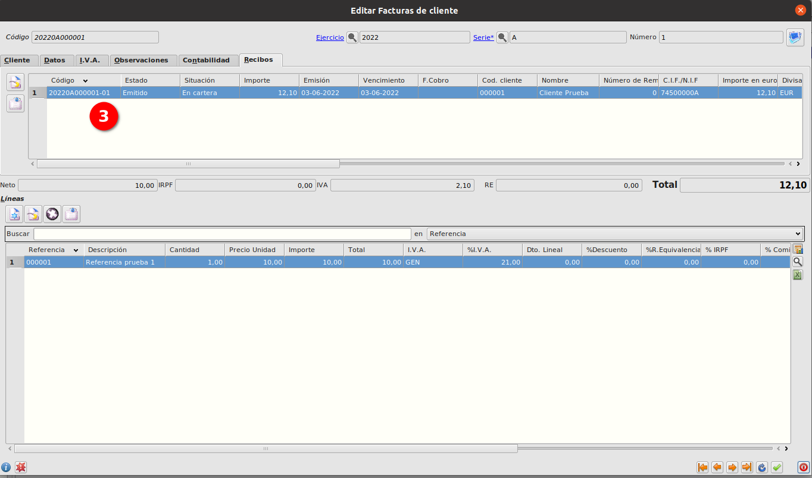
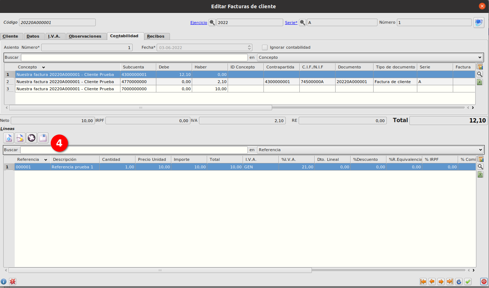
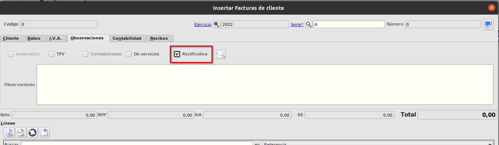
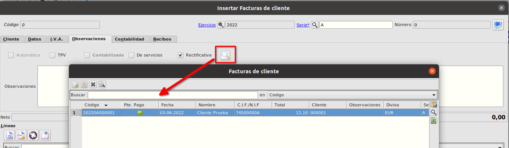
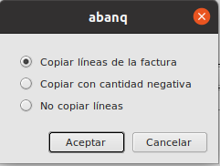
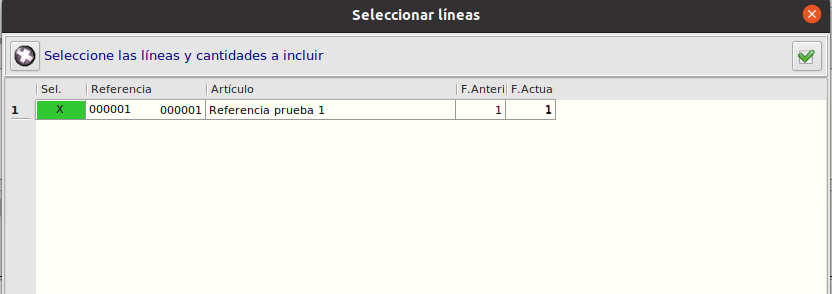
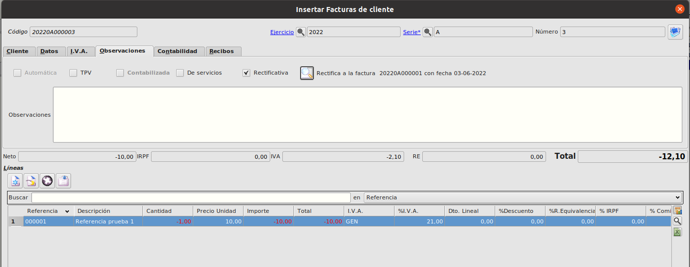

# Factura de Venta

## 1. Creación de factura

### Objetivo
    Generar una factura a un cliente
### Descripción
    Creación de una factura de cliente, ver como se crea el recibo y el asiento contable de forma automática.
### Proceso
1. Seleccionamos el *Cliente*, se cargarán los valores predeterminados del cliente.
2. Creamos la/s líneas

3. Guardamos y se generará automáticamente los recibos correspondientes (3) y el asiento contable (4)

    
## 2. Factura rectificativa
### Objetivo

    Generar una factura que rectifica otra factura de un cliente

### Descripción

    Creación de una factura rectificativa de un cliente a partir de otra factura creada previamente.

### Proceso

1. Seleccionamos el *Cliente*, se cargarán los valores predeterminados del cliente.
2. Vamos a la pestaña **Observaciones** y marcamos el check de *Rectificativa*.

3. Pulsamos sobre el botón de lupa y se nos mostrarán todas las facturas del cliente seleccionado.

4. Seleccionaremos una factura y al aceptar nos preguntará el sistema si queremos: 
* Copiar líneas de la factura 
* Copiar con cantidad negativa
* No copiar líneas

  

5. En cualquiera de las 3 opciones se quedará asignada la factura que estamos realizando como que rectifica a la factura seleccionada.
6. Si hemos seleccionado la opción 1 o la 2, se mostrará un formulario con las líneas de la factura original donde podemos desmarcar las líneas que no queremos que se copien o modificar la cantidad con la que queremos que se cree la línea.

7. Al aceptar se crearán tantas líneas como estén seleccionadas en el paso anterior con la salvedad de que se crearán con cantidad negativa si hemos seleccionado la opción 2.

8. Guardaremos la factura y se crearán los recibos y asiento correspondientes.

