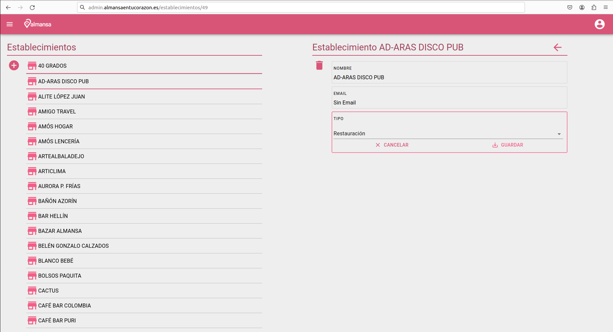

# Pantalla gestión de comercios

Pantalla con lista de comercios, los datos de los comercios son editables y posibilidad de eliminar un comercio de la lista.

## Nuevo comercio

Pulsando botón + abre formulario para dar de alta un nuevo comercio. Se utilizará el dato **cif/nif** como contraseña para la cuenta de uso de la aplicación de establecimientos.

[Volver al Índice](../index.md)