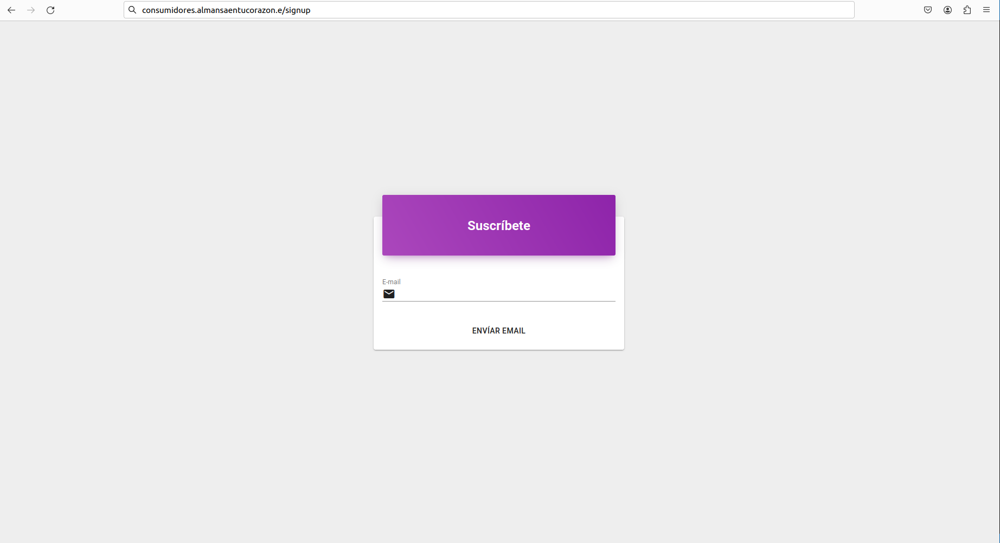
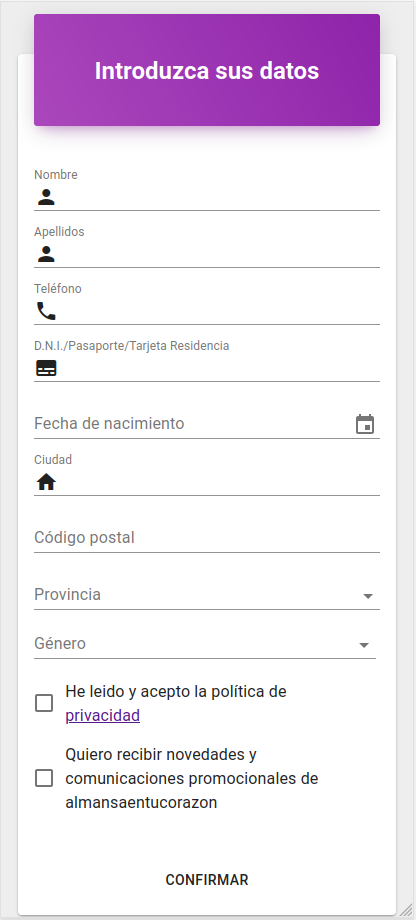

# Gestionar datos cliente

Para dar de alta a un nuevo consumidor, lo haremos desde la pantalla *signup* de la aplicación.  

Introduciremos un email, en el que el consumidor recibirá una entrada con un enlace que le redirigirá a la pantalla donde ingresará sus datos y se dará de alta en la aplicación.

[Volver al Índice](../index.md)