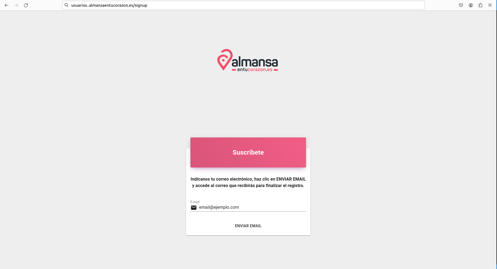
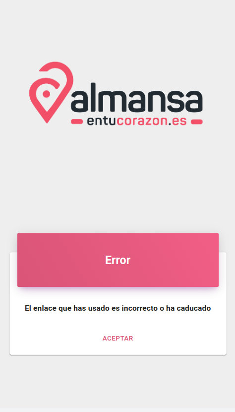
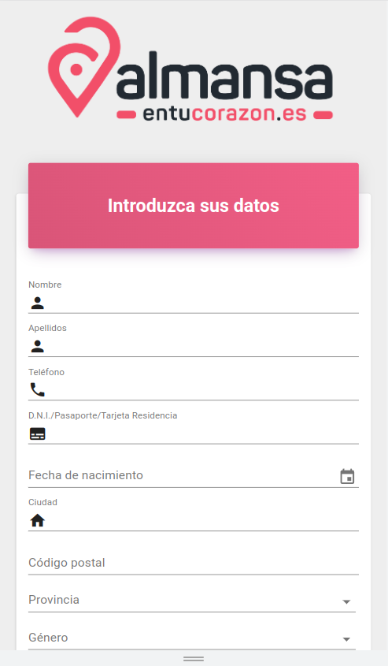

# Gestionar datos cliente

Para dar de alta a un nuevo consumidor, lo haremos desde la pantalla *signup* de la aplicación.  

Introduciremos un email, en el que el consumidor recibirá una entrada con un enlace que le redirigirá a la pantalla de alta. 

El enlace solo permanecerá habilitado o activo durante las siguientes dos horas de ser enviado. En que caso de que el enlace este caducado, se mostrará una pantalla informando de la situación.

Si el enlace es válido accederemos a la pantalla donde se ingresarán los datos del usuario, la aceptación de la política de privaciadad, la autorización para recibir comunicaciones y la contraseña para acceder a la aplicación.

Si todos los datos están completados podremos crear el usuario y empezar a utilizar la aplicación.

[Volver al Índice](../index.md)