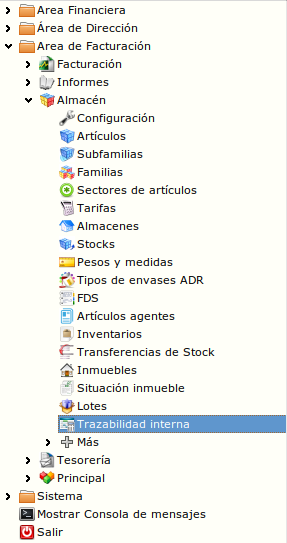
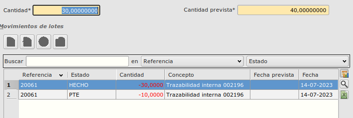
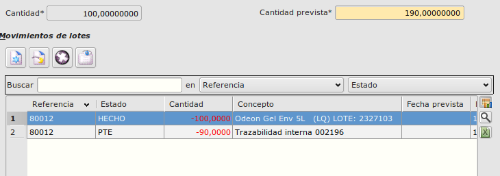
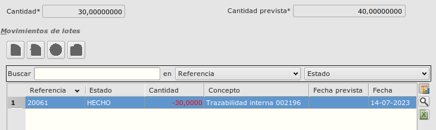

# Trazabilidad interna y producción

Esta funcionalidad nos permitirá generar registros de producción de compuestos, así como uso y reserva de componentes.

Para ello crearemos o editaremos un registro de fabricación desde **Area de facturación - Almacén - Trazabilidad interna**.

## Estructura

### Creación de nuevo registro de fabricación
* Informaremos los campos necesarios para crear un nuevo registro de fabricación en el formulario de alta (Producto, Tipo de fabricación, Almacen, Cant. prevista). 
Si el tipo de fabricacion es "Envasado", es necesario informar el campo "Código asociado".

* Una vez informados los campos, pulsaremos el botón **Carga componentes del producto**  para crear las líneas de productos de la trazabilidad. Para cargar estas líneas deberemos tener informada la composición del producto en la ficha del artículo.

* Cada línea por cada componente del producto, tendrá informado el campo **Cant Prevista** con la cantidad de componente que se ha de utilizar para fabricar una unidad del producto multiplicado por la cantidad de producto final a producir. **Ejemplo. Si queremos 10 unidades de producto final y por cada unidad gastamos 5 del componente serán 10 * 5 = 50**.

### Edición de registro de fabricación
* En la edición de un registros de fabricación nos podemos encontrar con dos casos:
    * Que el registro no tenga líneas de fabricación creadas. En este caso, podremos crearlas de la forma comentada en el punto anterior.
    * Que el registro tenga líneas de fabricación creadas. En este caso, podremos editar las líneas de fabricación existentes.

* En el caso de que ya hayamos cargado las líneas de fabricación, se bloquearán los campos de la cabecera del registro de fabricación, ya que no se pueden modificar una vez creadas las líneas de fabricación. Si queremos modificar estos campos, deberemos eliminar las líneas de fabricación y volver a crearlas. Esto lo podremos realizar mediante un botón en la cabecera del registro de fabricación **Borrar líneas** .
Una vez eliminadas las líneas, podremos modificar los campos de la cabecera y volver a cargar las líneas de fabricación.

### Tipos de líneas de fabricación
* En las líneas de fabricación podemos encontrarnos con líneas de dos tipos:
    * Líneas de fabricación de componentes.
    * Línea de fabricación de producto final.
* La edición de las líneas de fabricación se realizará de la misma forma para ambos tipos de líneas con la excepción de que algunas líneas de componentes pueden ser por lotes.

### Edición de líneas de fabricación sin lotes
* En el caso de que la línea de fabricación no sea por lotes, podremos editar el campo **Cantidad**. 
    * Abriremos el registro de la línea e informaremos la cantidad que se ha consumido de la línea. Cuando guardemos el registro se generará un registro de movimiento en estado **HECHO** y en el caso de que todavía quede cantidad por consumir, se generará un nuevo registro de movimiento en estado **PTE** con la cantidad que quede por consumir.

    

### Edición de líneas de fabricación por lotes
* En el caso de que la línea de fabricación sea por lotes, no podremos editar el campo **Cantidad** ya que la cantidad a consumir vendrá determinada por la suma de los lotes que se utilicen.
    * Abriremos el registro de la línea y pulsamos en insertar un nuevo movimiento de lote. Se abrirá un formulario para poder seleccionar el lote que se va a utilizar y la cantidad que se va a consumir de ese lote.

    * Cuando guardemos ese formulario se generará un registro de movimiento en estado **HECHO** y en el caso de que todavía quede cantidad por consumir, se generará un nuevo registro de movimiento en estado **PTE** con la cantidad que quede por consumir y se actualizará el campo **Cantidad** de la línea de fabricación con la cantidad que se ha consumido hasta el momento.

    

### Cerrar registro de fabricación
* Cuando hayamos terminado de editar todas las líneas y queramos cerrar el registro, pulsaremos el botón **Cerrar** . 
    * Al cerrar el registro de fabricación se borrarán todos los registros de movimiento en estado **PTE**. Se informará el campo **Cant. producida** y se bloquearán los campos de la cabecera y líneas y no se podrán editar.

    

    * Si queremos volver a abrir el registro de fabricación, pulsaremos el mismo botón. Al abrir el registro de fabricación se desbloquearán los campos de la cabecera y líneas y se podrán editar y se volverán a crear los registros de movimiento en estado **PTE** en el caso de que quedara cantidad en alguna línea.