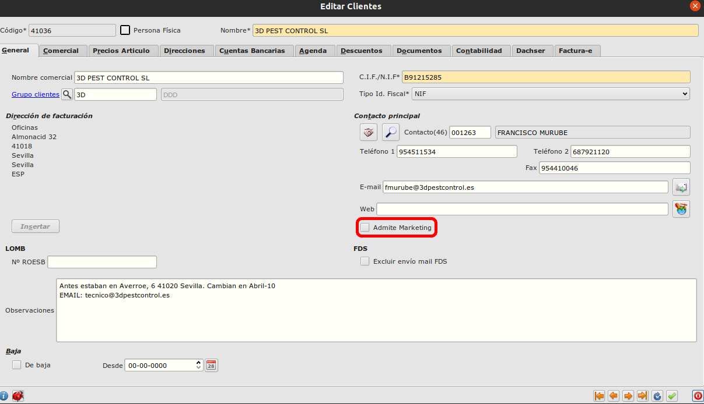

# Informe etiquetas

Muestra las direcciones de facturación o envío de los clientes seleccionados.

Ruta: **Área de facturación -> informes -> Etiquetas de Clientes** 

## Campo admite marketing

En el formulario de clientes hay un campo "Admite Marketing" en la pestaña general. Si lo marcamos el cliente estará incluido cuando filtremos los resultados del informe. 

Ruta: **Área de facturación -> Principal -> Clientes**

## Criterios de búsqueda y selección de formato

- **Rango de códigos de cliente:** Para seleccionar los clientes que deben incluirse en el informe podemos establecer un rango de códigos de cliente. Los campos del intervalo están situados en el centro del formulario, entre las 2 tablas de clientes.

- **Formato:** Para seleccionar el formato en el que queremos imprimir el informe podemos seleccionarlo entre las opciones del campo formato situado en la esquina superior derecha.

- **Dirección:** Podemos especificar cuál dirección  queremos imprimir en el informe, la de envío o la de facturación, seleccionandola en este campo en la esquina superior izquierda del formulario.

## Filtrar por admite marketing

Para filtrar los clientes que admiten marketing tendremos que hacer click en el icono con la lupa de la tabla de clientes superior. Buscamos entre los campos de la tabla el de "Admite Marketing", establecemos su columna de **condición** en "Igual a valor" y marcamos el check en la columna **valor**.

Una vez establecido el filtro volvemos a pulsar en el icono de la tabla situado justo encima de la lupa y ya podremos ver la tabla de clientes filtrada.

