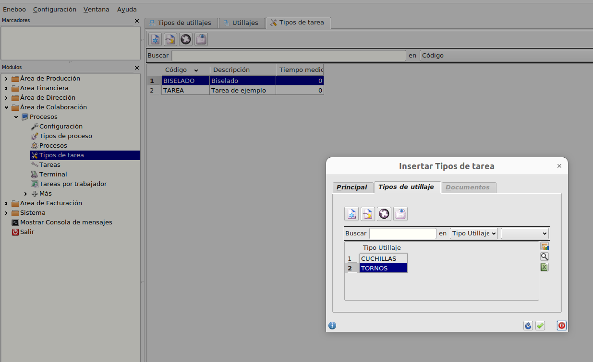
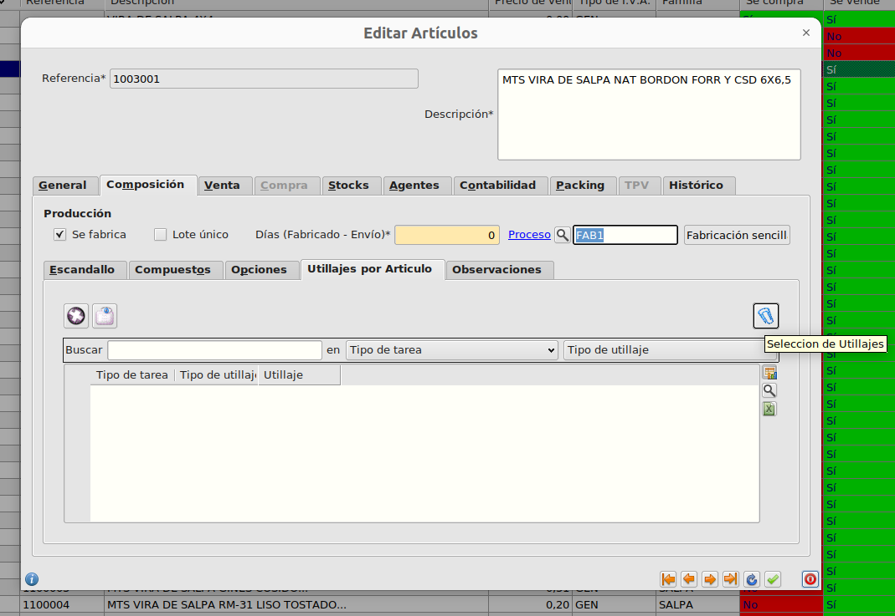
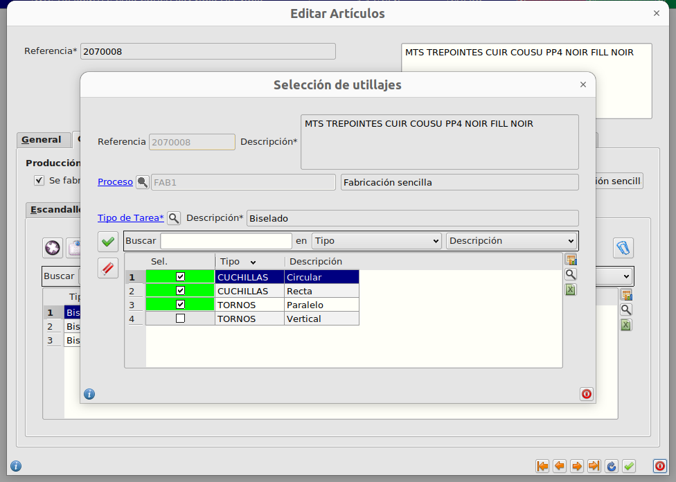

# Gestión de utillajes para producción

## Crear y configurar utillajes por tarea

Podemos crear y gestionar los Tipos de Utillaje desde **Producción - Principal - Tipos de Utillaje** con los botones de inserción, edición y borrado.

Podemos crear los diferentes utillajes de cada tipo desde **Producción - Principal - Utillajes** con los botones de inserción, edición y borrado.

A cada tipo de tarea podemos asociar los tipos utillaje que se utilizarán para realizar esa tarea desde **Colaboración - Procesos - Tipos de tarea** pestaña **Tipos de utillaje**

## Utillajes utilizados en la fabricación de un producto

Para cada artículo podemos establecer los utillajes que se utilizarán en su fabricación. Para ello accedemos al formulario de edición de artículos en la pestaña **Composición - Utillajes por artículo**. Para que esta tabla esté activa es necesario establecer antes el **Proceso de fabricación**

Si pulsamos el botón de la derecha de **Selección de Utillajes** se abrirá un formulario de multiselección para poder crear todos los utillajes necesarios según el tipo de tarea.

Para asociar los utillajes seguieremos lo siguientes pasos:

- Establecer el **Tipo de Tarea** y el **Tipo de utillaje**
- Pulsamos el botón **Buscar**
- Al hacer esto nos aparecerán en la tabla de arriba, todos los utillajes que podemos asociar a la fabricación de ese artículo. Seleccionamos los que sean necesarios.
- Pulsamos el botón **Seleccionar Utillaje** situado entre las dos tablas. Al hacer esto los utillajes aparecerán en la tabla inferior y quedarán asociados a ese artículo
- Podemos asociar más utillajes a otros tipos de tarea repitiendo todos los pasos.
- Para quitar utillajes los seleccionaremos en la tabla inferiro y pulsaremos el botón **Quitar utillaje**

## Observaciones a tener en cuenta en la fabricación de un producto

Podemos crear observaciones a tener en cuenta en la fabricación de un producto desde el formulario de edición de artículos en la pestaña **Composición - Observaciones**. Desde ahí, podemos dar de alta, editar o eliminar observaciones asociadas a una tarea en concreto

[Volver al Índice](../index.md)