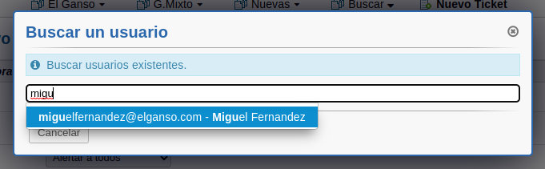
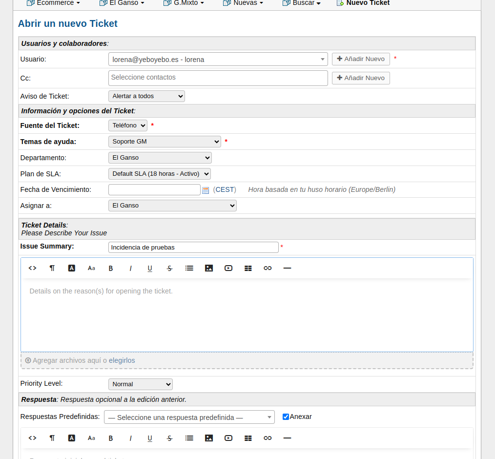

# Herramienta de gestión de tiquets

## Acceso a la plataforma

Accedemos como agente desde un navegador a http://soporte.yeboyebo.es/scp/login.php.

En los datos de login establecemos nuestro usuario y contraseña que se nos debe haber facilitado previamente.

Al acceder la primera vez nos pedirá que cambiemos la contraseña

## Consulta de tickets

Podemos ver los tickets creados en la pestaña **Tickets**->**El Ganso**

Aparecerá un menú con varias opciones:

- **Abiertas**. Incidencias que están en resolución
- **Cerrados**. Incidencias que ha han sido resueltos
- **Todos**. Todas las incidencias

Si abrimos un tiquet nos apasrecerá 

## Creación tickets

En esa pestaña tenemos varias opciones:

- **My Tickets**. Dónde vemos los tickets que tenemos asignados
- **El Ganso**. Dónde vemos los tiquets del grupo El Ganso
- **Nuevas**. Dónde vemos los tiquets que han entrado nuevos y no están asignadoas todavia a ningún departamente
- **Soporte GM**. Dónde vemos los tiquets del grupo Mixto
- **Ecommerce**. Dónde vemos los tiquets del grupo Ecommerce
- **Nuevo Ticket**. Dónde podremos crear nuevos tickets manualmente

Los tickets pueden crearse de dos formas:

- Enviando un correo a soporte@yeboyebo.es se genera automáticamente un ticket asignado al remitente del correo con el contenido del mismo. Lo ideal sería que los propios clientes envien las incidencias al correo para que automáticamente se creen los tiquets

- Manualmente desde la opción **Nuevo Ticket**.

Al crear un nuevo ticket manualmente lo primero que nos pedirá es el usuario al que irán dirigidas las comunicaciones, es decir al cliente. Podemos buscar su email si ya está creado o crearlo en ese momento

Al crear el ticket de cualquiera de las dos formas una vez creado debemos abrir el formulario del ticket y configurar algunas cosas:

- **Cc.**: Email de los usuarios a los que debe llegarle una copia de las notificaciones
- **Aviso de ticket**. Debe poner Alertar a todos (es la opción por defecto)
- **Fuente del ticket** Debemos establecer si ha sido por email, teléfono u otros
- **Temas de ayuda** El propio de cada grupo
- **Departamento** El grupo que corresponda
- **Asignar a** Agente al que se asigna la incidencia
- **Issue Summary** Nombre de la incidencia y descrilpción larga (comentarios del cliente, explicación detallada, datos...)

Pulsamos el botón inferior abrir y el ticket quedará creado

Una vez creado el ticket:

- Enviaremos mensaje de **Confirmación apertura** (explicado en el punto siguiente)
- Valoramos la prioridad de la inidencia para establecer una fecha de entrega:
    #P1 Fecha Entrega hoy o mañana
    #P2 Fecha Entrega 3 días
    #P3 Fecha Entrega 5 días

- Creamos la tarea en dailyjob:
    - Además del hastag del proyecto añadiremos los hastags de prioridad y el id del tiquet. Ej: #M_Xx_23AA #XXXXXX #P2 Descripción tiquet
    - Establecemos la fecha de entrega según la prioridad. Para que luego en dailyjob las tareas aparezcan ordenadas por prioridad