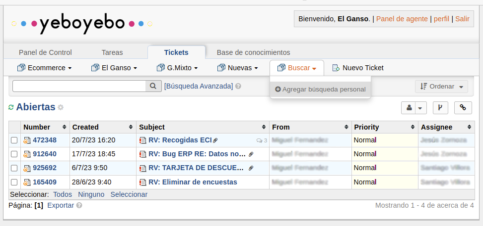
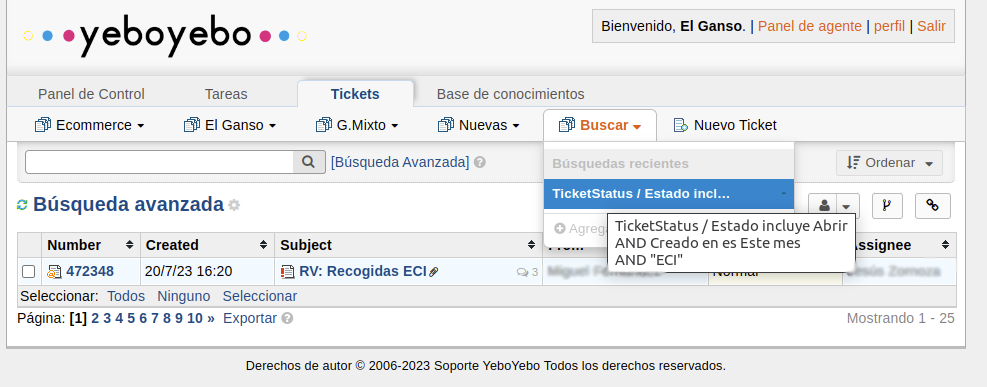
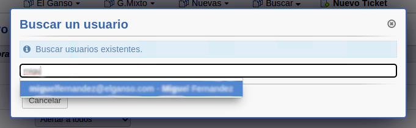
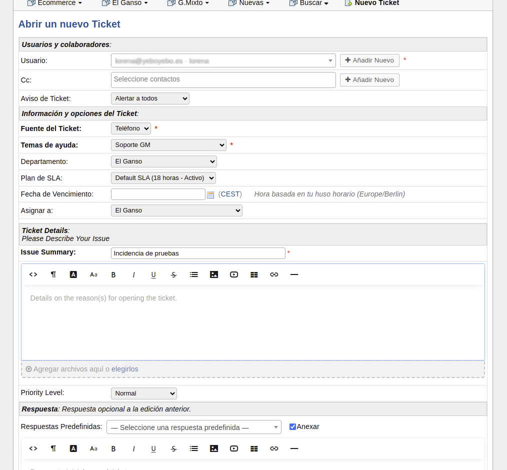

# Herramienta de gestión de tiquets

## Acceso a la plataforma

Accedemos como agente desde un navegador a http://soporte.yeboyebo.es/scp/login.php.

En los datos de login establecemos nuestro usuario y contraseña que se nos debe haber facilitado previamente.

Al acceder la primera vez nos pedirá que cambiemos la contraseña

## Consulta de tickets

Podemos ver los tickets creados en la pestaña **Tickets**->**El Ganso**

Aparecerá un menú con varias opciones:

- **Abiertas**. Tiquets nuevos o en resolución
- **Cerrados**. Tiquets que ha han sido resueltos
- **Todos**. Todos los tiquets

Si abrimos un tiquet nos apasrecerá toda la información referente a ese tiquet. El asunto, la descripción y todos los correos que se han ido enviado

Podemos hacer una consulta filtrando por fecha, estado o el criterio que necesitemos desde la opción **Busqueda**->**Agregar búsqueda personal**

## Creación tickets

Los tickets pueden crearse de dos formas:

- Enviando un correo a soporte@yeboyebo.es se genera automáticamente un ticket asignado al remitente del correo con el contenido del mismo. Lo ideal sería que los propios clientes envien las incidencias al correo para que automáticamente se creen los tiquets

- Manualmente desde la opción **Nuevo Ticket**.

Al crear un nuevo ticket manualmente lo primero que nos pedirá es el usuario al que irán dirigidas las comunicaciones, es decir al cliente. Podemos buscar su email si ya está creado o crearlo en ese momento

Al crear el ticket de cualquiera de las dos formas una vez creado debemos abrir el formulario del ticket y configurar algunas cosas:

- **Cc.**: Email de los usuarios a los que debe llegarle una copia de las notificaciones
- **Temas de ayuda** Soporte GM
- **Departamento** El ganso
- **Asignar a** El ganso. Este valor es importante informarlo correctamente. De no ser así el departamente el Ganso no tendrá constancia del nuevo ticket.
- **Issue Summary** Nombre de la incidencia y descrilpción larga (comentarios del cliente, explicación detallada, datos...)

Pulsamos el botón inferior abrir y el ticket quedará creado