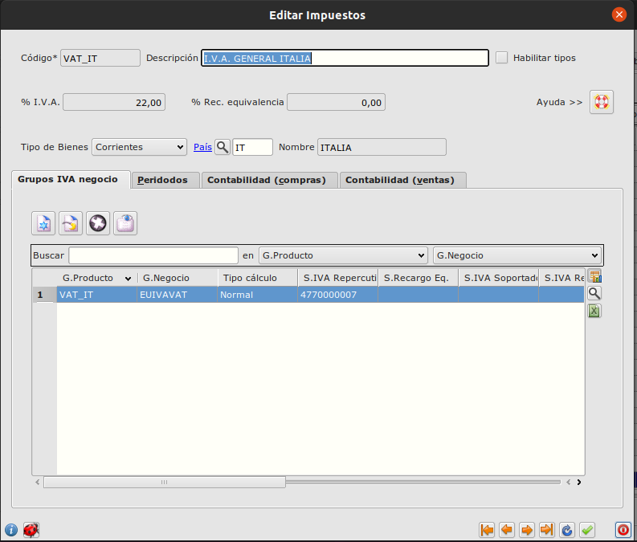
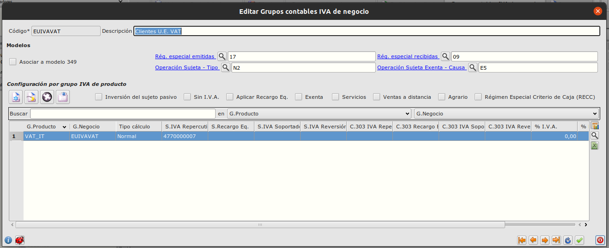
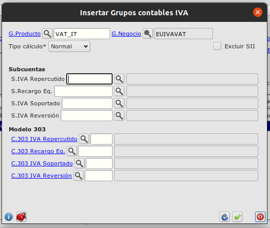
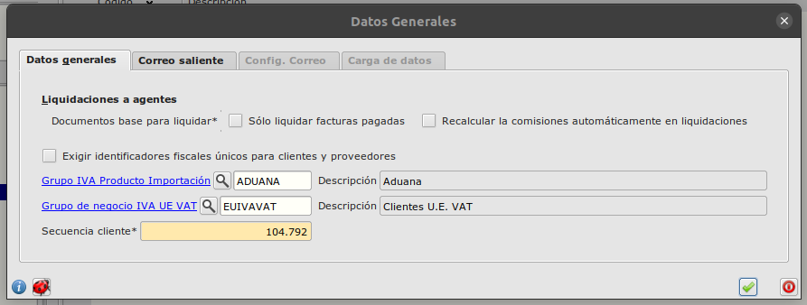
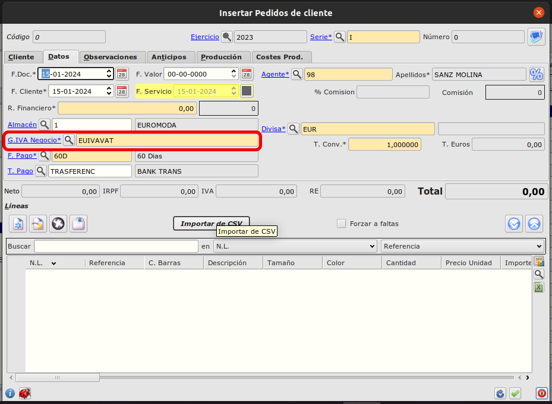
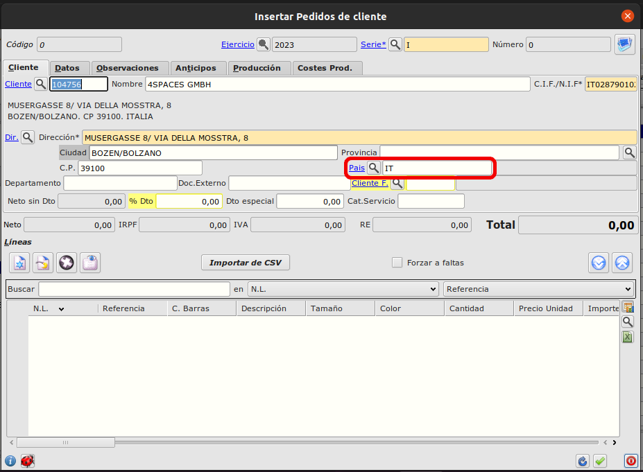
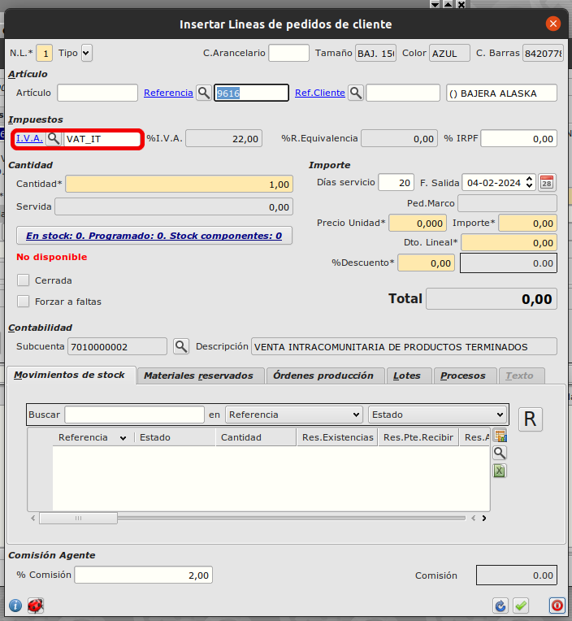

# IVA UE VAT

## Objetivo

El propósito de esta funcionalidad es poder asignar a una venta automáticamente el impuesto asignado al país de la Unión Europea correspondiente.

## Configuración

### Creamos los impuestos de cada país.

Nos dirigimos al formulario de impuestos en la siguiente ruta: **Area de Facturación -> Principal -> Impuestos**

Y añadimos los impuestos ligados a cada país.

### Creamos el grupo contable UE IVA VAT

Una vez tebemos los impuestos de cada país, debemos crear el grupo contable de IVA de negocio para los clientes de la unión europea.

Para ello vamos a la siguiente ruta: **Area Financiera -> Principal -> Más -> Grupos contables -> Grupos I.V.A. negocio**

Creamos el grupo con los siguientes datos:

A este grupo le añadimos los grupos contables de IVA correspondientes a cada país de la Unión Europea. Especificando las subcuentas necesarias a cada uno. Para ello simplemente añadimos líneas en la tabla 'Configuración por grupo IVA de producto'.

En campo 'G.Producto' del formulario añadiremos el código de impuesto de cada país, los cuáles ya creamos anteriormente.

Por último, nos dirigiremos a la configuración principal del módulo de facturación. Ruta: **Area de facturación -> Principal -> Configuración**

Y asignaremos el grupo contable de IVA de negocio que acabamos de crear en el campo 'Grupo de negocio IVA UE VAT'.

## Ejemplo de funcionamiento

Cuando un cliente añada una línea a un pedido, se comprobará que el grupo contable de IVA del pedido coincida con el de la configuración principal del módulo de facturación.
Si se cumple la condición se asignará el impuesto asignado al país del pedido, en caso contrario se aplicará el impuesto del producto por defecto.

Grupo contable de IVA asignado al pedido

País asignado al pedido

Impuesto asignado automáticamente al añadir la línea

[Volver al Índice](../index.md)