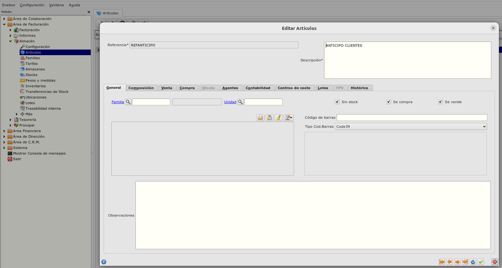
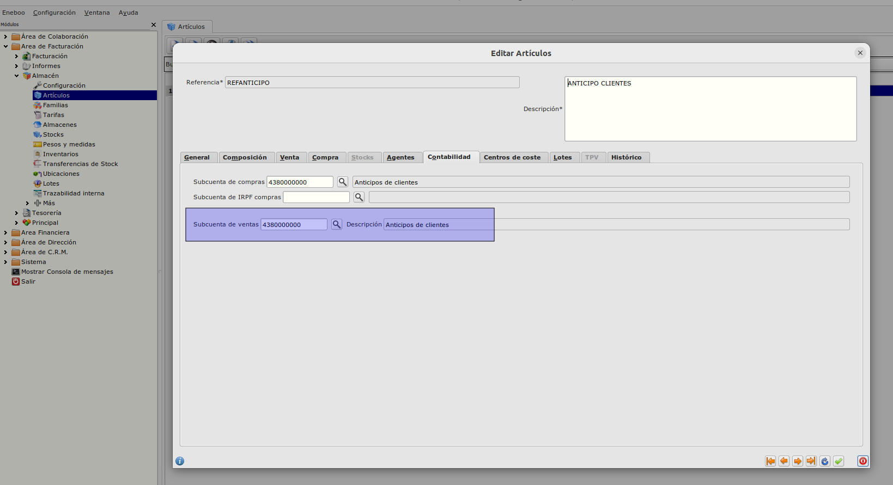
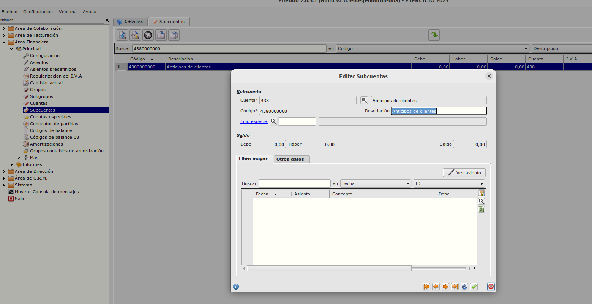
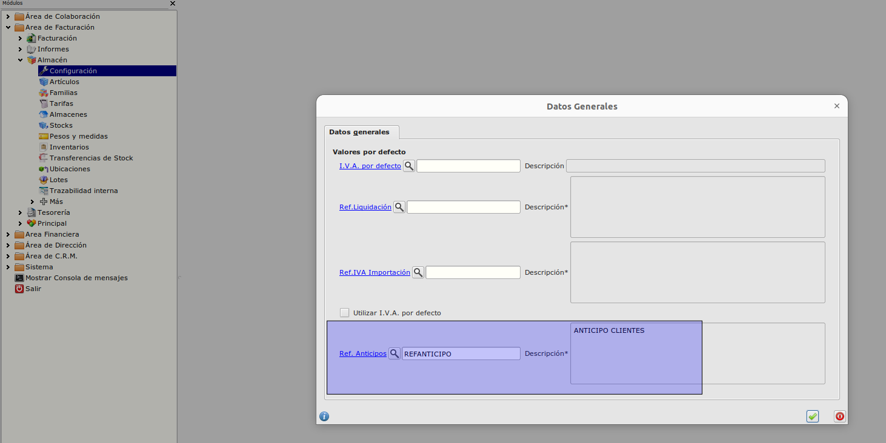

# Anticipos en pedidos de cliente / Configuración

Para el correcto funcionamiento de la funcionalidad tenemos que realizar una serie de configuraciones.

## Referencia IVA Importación
- Crearemos una referencia que utilizaremos exclusivamente para los Anticipos en el **Área de Facturación -> Almacén -> Artículos**
- La referencia la marcaremos con el check de "Se compra" y "Se vende".

- Informaremos en la referencia la subcuenta de compras que será una subcuenta 438 ya que será la subcuenta de anticipos de la factura.

- La subcuenta tendría que estar creada anteriormente.

- En el formulario **Configuración** del módulo de Almacén que podemos encontrar en **Área de Facturación -> Almacén -> Configuración** tenemos que informar el campo *Ref. Anticipos* con la referencia que hemos creado para el uso en las líneas de facturas de anticipo.

### Más

  * [Volver al Índice](./index.md)

