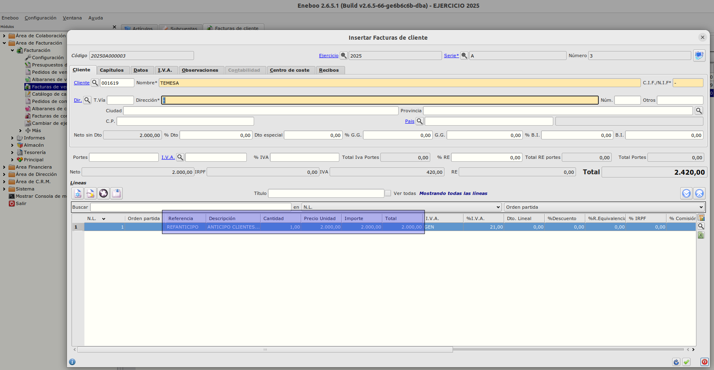
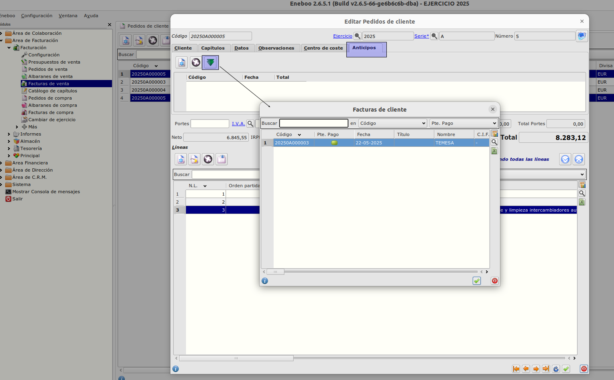
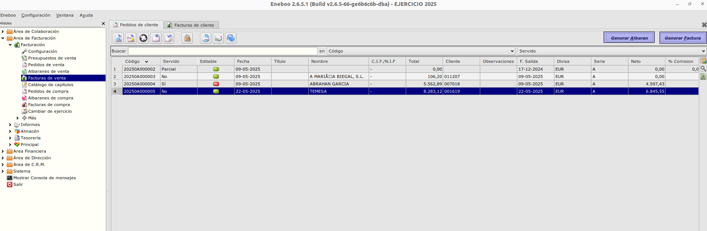
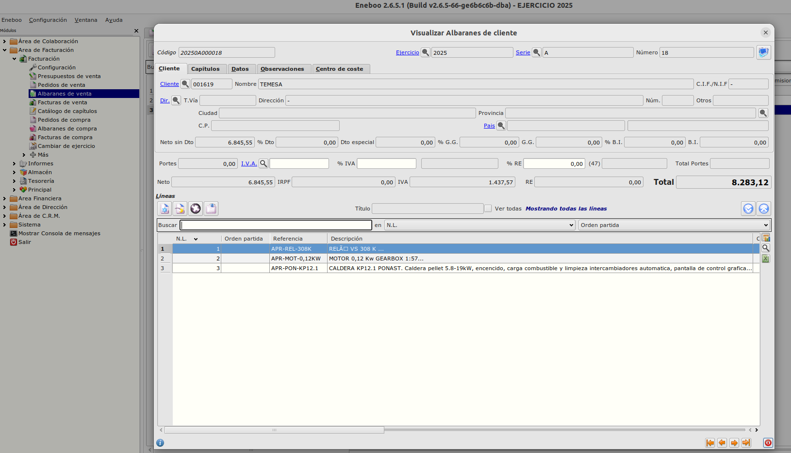
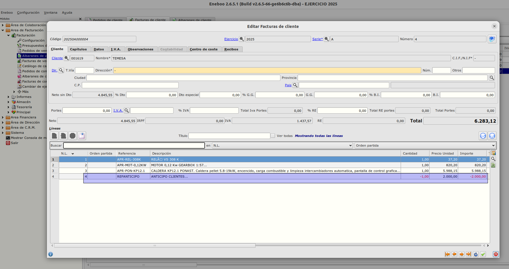

# Anticipos en pedidos de cliente / Funcionamiento

Para el correcto funcionamiento se debe de haber realizado la configuración tal y como se indica en el apartado [Configuración](./configuracion.md)

## Generación de Factura anticipo
Para la generación de una factura de venta anticipos seguiremos los siguientes pasos.
- Desde el **Área de Facturación -> Facturación -> Facturas de venta** pulsaremos en nuevo registro para generar una nueva factura.
- Informaremos el cliente y comprobamos sus datos de la cabecera.

- Crearemos una nueva línea e informaremos la referencia que hemos configurarado como *Ref. Anticipos* y el importe del anticipo del cliente.

- Guardaremos la línea y la factura.

## Generación de Pedido y relacionarlo con la factura de anticipo
Para la generación de un pedido de venta seguiremos los siguientes pasos.
- Desde el **Área de Facturación -> Facturación -> Pedidos de venta** pulsaremos en nuevo registro para generar un nuevo pedido.
- Informaremos el cliente y comprobamos sus datos de la cabecera.

- Crearemos todas las lineas de la petición del cliente.
- Una vez creadas las lineas desde la pestaña **Anticipos** con el botón *Flecha verde* seleccionamos la factura de anticipo del cliente previamente creada.

- Guardaremos el pedido.

## Generación de Albarán / Factura desde el pedido

- Con el botón *Generar Albarán* se generar el albarán asociado al pedido.
- Con el botón *Generar Factura* se generan el albarán y la factura asociados al pedido del cliente.

- El albarán generado contiene las lineas de pedido y en caso de pedido parcial las lineas selecionadas para servir.

- En la factura generada se ha incluido automaticamente la linea con *Ref. Anticipos* con cantidad /importe negativo.

### Más

  * [Volver al Índice](./index.md)
