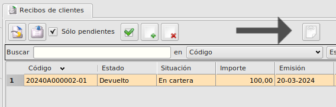
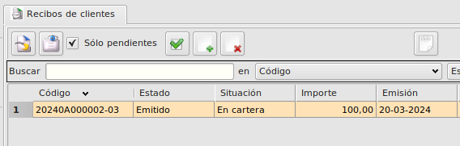
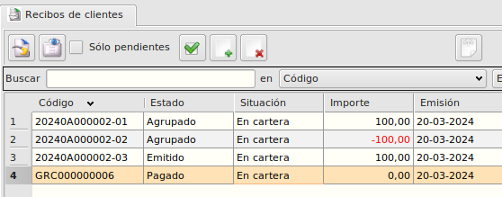
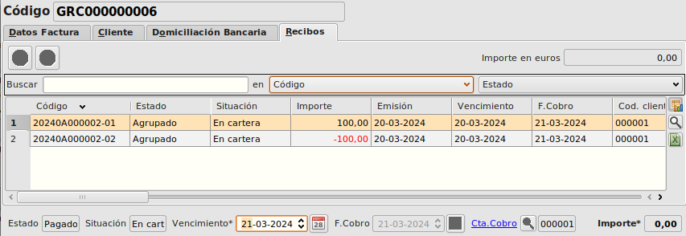

# Apertura recibos devueltos

Esta extensión permite la reapertura de un recibo de cliente que haya sido marcado como __Devuelto__, lo que permite la modificación de su importe.

### Funcionalidad anterior

Cuando hacías el pago de un recibo y luego este era devuelto, el importe era bloqueado y no podía ser modificado.

### Cambios en el formulario y funcionalidad nueva

Añadimos un botón en el master de recibos cliente.

 Si el cursor está encima de un recibo marcado como __Devuelto__ hará las siguientes: 

Creará un nuevo recibo con los mismos datos (importe, factura asignada). Pero ahora este tendrá su estado en __Emitido__ y se le podrá modificar su importe para pagarlo por partes.

Si desactivamos la opción _Sólo pendientes_, observaremos cómo el recibo original se ha agrupado con otro nuevo recibo.

El nuevo recibo agrupado tendrá el importe del original pero en negativo. Y al estar los dos agrupados se creará un grupo con importe 0.

### Más

  * [Volver al Índice](../index.md)

