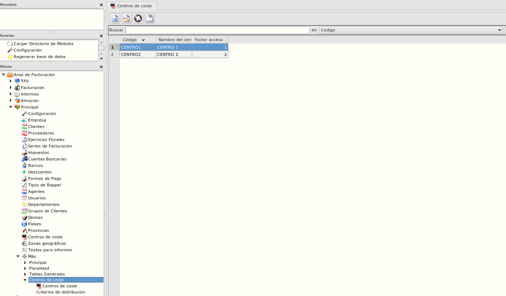
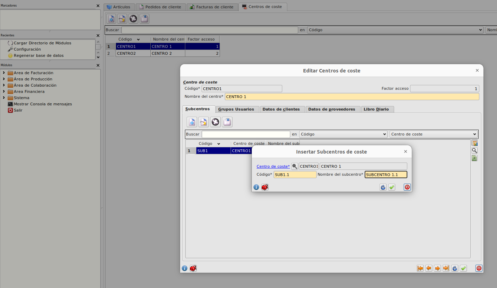
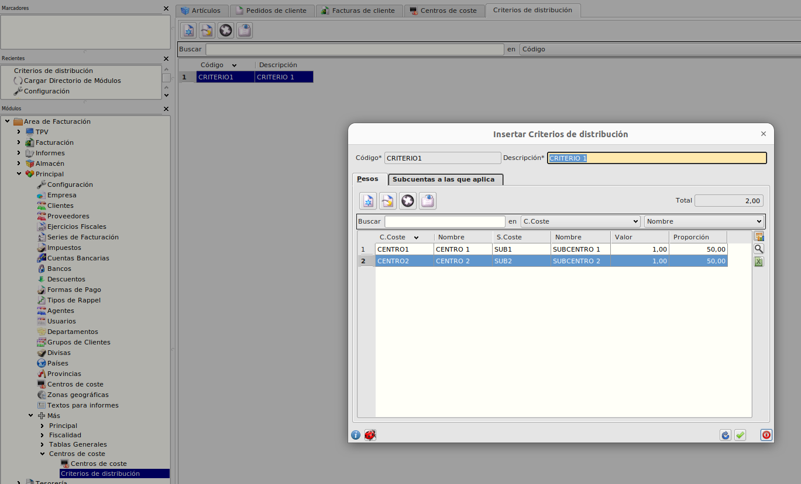
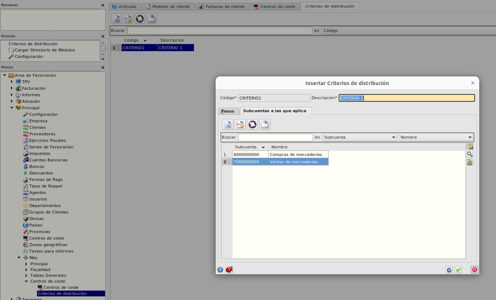
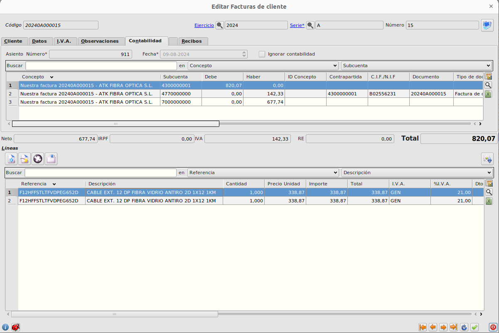
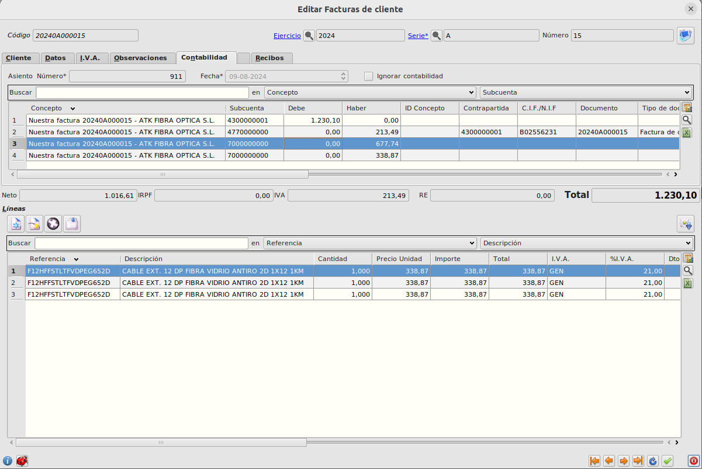
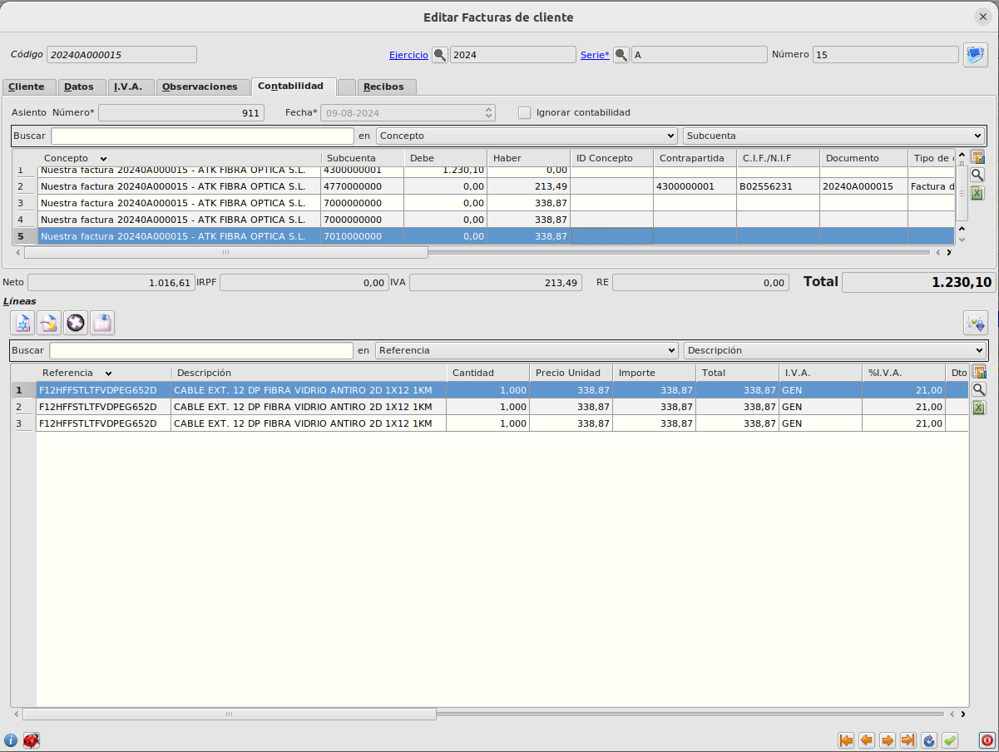
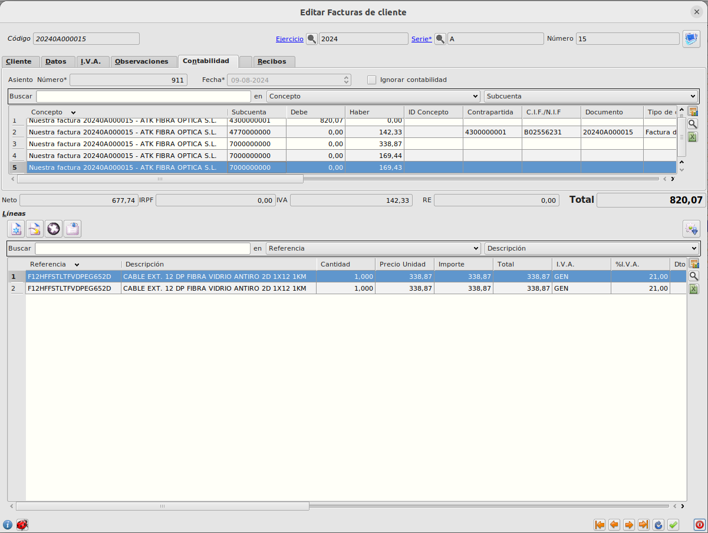

# Creación de centros de coste

## Configuración

Podemos crear los centros de coste en Área de Facturación -> Principal -> Más -> Centros de coste.

## Crear centros y subcentros de coste

Creamos un nuevo centro de coste, dentro de los centros de coste podemos crear uno o varios subcentros de coste que se asociarán únicamente al centro de coste desde el cual estan siendo creados.

## Crear criterios de distribución

Los criterios de distribución se tienen en cuenta cuando alguna de las líneas de documento de venta o compra no tenga informado centro y subcentro de coste.

Podemos crear criterios de distribución e informar las subcuentas y los pesos con los que se repartirá los importes en las diferentes partidas.

## Facturas de cliente
Se pueden dar los siguientes casos:
+ Mismos centros y subcentros de coste en todas las líneas.
+ Distintos centros y subcentros de coste en las líneas de documento.
+ Líneas sin centros y subcentro informados en las cuales se tendrá en cuenta criterios de distribución.

En las facturas de cliente, tenemos la posibilidad de informar los centros de coste y subcentros de coste en las líneas, en caso de haberlos informado, se crearán partidas en el asiento con las líneas agrupadas por centro y subcentro de coste, ejemplo:

### Ejemplo 1: 2 líneas con el mismo centro y subcentro de coste

Se creará una partida con el importe de la suma de de las dos líneas.

### Ejemplo 2: Líneas con diferentes centros de coste

Si hay líneas con diferentes centros de coste se crearán tantas partidas de venta como agrupaciones se encuentren de centro y subcentro:

Tenemos 3 líneas, dos de ellas tienen mismo centro y subcentro, la otra tiene un centro y subcentro diferente. En este caso se crearán dos partidas, la primera agrupara las dos líneas con mismo centro y subcentro y la segunda la línea con centro y subcentro diferente a las otras dos.

### Ejemplo 3: Extensión de subcuentas en líneas de venta

En caso de que tuvieramos instalada también la extensión de cuentas de venta en artículos, podría darse el caso de que la línea de la factura tuviera informada una subcuenta de venta diferente de la 700, esto implica que la agrupación para la generación de partidas tendría en cuenta también el código de subcuenta.

Si una de las líneas de la factura anterior tuviera informada una subcuenta, en este caso una de las que tenían mismo centro y subcentro, se crearían 3 partidas.

### Ejemplo 4: Líneas sin centro ni subcentro (criterios de distribución)

El último caso que se nos podría dar en facturas de cliente es que alguna o varias de las líneas no tuviera informado ni el centro ni el subcentro de coste, por lo tanto no sabríamos a que centro/subcentro incluir esa partida.

Aquí es donde se tienen en cuenta los criterios de distribución explicados en un apartado anterior. Si existe un criterio de distribución el cual tenga incluida una subcuenta que incluya la partida que se esta creando donde no sabemos el centro de coste, el centro/subcentro de coste se buscará en este criterio y se crearán tantas partidas como registros de pesos tenga dividida con los importes según los porcentajes informados.

## Facturas de proveedor

Los posibles casos de facturas de proveedor son similares a las facturas de cliente.