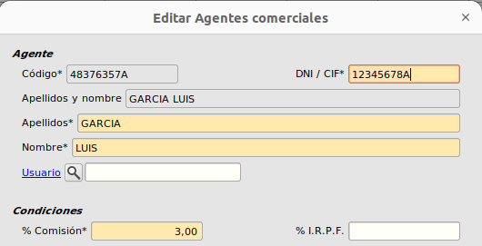
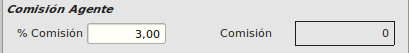

# Comision de Clientes

Esta extensión permite controlar la comisión que corresponderá a los agentes dependiendo de un cliente en concreto.

### Funcionalidad anterior

Antes la comisión asociada a una línea de venta era la comisión asociada al agente de la venta en su ficha.

### Cambios en el formulario

Añadimos un campo al formulario de clientes el cuál contendrá la comisión especial que tendrán el agente con este cliente.

Como se puede ver en la siguiente al cliente con __id__ _000007_ le hemos puesto una comisión del 5%.

En este ejemplo el agente comercial tiene asignado un 3% de comisión.

### Resultado final

Ahora la comisión asociada a una línea es:

+ Si el agente de la venta tiene informada una comisión especial en la ficha del cliente, se toma dicha comisión.
+ Si el agente de la venta no tiene informada una comisión especial en la ficha del cliente, se toma la comisión de la ficha del agente.

### Ejemplo

Una vez introducidos los datos de las diferentes comisiones veremos como funciona con un ejemplo.

Para comprobar que la comisión esté reflejando bien seguiremos los siguientes pasos:

1. Tener dos clientes, uno con el campo **comisión** informado y otro sin tenerlo informado.
2. Los dos clientes los relacionaremos con el mismo agente, el cuál tendrá una comisión diferente a la del cliente.
3. Después nos iremos al formulario de **Presupuestos de clientes** y crearemos un nuevo presupuesto.
     
#### __Presupuesto con cliente que tiene comisión especial__

Creamos un nuevo presupuesto de cliente y le asociamos el cliente con comisión especial. Al crear una línea el resultado será el siguiente

Como podemos ver, el % Comisión es igual que la comisión especial del cliente.

#### __Presupuesto con cliente sin comisión especial__

En cambio, si creamos un presupuesto con el cliente que no tiene comisión especial el resulatado será como el de la imágen.

El % de comisión es el mismo que tiene el agente en su ficha porque el cliente relacionado no tiene una comisión especial propia.

