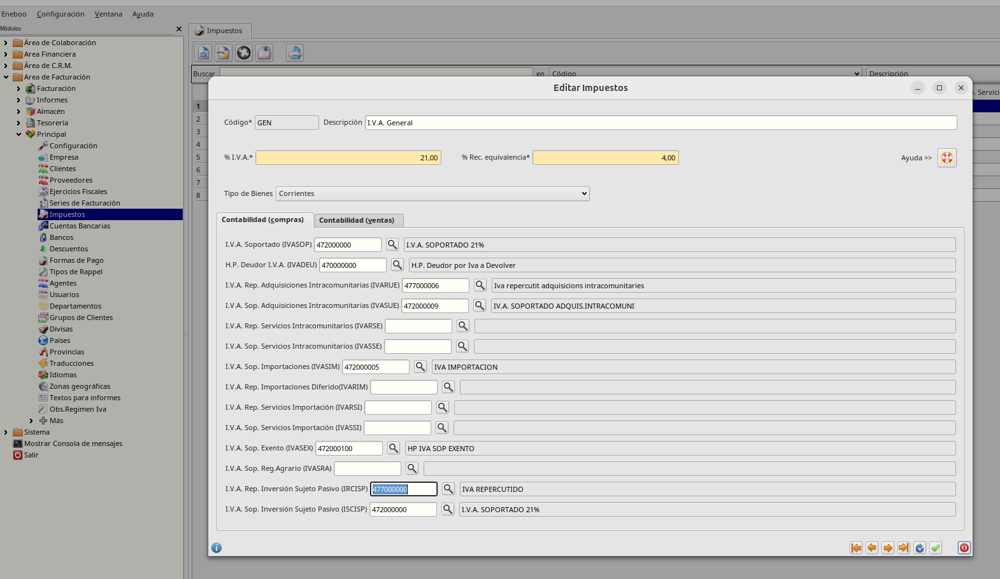
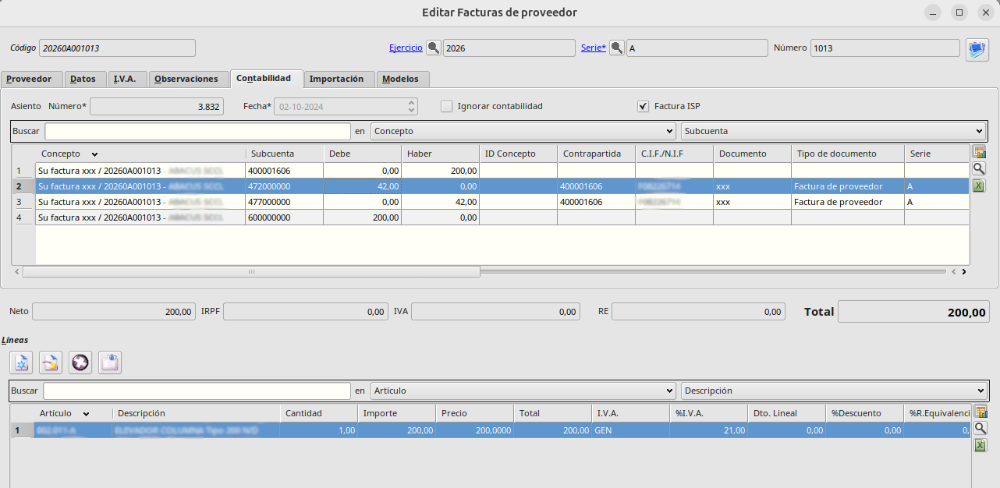

# Contabilidad con Inversión de Sujeto Pasivo

### Configuración

Vamos al **Área de Facturación -> Principal -> Impuestos**. Editamos el tipo de impuesto para el que vayamos a configurar la inversión de sujeto pasivo.
Debemos informar los siguientes valores en la pestaña _Contabilidad (compras)_:
 - _I.V.A. Rep. Inversión de sujeto pasivo_ 
 - _I.V.A. Sop. Inversión de sujeto pasivo_

    
### Generar factura de proveedor

Crearemos una factura de proveedor desde el **Área de Facturación -> Facturación -> Facturas de compra** 

Creamos la factura de proveedor de forma normal. 
Para que genere las subcuentas tal y como las hemos configurado debemos marcar la casilla _Factura ISP_ en la pestaña de _Contabilidad_

  * [Volver al Índice](../index.md)
