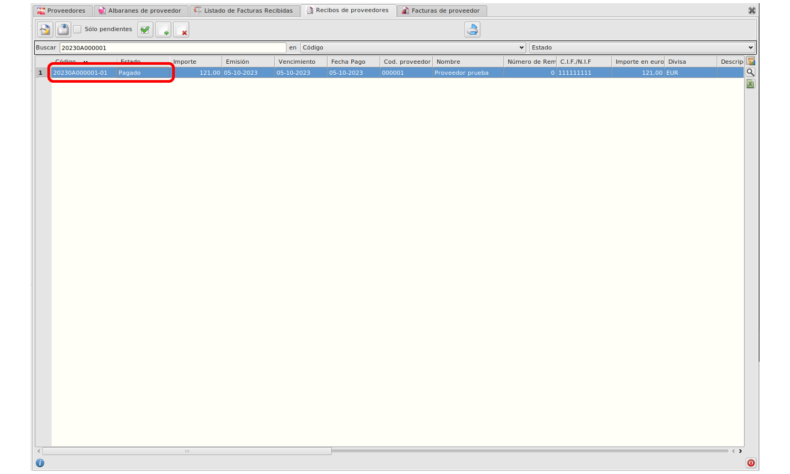

# Criterio caja

### Guía de uso paso a paso

Vamos al formulario de proveedor, y en la pestaña de contabilidad marcamos el check para marcar que está acogido a criterio de caja.

Ruta: **Área de Facturación -> Principal -> Proveedores**

    Esto hará que todas las facturas de proveedor asociadas a este proveedor se generen acogidas a criterio de caja.

Ahora generamos una factura asociada al proveedor. No importa si lo hacemos a partir de un albarán o la creamos manualmente.

Ruta: **Área de Facturación -> Facturación -> Facturas de compra**

    Al seleccionar un proveedor acogido a criterio de caja, automáticamente se marcará la factura para ser tratada como tal.

    Si tenemos instalada la extensión del SII, en la pestaña SII de la factura también se modificará automáticamente el valor de la clave de Régimen especial cuando tratemos de añadir líneas a la factura.

Vamos a guardar algún recibo de pago asociado a la factura para visualizar cómo se verá en el informe.

Ruta: **Área de Facturación -> Tesorería -> Recibos de compra**

    Al guardar el recibo, si visualizamos un informe de facturas recibidas en el que aparezca la factura, podremos visualizar todos sus recibos pagados como en el siguiente ejemplo.

Ruta: **Área Financiera -> Informes -> Facturas recibidas**

