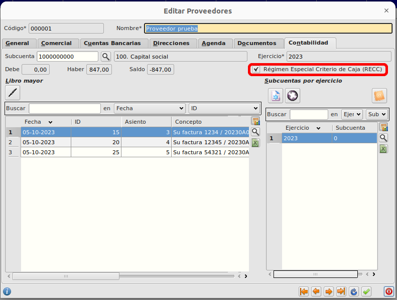
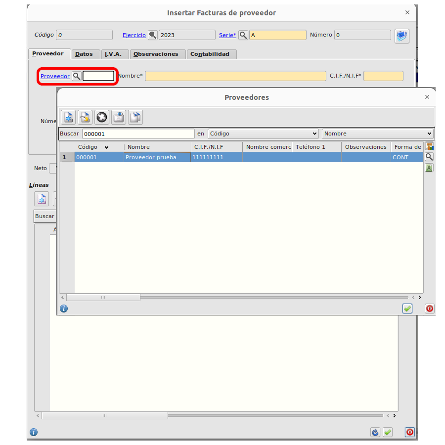
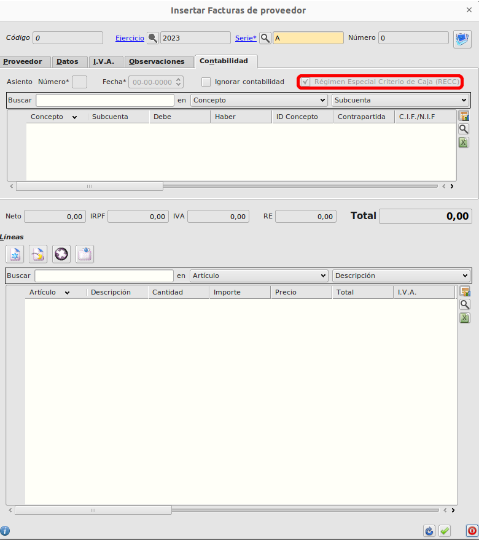
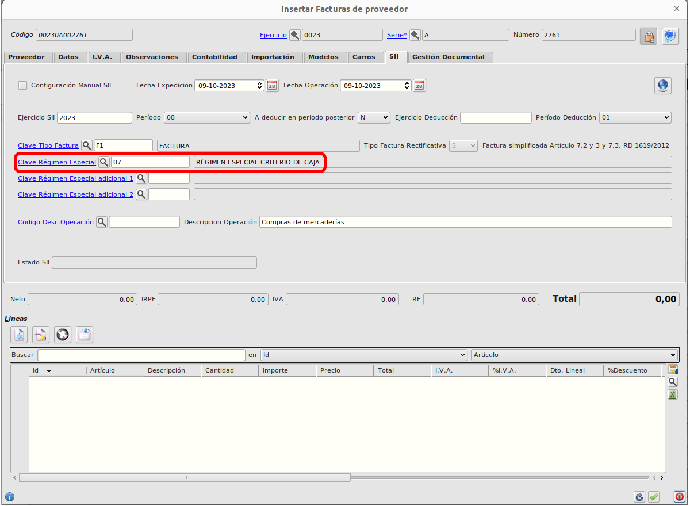
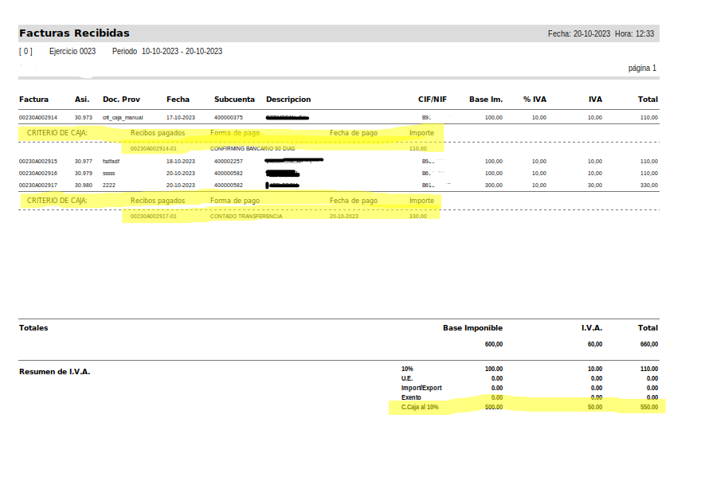

# Criterio caja

### Marcar proveedor acogido a criterio caja

Vamos al **Área de Facturación -> Principal -> Proveedores** y en la pestaña de **Contabilidad** marcamos el check *Régimen Especial Criterio de Caja* para marcar que está acogido a criterio de caja.

    Esto hará que todas las facturas de proveedor asociadas a este proveedor se generen acogidas a criterio de caja.

### Generar factura de proveedor acogido a criterio caja

Crearemos una factura directa o a partir de un albarán desde el **Área de Facturación -> Facturación -> Facturas de compra** 

    Al seleccionar un proveedor acogido a criterio de caja, automáticamente se marcará la factura para ser tratada como tal.

    Si tenemos instalada la extensión del SII, en la pestaña SII de la factura también se modificará automáticamente el valor de la clave de Régimen especial cuando tratemos de añadir líneas a la factura.

### Pago de recibo de factura de proveedor acogido a criterio caja

No hay cambio a la hora de pagar un recibo acogido a criterio de caja pero estos recibos se mostrarán en el informe de facuras recibidas.

### Informe de facturas recibidas

En el informe de facturas recibidas el cual podemos imprimir desde  **Área Financiera -> Informes -> Facturas recibidas** se mosrtarán los pagos realizados de facturas acogidas a criterio de caja y habrá una totalización aparte para estas facturas:

### Más

  * [Volver al Índice](../index.md)
