# Criterio caja

### Crear grupo de iva de negocio criterio caja

+ Vamos al **Área Financiera -> Principal -> Más -> Grupos contables -> Grupos I.V.A. Negocio** y crearemos un nuevo grupo contable *CRIT.CAJA* con las siguientes configuraciones:
    + El campo *Rég. especial recibidas* debe de contener el valor *07-RÉGIMEN ESPECIAL CRITERIO DE CAJA*
    + El check de "Régimen Especial de Criterio Caja (RECC) debe de estar marcado

    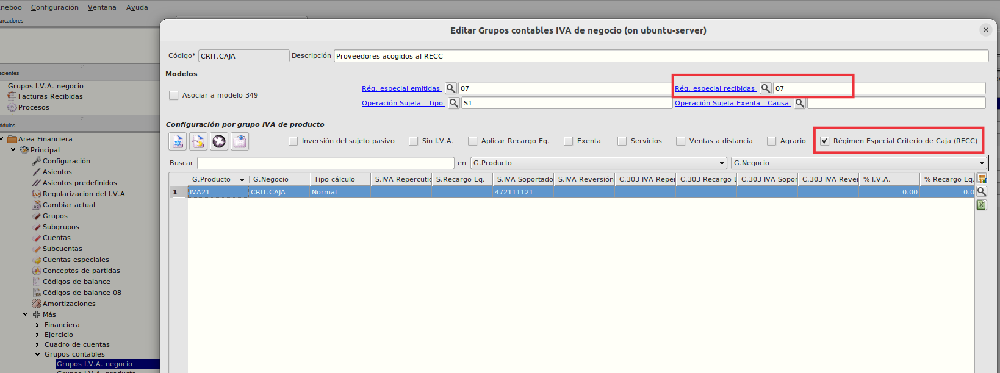

    + Crearemos tantas combinaciones del grupo de iva de negocio con grupo de producto (código de impuesto) como sea necesario informando siempre la subcuenta de IVA. Soportado.

    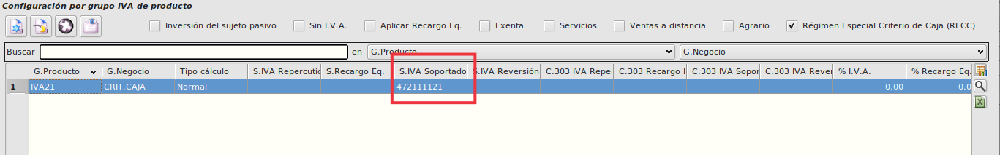

    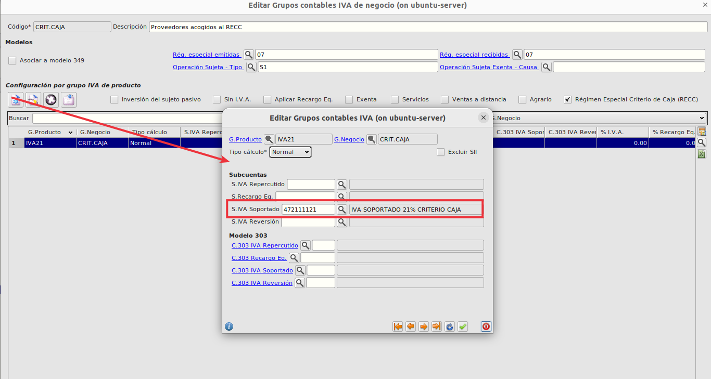

### Marcar proveedor acogido a criterio caja

Vamos al **Área de Facturación -> Principal -> Proveedores** y en la pestaña de **Contabilidad** asignaremos al proveedor el grupo de iva de negocio que hemos creado anteriormente configurado como criterio caja.

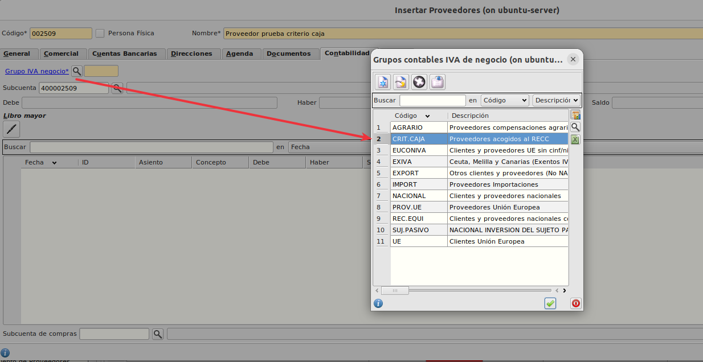

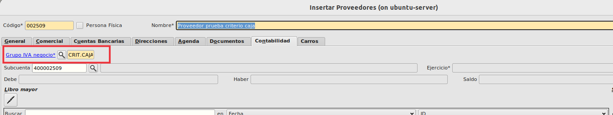

Esto hará que todas las facturas de proveedor asociadas a este proveedor se generen con este grupo de iva de negocio acogidas a criterio de caja.

### Generar factura de proveedor acogido a criterio caja

Crearemos una factura directa o a partir de un albarán desde el **Área de Facturación -> Facturación -> Facturas de compra** 

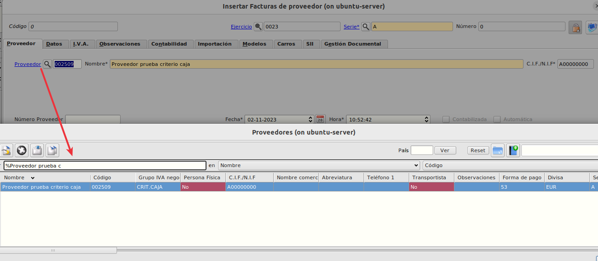

    Al seleccionar un proveedor que tenga el grupo de iva de negocio marcado como criterio caja esta factura,  automáticamente se marcará la factura para ser tratada como tal.

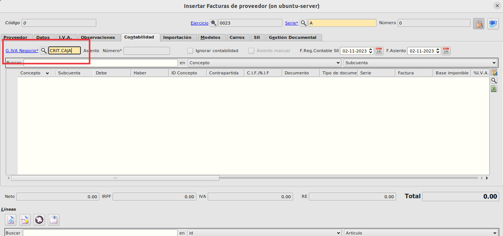

    Si tenemos instalada la extensión del SII, en la pestaña SII de la factura también se modificará automáticamente el valor de la clave de Régimen especial cuando tratemos de añadir líneas a la factura.

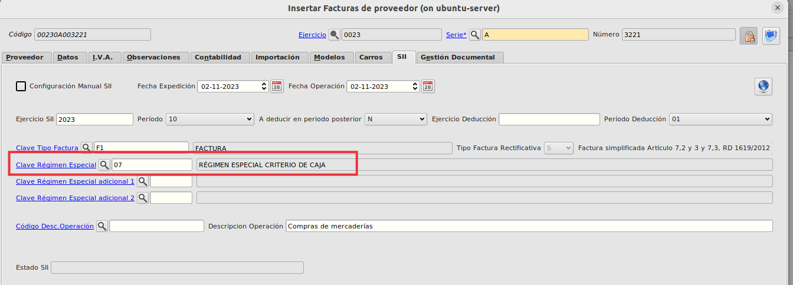

### Pago de recibo de factura de proveedor acogido a criterio caja

No hay cambio a la hora de pagar un recibo acogido a criterio de caja pero estos recibos se mostrarán en el informe de facuras recibidas.

### Informe de facturas recibidas

En el informe de facturas recibidas el cual podemos imprimir desde  **Área Financiera -> Informes -> Facturas recibidas** se mosrtarán los pagos realizados de facturas acogidas a criterio de caja y habrá una totalización aparte para estas facturas:

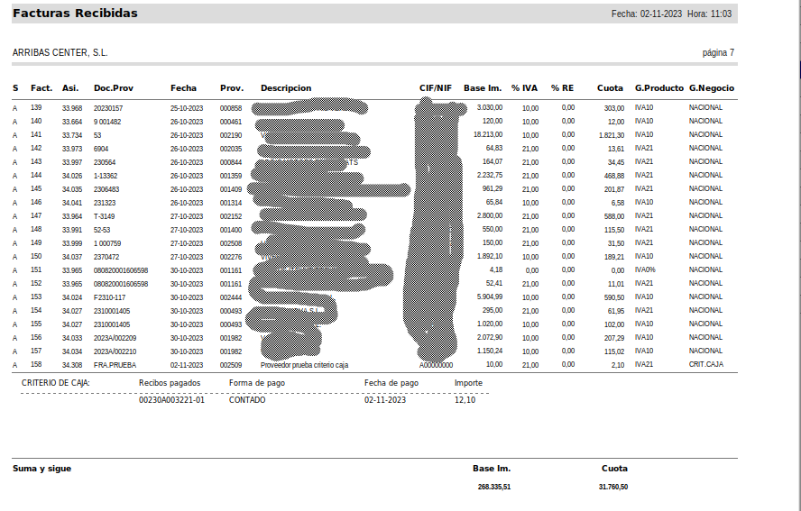

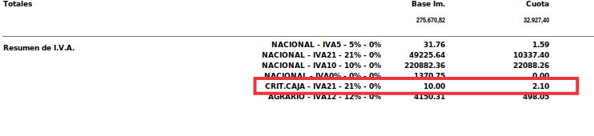

Lo mismo ocurre con el informe de facturas recibidas agrupado por grupo de negocio

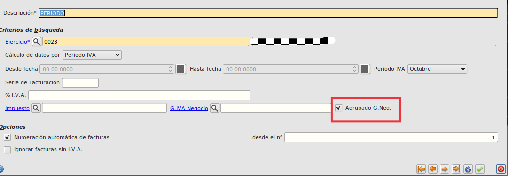

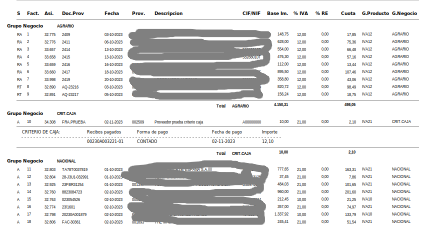

