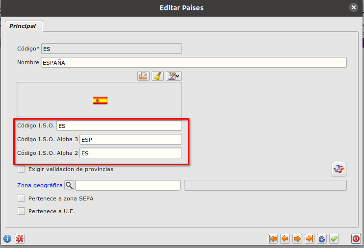
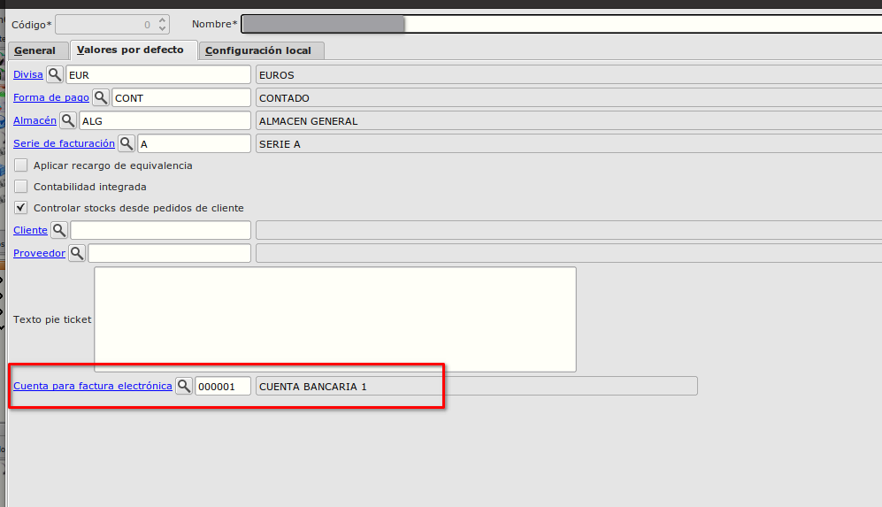

# Factura Electrónica / Configuración

Para el correcto funcionamiento de la generación y la firma de la factura electrónica debemos de configurar varios apartados dentro de Eneboo así como tener en el equipo guardado el certificado digital y la librería EnebooSignature.

## Formulario países
En el formulario **Países** tenemos que informar los campos *Código I.S.O.*, *Código I.S.O. Alpha 2* y *Código I.S.O. Alpha 3* para el país España tal como se muestra en la imagen.
El formulario países los podemos encontrar en **Área de Facturación -> Principal -> Países**

## Formulario Formas de Pago
En el formulario de **Formas de Pago** debemos de informar el campo *'Pago factura-e'* a aquellas formas de pago en las cuales se vaya a utilizar el formato Factura eléctronica.
El formulario países los podemos encontrar en **Área de Facturación -> Principal -> Formas de Pago**

## Formulario de Empresa
En el formulario de **Empresa** ( **Área de Facturación -> Principal -> Empresa**), en la pestaña **Valores por defecto** informaremos la cuenta bancaria que se utilizará en la factura electónica.

Dentro de la pestaña **Configuración local** está la pestaña **Factura electrónica** en la cual informaremos la ruta a la librería *EnebooSignature* y la ruta al *certificado digital*, ambos ficheros deben de haberse guardado previamente en el equipo.

## Configuración de ficha de cliente.
Para aquellos clientes a los cuales se vaya a vender con factura electrónica, en el formulario de **Clientes**, dentro de la pestaña **Factura-e** hay que informar los *Centros administrativos de cliente* en los cuales hay que introducir como mínimo los roles de *01-Fiscal*, *02-Receptor* y *03-Pagador*.
Dentro de la misma pestaña informaremos los campos *Extensión de factura-e* (xml por defecto), *Esquema facturae* y marcaremos el check de *Informar Albarán en factura-e* si queremos que se informe el albarán en el fichero.

### Más

  * [Volver al Índice](./index.md)

