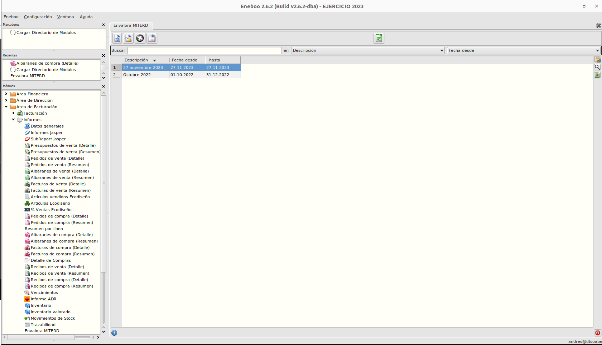

# Envalora

## Objetivo

Permitir la generación de los informes MITERD que llevan control sobre las ventas de los envases, permitiendonos saber qué cantidad de peso se ha vendido de cada material.

### Añadir composición a los envases

Para configurar los datos de los envases, se ha añadido una pestaña nueva "Envase" al formulario de "Artículos".
Ruta: **Area de facturacion -> Almacen -> Articulos**

Para poder guardar un artículo como un envase, hay que marcar el check, seleccionar un tipo de envase distinto a E00, seleccionar una clasificación (primario, secundario, terciario o difusores y trampas agroforestales) y rellenar los datos de composición en la tabla de materiales.

La suma de la columna de "% de composición" debe ser 100 para que se pueda guardar. Y si la fila correspondiente al plástico es distinta de 0, es obligatorio seleccionar un tipo de plástico.

### Informes

Para generar los distintos informes MITERD debemos dirigirnos al apartado "Envalora MITERD" en la siguiente ruta:
**Area de facturacion -> Informes -> Envalora MITERD**

Seleccionamos el informe que queramos imprimir y pulsamos en el botón de excel de la parte superior central.

Se abrirá una ventana de selección dónde podremos elegir el tipo de informe que queremos imprimir.

Una vez seleccionamos el tipo de informe, tendrémos que seleccionar la ruta donde queremos generar el archivo excel con el informe.

### Informe adjunto de composiciones

Ya que estos informes dependen de los datos de composición de los artículos compuestos (como la cantidad de envases que contienen), y de la composición de materiales de los envases. Si estos datos cambian en el tiempo, un mismo informe generado en 2 momentos diferentes puede ser distinto aunque no hayan cambiado las ventas.

Para poder justificar los resultados de informes ya generados, al momento de generar los informes se genera al mismo tiempo un archivo csv en la misma ruta donde generamos dicho informe, en el cuál se guardan los datos de composición de los productos vendidos al momento de generar el informe.

Este archivo tendrá de nombre la descripción del informe que hayamos generado seguido de la fecha y hora en la que se generó y el sufijo "\_comps".

El caracter separador de los datos de este archivo csv es "|".

### Más

  * [Volver al Índice](../index.md)
