# Envío Mail

Esta extensión incluye la funcionalidad de adjuntar un documento del programa (pedido, factura, etc.) en un e-mail a un cliente / provedor.

## Configuración

Para el correcto funcionamiento de envío mail hay que configurar unos parámetros generales y según el cliente de correo y el sistema operativo tendremos que realizar unas configuraciones específicas.

### Configuración general

Dentro de **Área de Facturación -> Principal -> Empresa** iremos a la pestaña **Configuración local** y dentro de esta a **Envío mail**.
Aquí tenemos que informar:
- Tipo de cliente de correo: Seleccionaremos un valor entre los posibles (Eneboo, Kmail, Thunderbird, Outlook, Python)
- Directorio temporal: Inforaremos la carpeta donde se guardarán temporalmente los adjuntos del correo.

### Configuración Thunderbird
#### Linux
- Nombre y ruta de la aplicación: Por defecto lo informa al seleccionar el tipo de correo, si no lo hace hay que informar *thunderbird*

#### Windows

- Nombre y ruta de la aplicación: Informaremos la **ruta completa** del ejecutable de Thunderbird:

- Variables de entorno: Editaremos las variables de entorno y añadiremos una entrada al path con la ruta completa del ejecutable de Thunderbird:

### Configuración Outlook
#### Windows

- Nombre y ruta de la aplicación: Informaremos la **ruta completa** del ejecutable de Outlook:

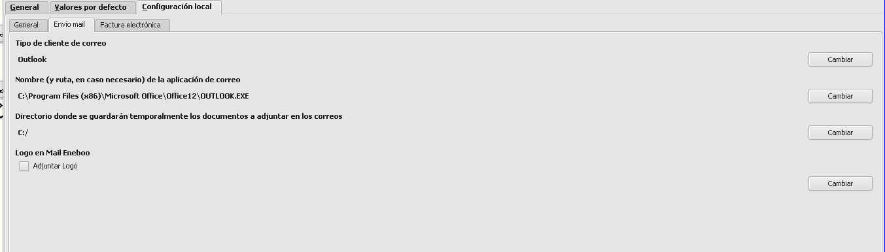

- Variables de entorno: Editaremos las variables de entorno y añadiremos una entrada al path con la ruta completa del ejecutable de Outlook:

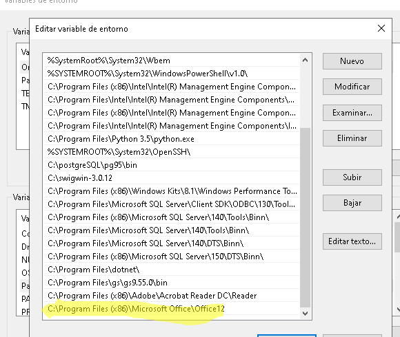

## Configuración de e-mails en clientes

- Cuando enviemos un e-mail desde presupuestos, pedidos, albaranes o facturas, el e-mail al que se enviará el correo será el que esté configurado en la ficha del cliente, bien en el campo *E-mail* de la pestaña **General** o bien en los e-mails configuarados en la pestaña de **Agenda**.

### Configuración e-mail principal

- En la pestaña **General** de la ficha de clientes informaremos el e-mail principal del cliente

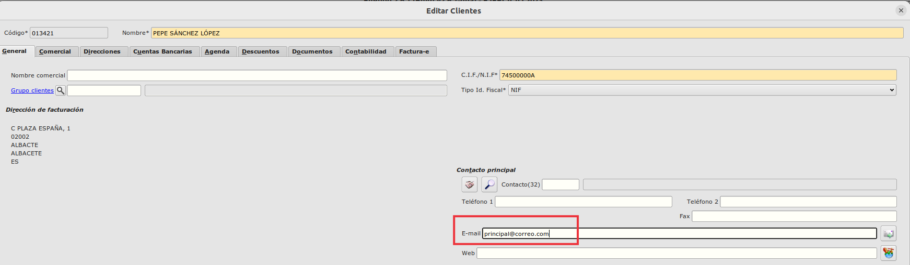

### Configuración e-mail contactos

- En la pestaña de **Agenda** de la ficha de clientes tenemos una tabla para asignar distintos contactos al cliente, cada contacto tiene un campo para informar su e-mail.

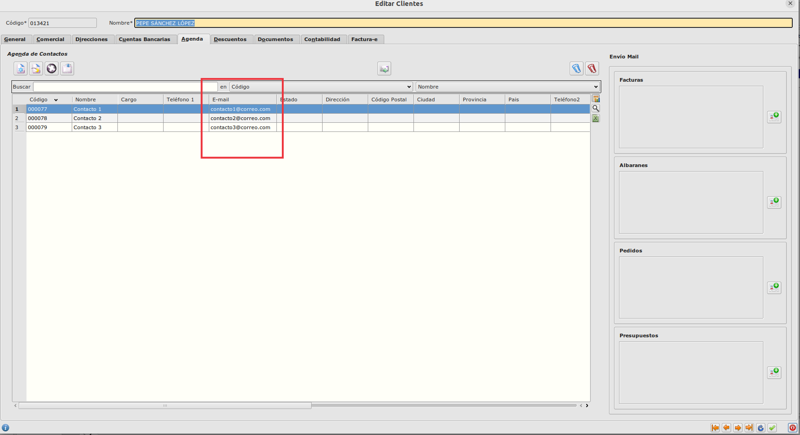

- En la misma pestaña, en la parte de la derecha podemos configurar para cada tipo de documento uno o varios e-mails de tal forma que al seleccionar un documento desde su maestro y pulsar sobre el botón de envío mail, se enviará a las direcciones de correos que se hayan configurado según el tipo de documento.

- Si queremos configurar los e-mails destinos a los que se enviarán cuando pulsemos en enviar correo desde el maestro de facturas, pulsaremos sobre el botón de añadir e-mails en el recuadro de facturas.

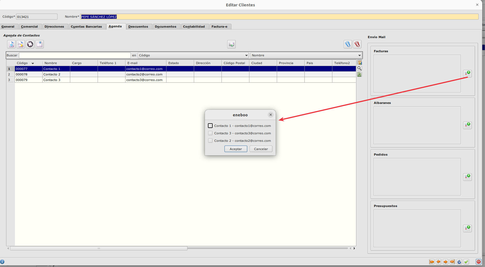

- Seleccionaremos una o varias direcciones de correo y aceptaremos.

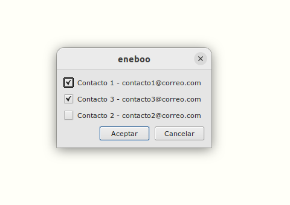

- Se quedarán guardadas las direcciones de los e-mails de dicho cliente a los que se enviarán los correos cuando pulsemos el botón de enviar e-mail de una factura de dicho cliente.

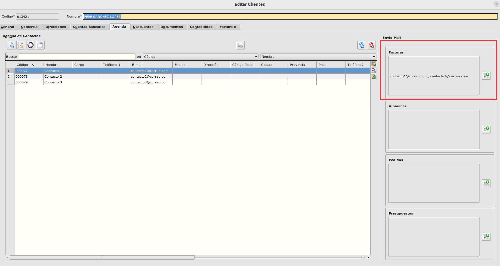

### Prioridad de selección de e-mail

- A la hora de enviar un documento por e-mail, primero se mirará si existe para el tipo de documento uno o varios e-mails configurados en la pestaña **Agenda** de la ficha del cliente, si no existe ningún e-mail configurado para el tipo de documento entonces mirará el e-mail configurado en la pestaña **General** 

## Envío de e-mail desde maestro de documentos

- En los maestros de presupuestos, pedidos, albaranes y facturas de clientes existe un botón el cual teniendo seleccionado un documento, enviará un e-mail a la dirección de correo configurada siguiendo la prioridad descrita anteriormente adjuntando una copia del impreso del documento correspondiente.

- En el ejemplo podemos ver como se adjunta la factura 20230A000001 y se envía a los destinatarios que habíamos configurado en la ficha del cliente, en la pestaña de Agenda en el recuadro de facturas.

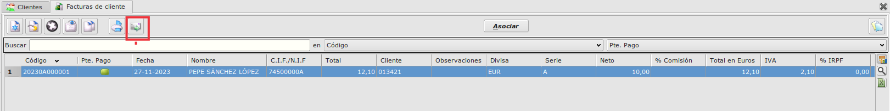

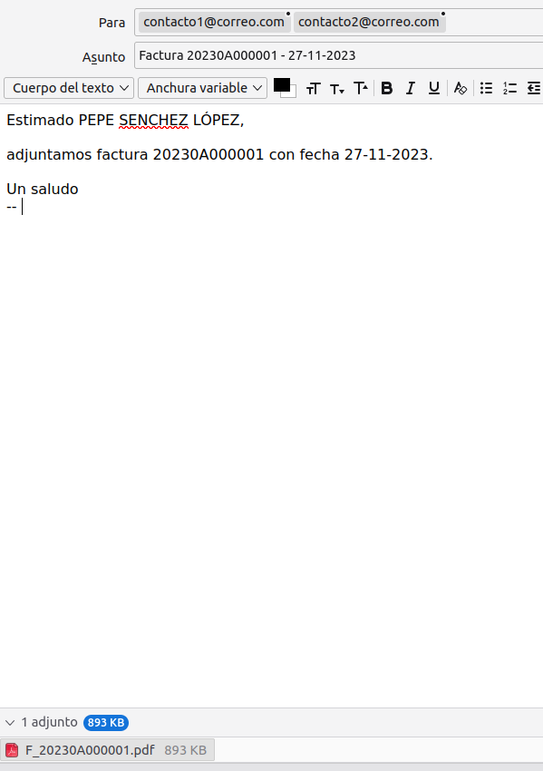

## Uso de plantillas en envío de correos

- Desde el **Área de facturación -> Más -> Principal -> Plantillas mail** podemos crear plantillas para el envío de mail

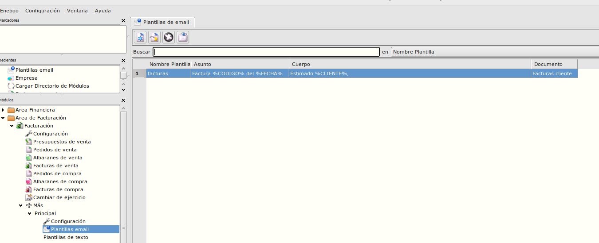

- Para crear una nueva plantilla pulsaremos en nuevo registro e informaremos los siguientes campos: *Asunto* (asunto del correo), *Cuerpo* (el texto del correo) y *Nombre Plantilla* (es el nombre de la plantilla) y seleccionaremos en el depl

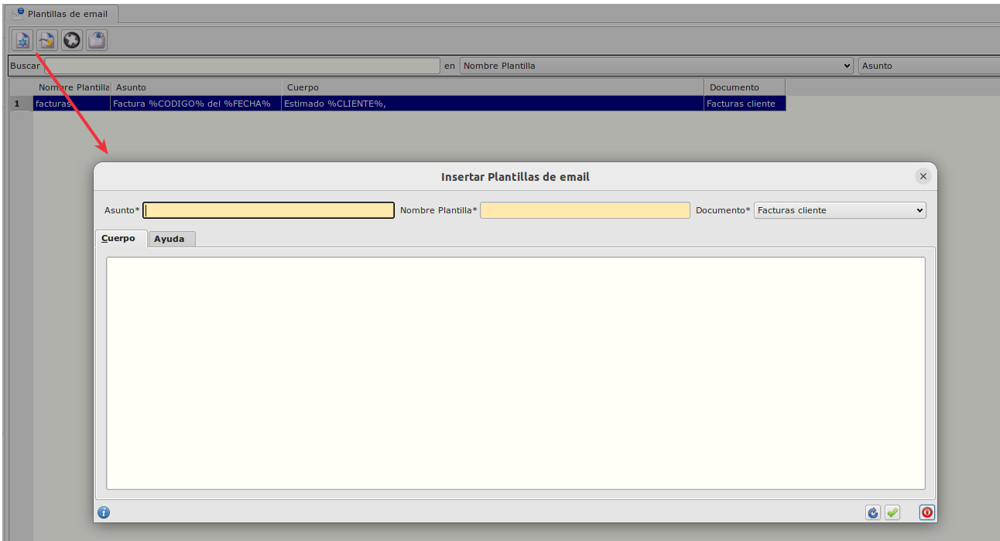

    . Asunto: Asunto asunto del correo.
    . Cuerpo: El texto del correo
    . Nombre plantilla: Nombre que le damos a la plantilla
    . Documento: Desplegable con el tipo de documento en el que se utilizará la plantilla.

- En los campos *Asunto* y *Cuerpo* podremos utilizar etiquetas las cuales se sustituirán al enviar el mail con los datos del documento que se va a enviar.

- En la pestaña de *Ayuda* podemos ver que etiquetas se pueden usar y por qué datos serán sustituidas:

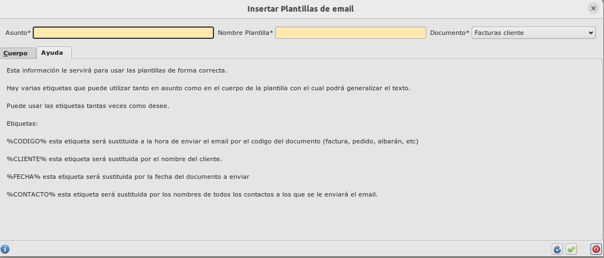

### Ejemplo de plantilla

* En el siguiente ejemplo podemos ver una plantilla que se utliza en facturas donde utilizamos las etiquetas que se sustituirán por el nombre del cliente, el código de la factura y la fecha del documento.

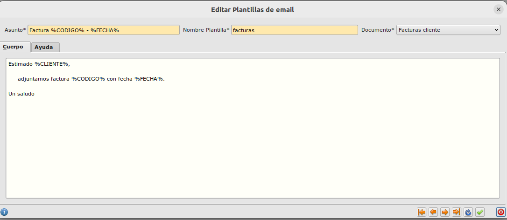

* La factura 20230A00001 con fecha 27-11-2023 es del cliente *PEPE SÁNCHEZ LÓPEZ*

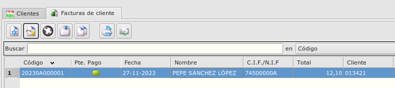

* Si pulsamos en el botón de enviar mail, se utilizará la plantilla de facturas y sutituirá las etiquetas que hemos incluido en los campos *Asunto* y *Cuerpo* de la plantilla por los datos de la factura:

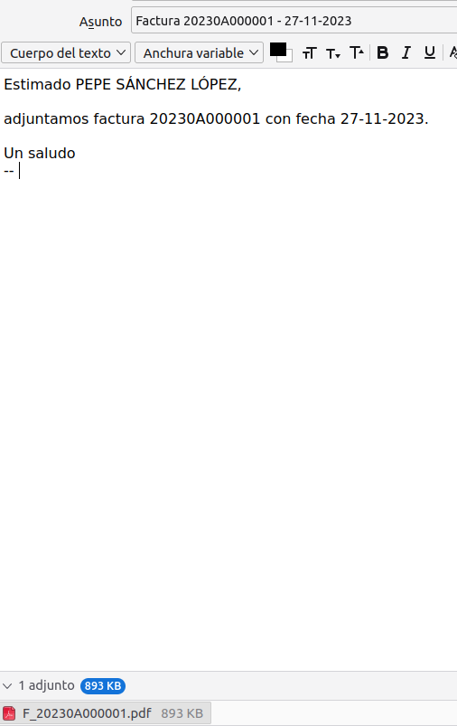

