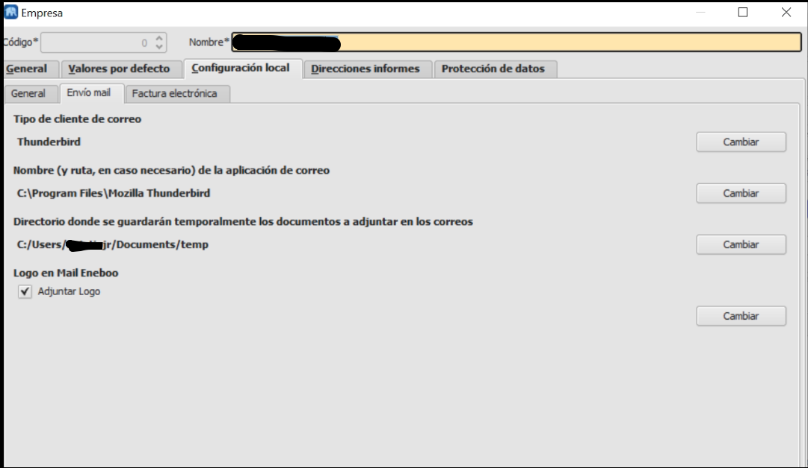
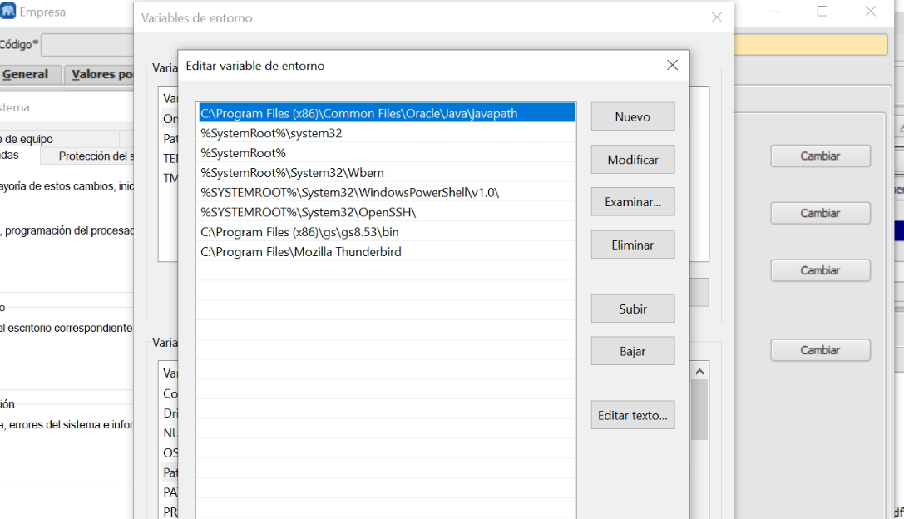

# Envío Mail

Esta extensión incluye la funcionalidad de adjuntar un documento del programa (pedido, factura, etc.) en un email a un cliente / provedor.

## Configuración

Para el correcto funcionamiento de envío mail hay que configurar unos parámetros generales y según el cliente de correo y el sistema operativo tendremos que realizar unas configuraciones específicas.

### Configuración general

Dentro de **Área de Facturación -> Principal -> Empresa** iremos a la pestaña **Configuración local** y dentro de esta a **Envío mail**.
Aquí tenemos que informar:
- Tipo de cliente de correo: Seleccionaremos un valor entre los posibles (Eneboo, Kmail, Thunderbird, Outlook, Python)
- Directorio temporal: Inforaremos la carpeta donde se guardarán temporalmente los adjuntos del correo.

### Configuración Thunderbird
#### Linux
- Nombre y ruta de la aplicación: Por defecto lo informa al seleccionar el tipo de correo, si no lo hace hay que informar *thunderbird*

#### Windows

- Nombre y ruta de la aplicación: Informaremos la **ruta completa** del ejecutable de Thunderbird:

- Variables de entorno: Editaremos las variables de entorno y añadiremos una entrada al path con la ruta completa del ejecutable de Thunderbird:

