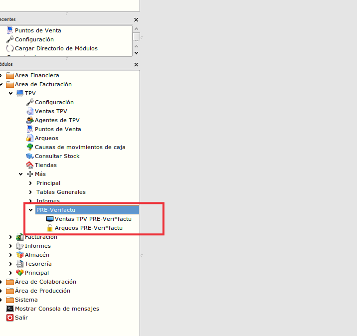
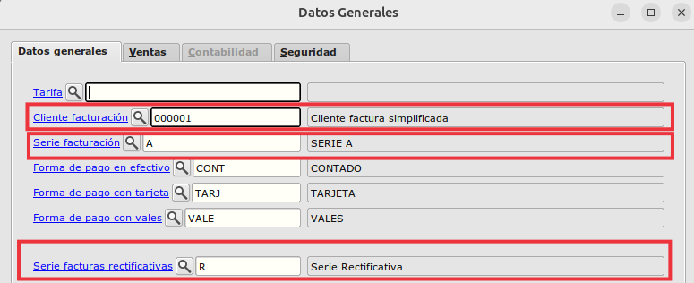
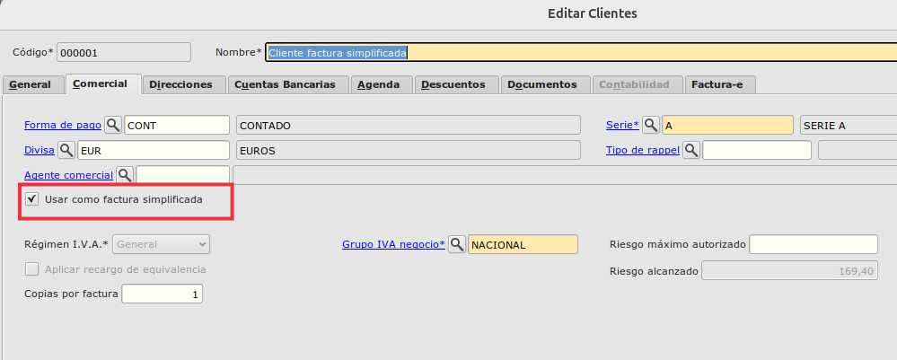

## Integración TPV con Fiskaly y Veri*Factu

- La idea principal es que se puedan generar facturas en vez de tickets desde el TPV.

- Estas facturas son facturas simplificadas y la impresión de estas deben de tener el QR pero en el formato del ticket.

- El funcionamiento es el mismo que el actual pero cambiando la tabla **tpv_comandas** por **facturascli** y la tabla **tpv_lineascomanda** por la tabla **lineasfacturascli**.

- Cuando se realiza la venta justo antes de imprimir el ticket, se realiza el envío a Fiskaly de esta factura para obtener el QR y poder imprimirlo en el ticket.

- La parte de pagos no cambia así como la de arqueos.

- Hay que modificar los tickets para poder incluir el QR, se ha realizado un formato en **jasper** que facilita la inclusión del QR y  que mejora la impresión que se realizaba hasta hora por **ESC/POS**.

- Ahora diferenciaremos las ventas **PRE_Verifactu** de las ventas que hagan después de instalar la extensión **tpv_verifactu** por el cambio de tablas así como los arqueos, el motivo de no tenerlas juntas es para poder reimprimir si hicera falta tanto ventas o arqueos. 

- Tanto las ventas anteriores a verifactu como los arqueos estarán dentro de una nueva situada en **Área deFacturación -> TPV -> Más -> PRE-Verifactu** 

    

- Para que funcione el nuevo TPV con las tablas de facturas, una vez que instalemos la extensión, a parte de la configuración de propia de verifactu ([https://yeboyebo.github.io/manuales_publicos/extensiones/fiskaly/instconfverifactu.html](https://yeboyebo.github.io/manuales_publicos/extensiones/fiskaly/instconfverifactu.html)), realizaremos las siguientes configuraciones:

- Marcar el campo **pre_verifactu** en la tabla de **tpv_arqueos** con el valor **true**, de esta forma, saldrán los arqueos anteriores a verifactu en el la acción prevista para ello.

    ```SQL
        UPDATE tpv_arqueos SET pre_verifactu = true;
    ```

- Actualizar la secuencia de de facturascli con la máxima entre la secuencia de facturas y de la de comandas

    ```SQL
        select setval('facturascli_idfactura_seq',(select max(max_id) from (select max(idfactura) as max_id from facturascli union select max(idtpv_comanda) as max_id from tpv_comandas) as tablas_fra));
    ``` 

- Dentro del formulario de **Configuración** del módulo de **TPV** tenemos que informar:

    

    - CLiente de facturación, el cual debe de estar marcado como **Usar como factura simplificada**  

        

    - Serie de facturación.

    - Serie facturas rectificativas

    - Serie facturas simplificadas
