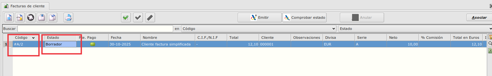
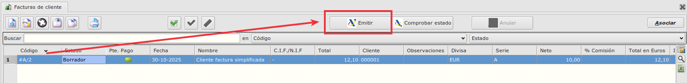
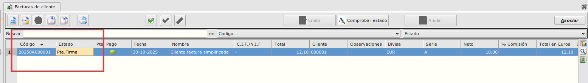
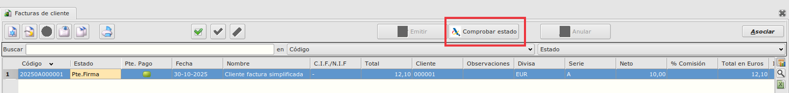
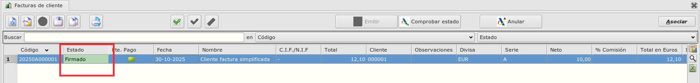
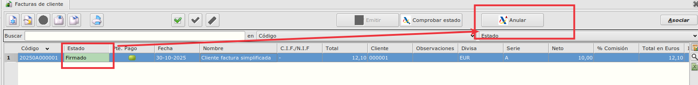
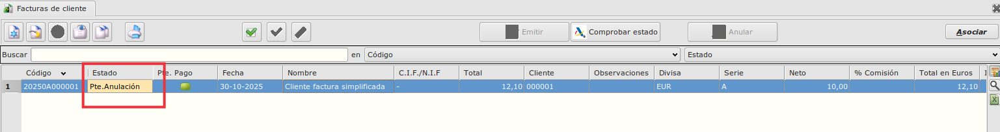
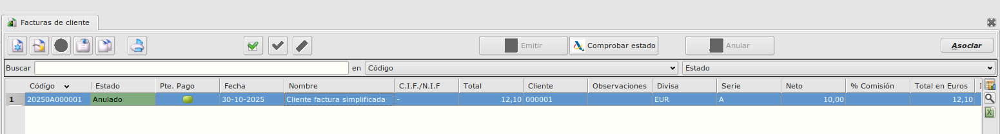
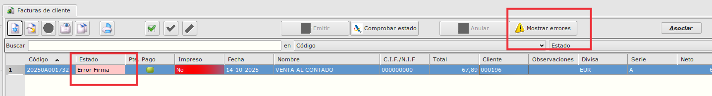
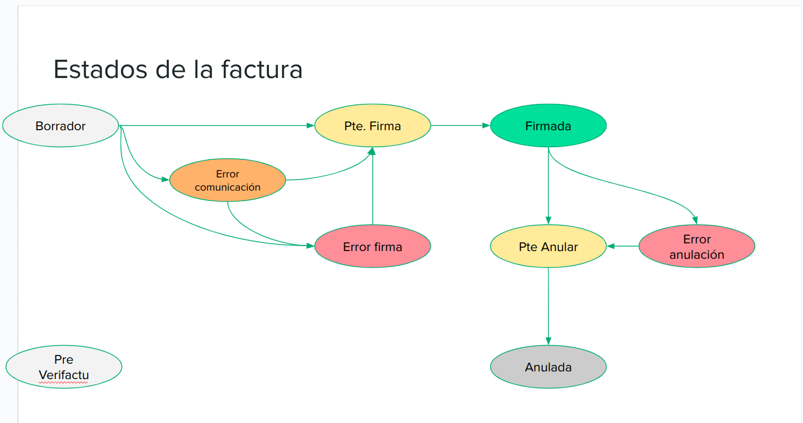

## Manual usuario Fiskaly-Veri*Factu

### 1. Proceso crear/firmar facturas 
#### 1.1. Crear factura (borrador)

- Una vez resgistrados en Fisklay y se ha informado toda la configuración en el ERP, podremos crear facturas y firmarlas con Fiskaly.

- El proceso de creación de facturas es el estandard del ERP pero hasta que la factura no se emite a Fiskaly y queda firmada no estará en firme.

- Al crear la factura, no tiene un código estándard, nos da un código de borrador y el estado será **Borrador**

- En este estado podemos:
    - Modificar o borrar las facturas
    - Enviarlas al cliente para su aprobación, en un informe que indicará claramente que se trata de un borrador y no de una factura emitida.

- Los borradores de factura no son facturas emitidas.

- Cuando se emite un borrador:
    - Se le da un código definitivo y se actualiza su fecha y hora de emisión
    - Se registra su asiento contable de la factura y se crean sus recibos
    - Se llama a la API de Fiskaly para registrar la factura y obtener el QR

- Una vez emitida, la factura no puede modificarse ni borrarse

#### 1.2. Emitir factura

- Con el borrador seleccionado, pulsamos en el botón **Emitir** 

- Cuando pulsamos el botón de **Emitir** podemos tener los siguientes escenarios:

    - Aviso de Eneboo
        - Puede ser que Eneboo no nos deje continuar con la emisión si la factura tiene algún tipo de problema (factura simplificadas de más de 400€, CIF y nombre no coincidentes, etc).

    - Estado **Pte.Firma**
        - La factura ha sido recibida y validada por Fiskaly. Falta que Fiskaly la envíe a la AEAT. Esto sucede casi instantáneamente.

        

    - Estado **Error comunicación** (no hay conexión de red)
        - Cuando no hay conexión, Eneboo genera un QR que permite continuar la emisión de la factura.

        - Cuando se reestablece la conexión, el envío de las facturas con este error lleva una etiqueta que las identifica de la forma que la AEAT exige en estos casos.

    - Estado **Error Firma**
        - Fiskaly no admite la factura por alguna validación. Contactar con soporte.

- Una vez que hemos emitido la factura, será firmada por Fiskaly y la siguiente factura que se presente obtendrá la información del estado de las facturas en estado **Pte.Firma** y actualizará el estado como **Firmada** si todo ha ido bien.

- Una forma alternativa de actualizar el estado sin tener que esperar a enviar otra factura es pulsando el botón de **Comprobar estado**. 

### 2. Proceso anular facturas 

- Las facturas que tengan el estado de **Firmada** o **Error firma** , pueden ser anuladas. 

- Con la factura seleccionada, pulsaremos el botón de **Anular**

- Al anular:
    - Se genera un asiento de anulación

    - Se borran los recibos asociados (una factura anulada no puede estar pagada)

    - Se informa a Fiskaly de su anulación, pasando a estado Pte.Anular.

- Al igual que las facturas Firmadas, para actualizar el estado de **Pte.anular** a **Anulada**, pulsaremos en el botón de **Comprobar estado** o en la siguiente factura que se envée a Fiskaly se actualizará.

### 3. Errores

- Podemos tener 3 estados distintos de errores:

    - **Error Comunicación** --> Ocurre cuando no hay comunicación con Fiskaly y no se ha podido enviar, este error se solucionará cuando hay internet. Mientras tanto, eneboo genera un QR manual para que se pueda imprimnir.

    - **Error Firma** --> Ocurre cuando ha dado un error al firmar, estos errores serán los menos porque están controlados por el propio ERP y habría que contactar con soporte para poder solucionarlo.

    - **Error Anulación** --> Similar al Error firma pero cuando se está anulando.

- Cuando existe un error, se activa el botón de **Mostrar errores** el cual nos muestra un mensaje con el error que ha ocurrido.

- En resumen, estos son los estados por los que puede pasar desde borrador a factura.

### 4. Impresión de facturas

- En las facturas que se impriman, obligatoriamente debe de aparecer el QR generado al presentarse en la AEAT.

### 5. Estado PRE_Verifactu

- Todas las facturas que están creadas antes de la implantación de Fiskaly/Veri*Factu, serán marcadas con el estado **PRE_Verifactu**, este estado permite modificar y borrar las facturas pero no presentarlas.