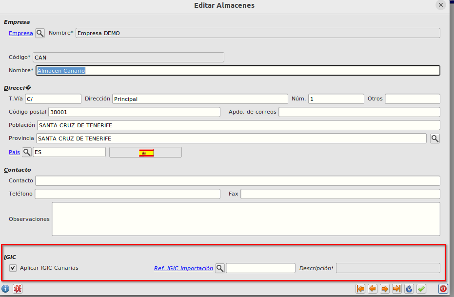
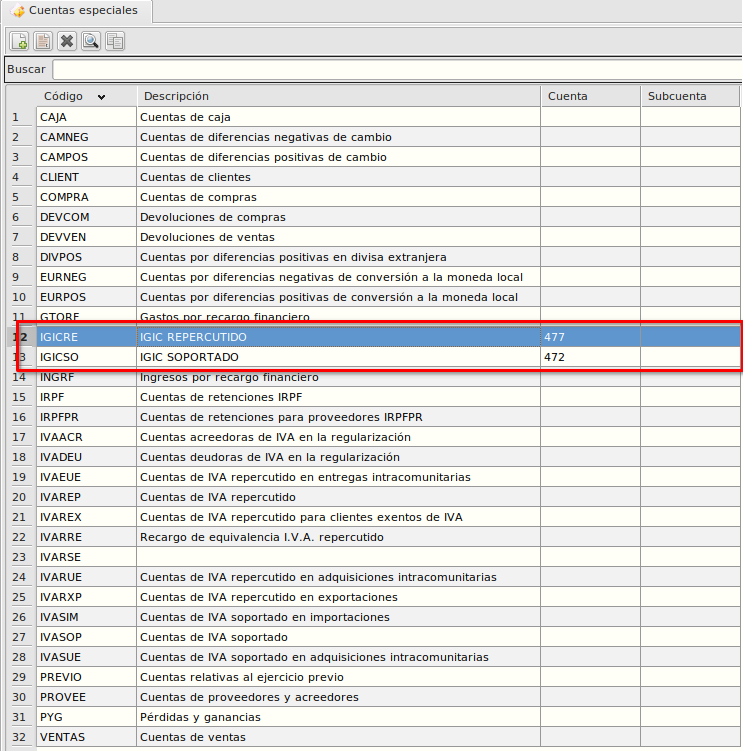
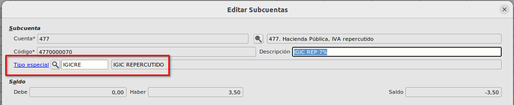
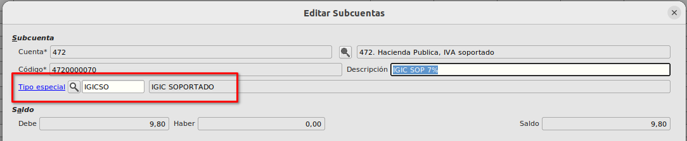
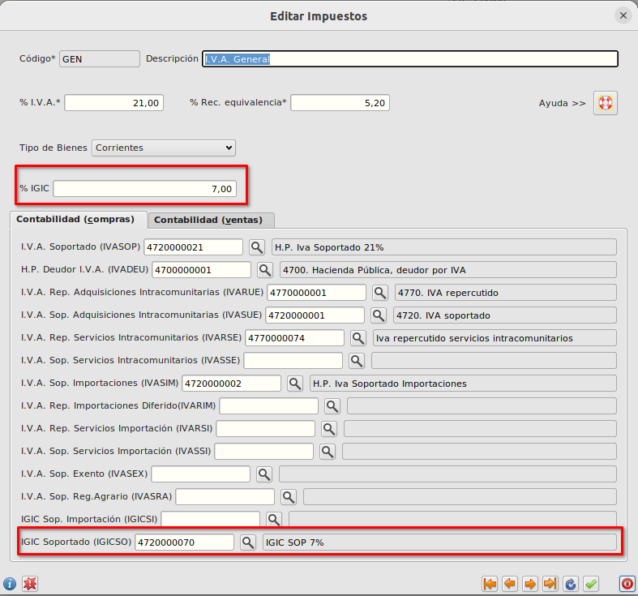
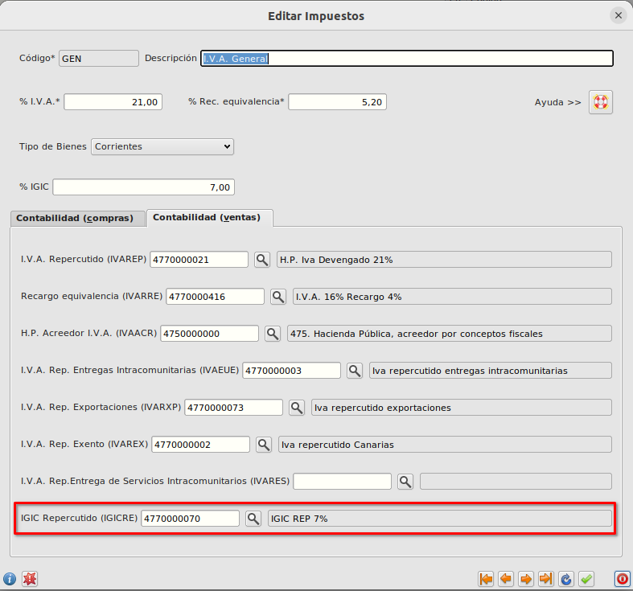
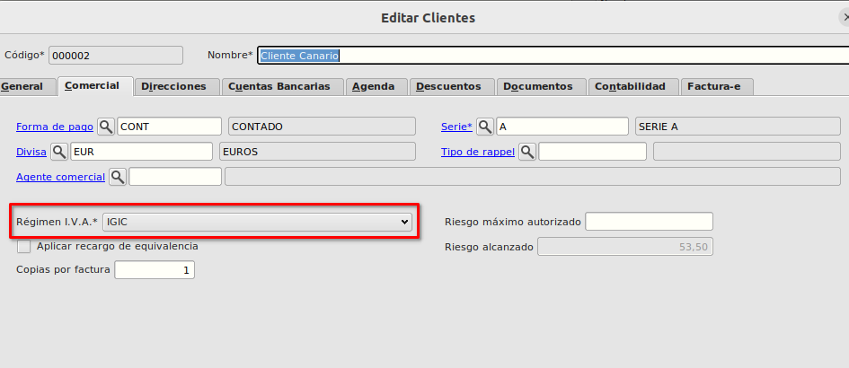
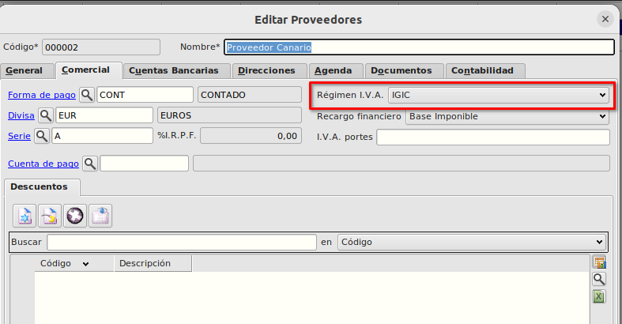

# IGIC Canarias / Configuración

Para el correcto funcionamiento del IGIC Canarias debemos de realizar una serie de configuraciones

## Configuración de almacenes
Debemos de marcar aquellos almacenes donce queremos que se aplique el IGIC. 

En el formulario **Almacenes** tenemos el check *Aplicar IGIC Canarias* el cual marcaremos para aquellos almacenes en el que queremos que se aplique IGIC en vez de IVA.

En el mismo formulario tenemos un campo para poder informar si es necesario la Referencia IGIC importación (sólamente aplicable con la extensión de varios duas la cual permite incluir mas de un DUA en una misma factura de transitario).

El formulario almacenes los podemos encontrar en **Área de Facturación -> Almacén -> Almacenes**

## Configuración de cuentas especiales
En el formulario de **Cuentas especiales** debemos de crear dos nuevas cuentas especiales, *IGICRE* (IGIC repercutido) e *IGICSO* (IGIC soportado).

El formulario de cuentas especiales lo podemos encontrar en **Área Financiera -> Principal -> Cuentas especiales**

## Configuración de subcuentas IGIC soportado e IGIC repercutido
En el formulario de **Subcuentas** crearemos tantas subcuentas de IGIC repercutido e IGIC soportado como nos hagan falta. 

El formulario de subcuentas lo podemos encontrar en **Área Financiera -> Principal -> Subcuentas**

Al crear la subcuenta hay que asignarle la cuenta especial *IGICRE* para el caso de subcuentas de IGIC repercutido 

y la cuenta especial *IGICSO* para el caso de subcuentas de IGIC soportado

## Configuración de impuestos
Tenemos que configurar cada uno de los distintos impuestos (General, Reducido, Superreducido...) para indicar el *%IGIC* que corresponde así como las subcuentas de *IGIC Soportado* e *IGIC Repercutido* que se utilizarán en las partidas de IGIC del asiento de facturas.

El formulario de impuestos lo podemos encontrar en **Área de Facturación -> Principal -> Impuestos**

## Configuración de clientes y proveedores.
Para aquellos clientes/proveedores canarios a los cuales vayamos a vender/comprar utilizando IGIC, tenemos que marcarlos con el régimen general *IGIC*.

En el formulario de **Clientes** y en el formulario **Proveedores**, dentro de la pestaña **Comercial** modificaremos el campo *Régimen I.V.A.*.

### Más

  * [Volver al Índice](./index.md)

