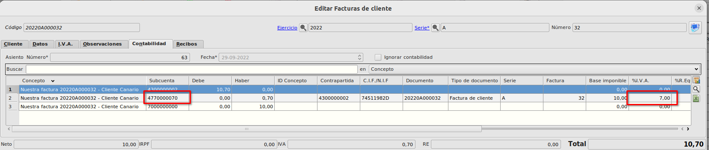

# IGIC Canarias / Funcionamiento

Para el correcto funcionamiento se debe de haber realizado la configuración tal y como se indica en el apartado [Configuración](./configuracion.md)

## Generación de documentos de ventas/compras con IGIC
Cuando generemos un documento de venta (presupuesto/pedido/albarán/factura) o un documento de compra (pedido/albarán/factura) en los que queramos que se aplique el IGIC tendremos que tener en cuenta que el cliente/proveedor tenga marcado el *Régimen I.V.A.* como *IGIC* y que el almacén del documento tenga marcado el check de *Aplicar IGIC Canarias*, de esta forma, el régimen de IVA del documento será *IGIC* porque lo heredará automáticamente del cliente y el %IVA de las líneas se informará automátiamente con el %IGIC asociado al código de impuesto de la línea en vez de el %IVA.

El régimen de IVA de cada documento de venta para clientes con Régimen de IVA IGIC se calculará de la siguiente forma:
* Si el almacén de salida **no es Canarias**, el régimen será Exportaciones, y el IVA del documento será 0. Contablemente se usarán las subcuentas de IVA repercutido asociadas al régimen Exportaciones.
* Si el almacén **es Canarias**, el régimen de IVA será IGIC, y el IVA del documento será el correspondiente porcentaje de IGIC asociado a cada código de impuesto indicado en las líneas.

Validaciones:
* Si el régimen es IGIC, la provincia de destino del albarán asociado, si lo hay, debe ser de Canarias.
* Si se intenta modificar el régimen de IVA en estos casos para no hacerlo coherente con el almacén, se advertirá al usuario "El régimen de IVA / IGIC no es coherente con el almacén de salida de la mercancía"

Una vez que guardamos la factura, el asiento se generará con una partida de donde el %IVA es el %IGIC 

## Informes de facturas emitidas y de facturas recibidas
Desde **Área Financiera -> Informes -> Facturas Emitidas** podemos imprimir el informe de las *Facturas Emitidas* para un determinado periodo de tiempo. Este informe se ha modificado para que las facturas que contienen IGIC se muestren y además se han añadido 2 columnas nuevas *%IGIC* e *IGIC* para mostrar el % de impuesto que se aplica.
Estas facturas no suman a los totales ya que son exentas en cuanto a impuestos de IVA se refieren.

De forma similar podemos imprimir el informe de *Facturas Recibidas* desde **Área Financiera -> Informes -> Facturas Recibidas** donde al igual que el de facturas emitidas se muestran 2 nuevas columnas con el *%IGIC* e *IGIC* y tampoco suman a los totales.

 

### Más

  * [Volver al Índice](./index.md)
