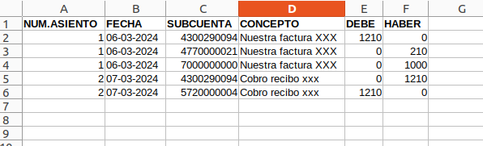
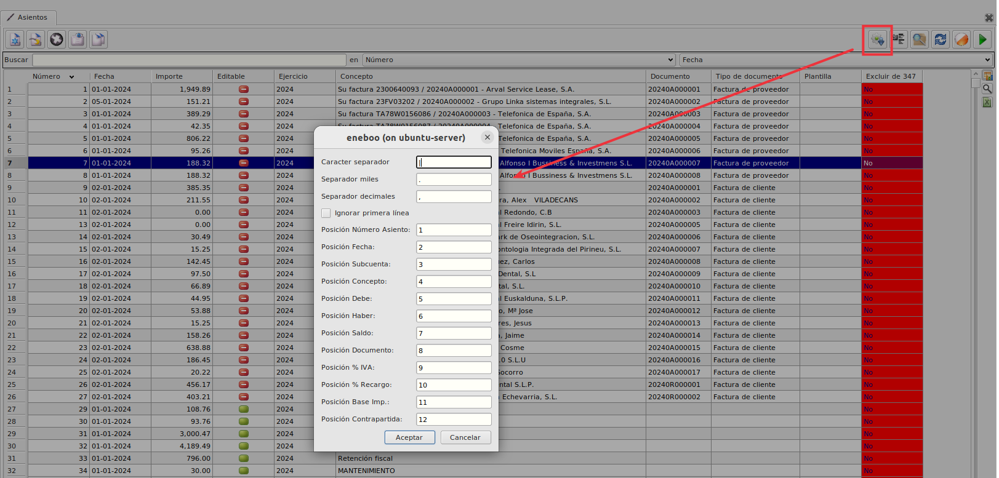
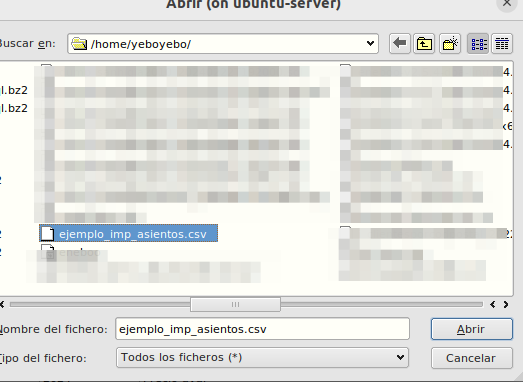

# Importar asientos

Esta extensión permite importar asientos a partir de un fichero csv..

### Funcionalidad

Los datos mínimos que debe contener el fichero csv para poder importarlo son:

    Número de asiento - Fecha - Subcuenta - Concepto - Debe - Haber
Aunque puede contener también:

    Saldo - Documento - % IVA - % Recargo - Base imponible - Subcuenta contrapartida

En el ejemplo vemos 2 asientos, uno que sería una factura con 3 partidas y otro con el cobro del asiento.

En el maestro de Asientos podemos ver un nuevo botón "Importar asientos".
Al pulsar nos aparecerá un diálogo para configurar las columnas de nuestro csv.
Marcaremos "Ignorar primera línea" en caso de que nuestro csv contenga título y cambiaremos las columnas necesarias y pulsaremos aceptar

Nos pedirá seleccionar el fichero csv

Seleccionamos y al aceptar se generarán los asientos.

### Más

  * [Volver al Índice](../index.md)

