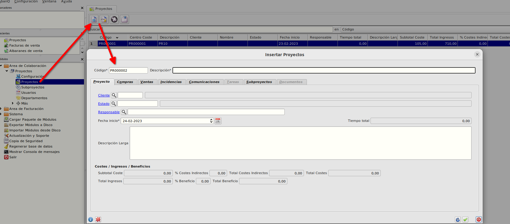
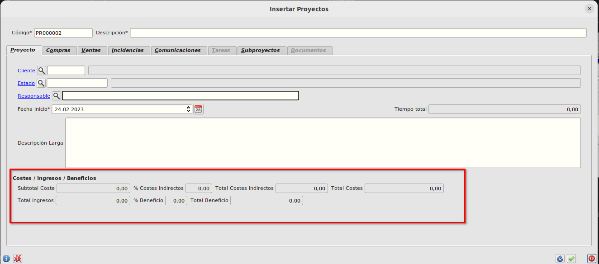
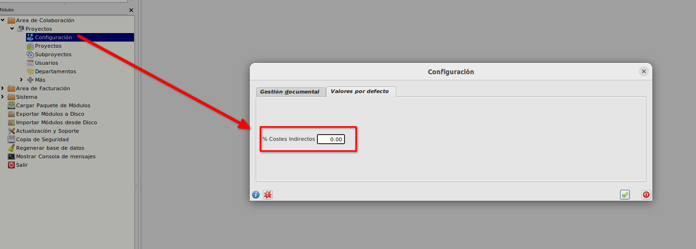
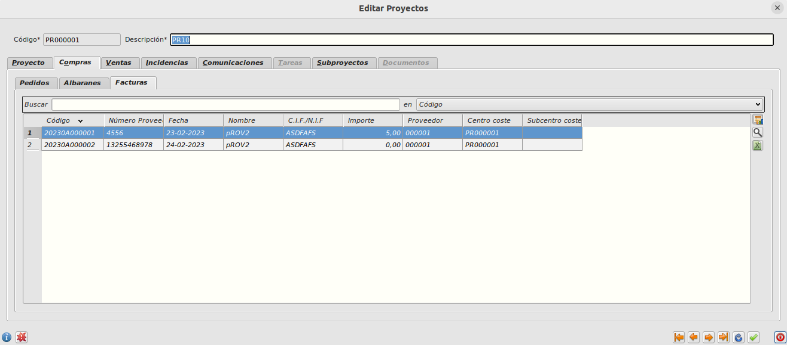
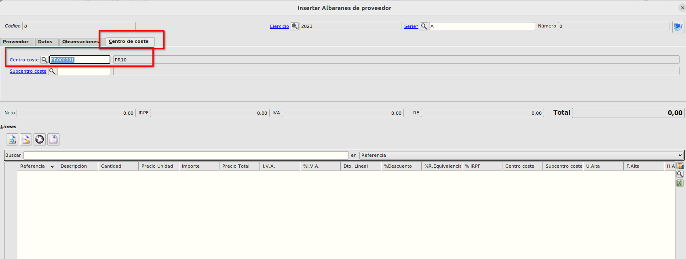
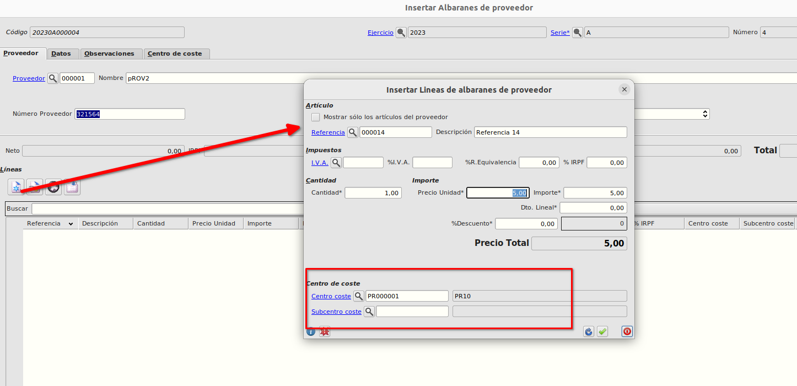
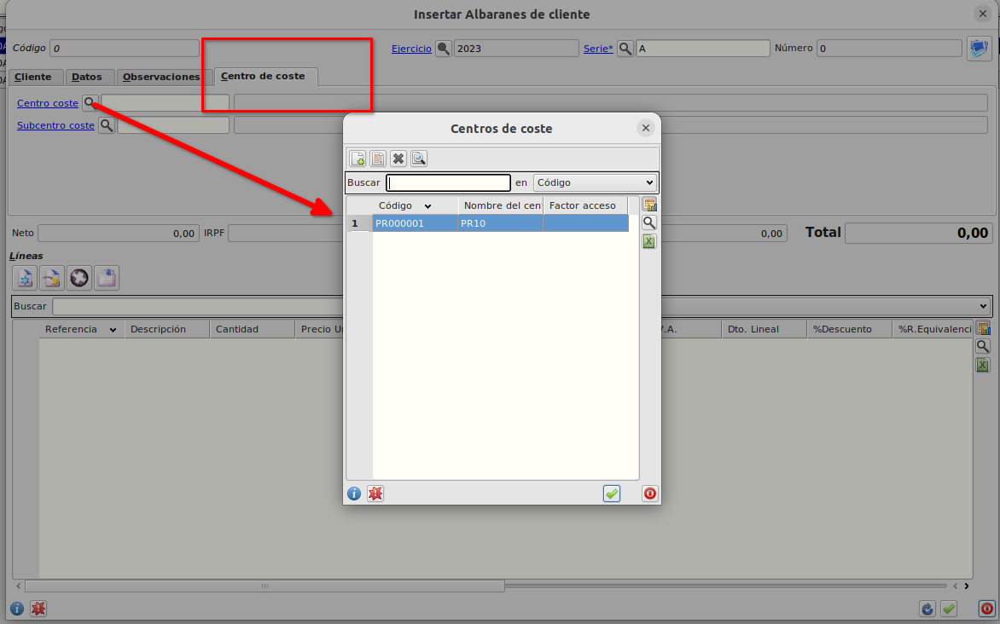
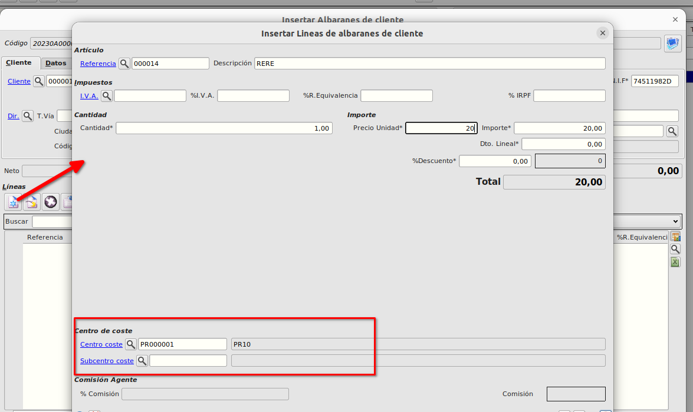

# Proyectos CC

## Creación de un proyecto
Desde el **Área de colaboración -> Proyectos -> Proyectos** podemos crear un proyecto.



Al pulsar nuevo registro informaremos en la primera pestaña **Proyecto** obligatoriamente la *Descripción* y cambiaremos la *Fecha Inicio* si es necesario, por defecto se crea con la fecha actual.

En la parte de abajo del formulario, podemos ver el apartado dónde se irán totalizando los costes e ingresos del proyecto:



- Subtotal Coste --> Este campo se calcula automáticamente como la suma del neto de albaranes de proveedor no facturados y del neto de facturas de proveedor donde se ha informado el proyecto en su cabecera más la suma del neto de las líneas de albaranes de proveedor no facturados y del neto de las líneas de facturas de proveedor donde se ha informado el proyecto.
- % Costes indirectos --> Este campo se informa automaticamente con el % parametrizado en **Área de colaboración -> Proyectos -> Configuración**



- Total Costes Indirectos --> Resultado de aplicar el *% Costes Indirectos* al *Subtotal de costes*.
- Total Costes --> Subtotal Coste + Total Costes Indirectos.
- Total Ingresos --> Este campo se calcula automáticamente como la suma del neto de albaranes de cliente no facturados y del neto de facturas de cliente donde se ha informado el proyecto en su cabecera más la suma del neto de las líneas de albaranes de cliente no facturados y del neto de las líneas de facturas de cliente donde se ha informado el proyecto.
- % Beneficio --> Calculado como:
```
 Total Ingresos - Total Costes
 ________________________________  X 100
       Total Costes
```
- Total Beneficio --> Total Ingresos - Total Costes

### Pestaña Compras
- En la pestaña de compras podemos los documentos que están asociados al proyecto



### Pestaña Ventas
- En la pestaña de ventas podemos los documentos que están asociados al proyecto


## Asignación de albarán o factura de proveedor a un proyecto.

Podemos asignar un proyecto a un albarán o factura de proveedor de dos formas, bien informando el proyecto en la cabecera del documento o bien informando en la/s líneas que queramos el proyecto.

Si informamos en la cabecera del documento no podremos informar en ninguna línea y el coste que se asignará del documento será el neto.

En la pestaña de **Centro de Coste** del albarán o factura informaremos en el campo *Centro coste* el proyecto en el cual queremos imputar el coste.




Si por el contrario no informamos el proyecto en la cabecera del proyecto y lo informamos en las líneas (lo que nos permite asignar varios proyectos a un documento), no podremos informar el proyecto en la cabecera del documento y el coste será la suma de los importes de la línea sin iva.




## Asignación de albarán o factura de cliente a un proyecto.

Al igual que en la imputación de costes, podemos asignar un proyecto a un albarán o factura de cliente de dos formas, bien informando el proyecto en la cabecera del documento o bien informando en la/s líneas que queramos el proyecto.

Si informamos en la cabecera del documento no podremos informar en ninguna línea y el ingreso que se asignará del documento será el neto.

En la pestaña de **Centro de Coste** del albarán o factura informaremos en el campo *Centro coste* el proyecto en el cual queremos imputar el ingreso.




Si por el contrario no informamos el proyecto en la cabecera del proyecto y lo informamos en las líneas (lo que nos permite asignar varios proyectos a un documento), no podremos informar el proyecto en la cabecera del documento y el ingreso será la suma de los importes de la línea sin iva.




### Más

  * [Volver al Índice](./index.md)
