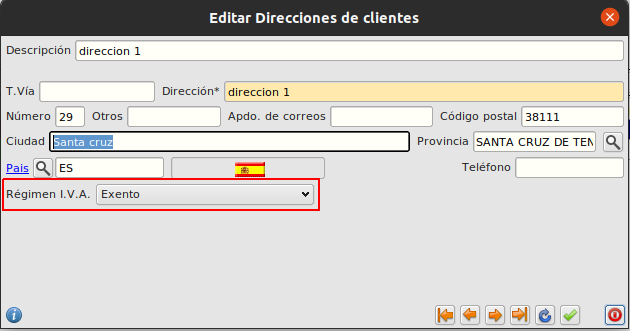
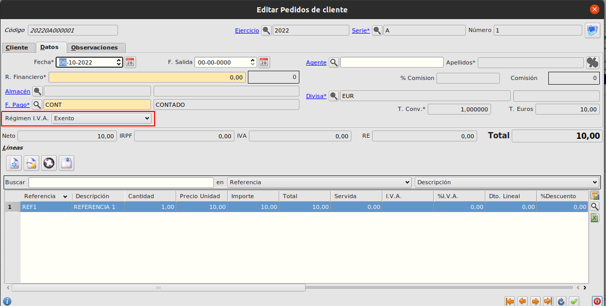
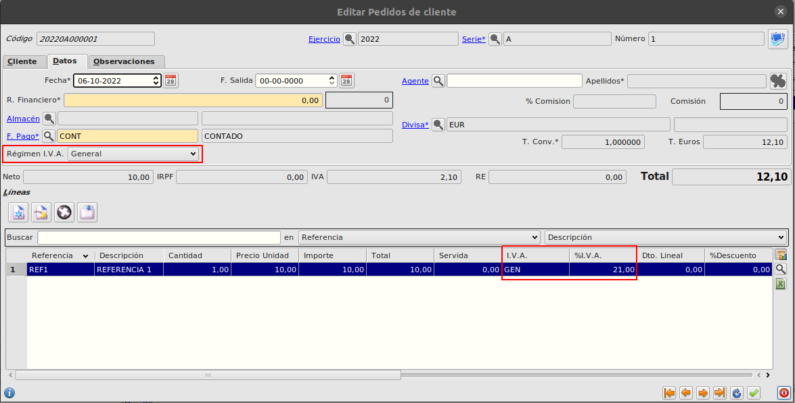
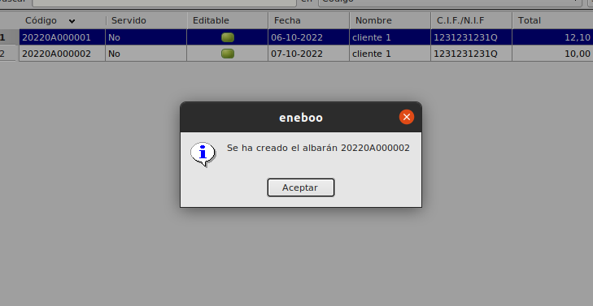
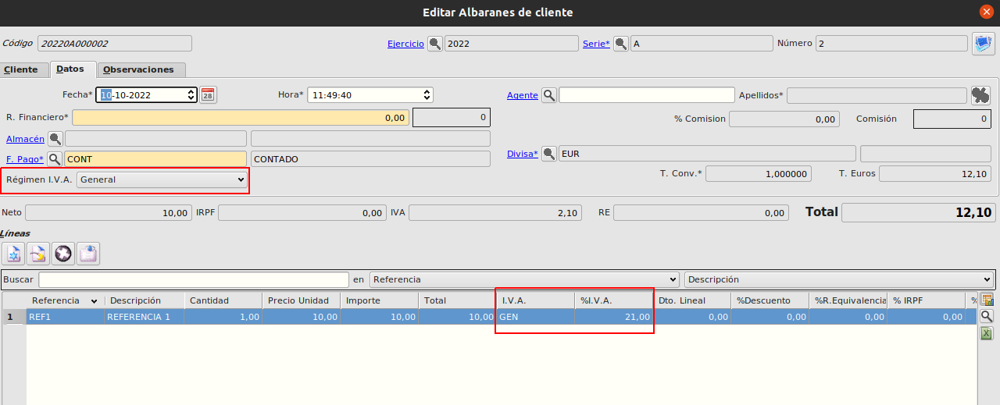

# Régimen IVA en direcciones de cliente

### Objetivo

* Crearemos documentos de ventas en los cuales el regimen de IVA se establecerá según lo tengamos informado en la dirección del cliente asociada al documento.

# Funcionamiento

## Revisar direcciones de cliente
Comprobaremos y editaremos nuestras direcciones de cliente para establecer un régimen de IVA que sea necesario.

Cuando generemos un documento de venta (presupuesto/pedido/albarán/factura) e informemos el cliente, el régimen de IVA del documento será heredado automáticamente de la direccion del documento y el %IVA de las líneas se informará automátiamente.

En caso de no tener establecido un régimen de IVA concreto para una dirección usaremos el que tenga establecido el cliente en su ficha principal.

Cuando cambiamos la dirección de la cabecera del documento, se recalculará el régimen de IVA del documento y los %IVA de las líneas.

Cuando generamos albaranes/facturas desde pedidos el regimen de IVA se heredará del documento inicial.

