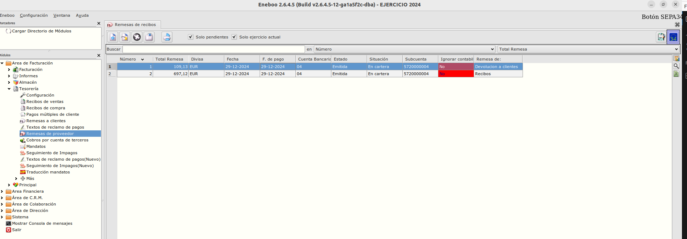

# Recibos de cliente en norma SEPA 34 (remesas de pago)

Esta extensión permite incluir recibos de clientes con importe negativo (pagos) en remesas de pago de norma 34.

## Creación de remesa de pago
Para la creación de una remesa de pago seguiremos los siguientes pasos.
- Desde el **Área de Facturación -> Tesorería -> Remesas de proveedor** pulsaremos en nuevo registro para generar una remesa.
- Informaremos la _Cuenta Bancaría_ y el tipo de remesa (Remesa de:) con valor _Recibos devoluciones_. Se activará la pestaña _Pagos a clientes_.
- Desde esta la pestaña podemos añadir recibos de clientes con importes negativos. Una vez se añaden los recibos se guarda el formulario y la remesa de pago ya esta creada.

### Tesorería / Expedición fichero norma SEPA 34
Para generar el fichero _Remesa formato SEPA_ usamos el botón con la bandera de UE.

El proceso es igual como la generación de un fichero de remesa de proveedores formato SEPA.