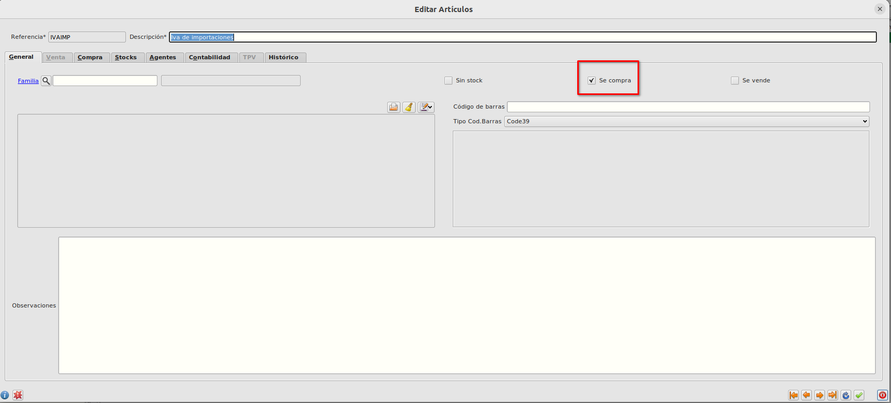
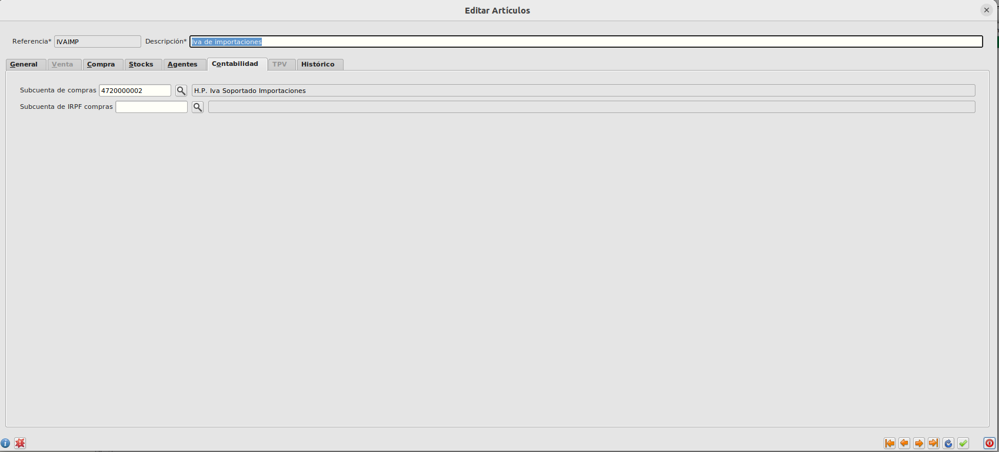
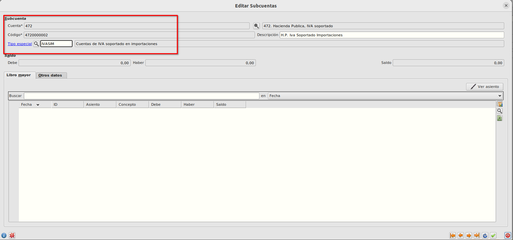
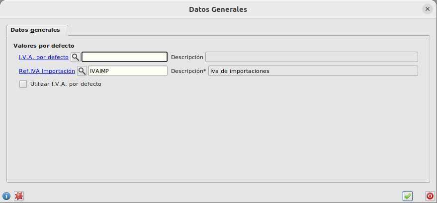

# Varios Duas / Configuración

Para el correcto funcionamiento de la funcionalidad de asociar varios duas a una factura de compras tenemos que realizar una serie de configuraciones.

## Referencia IVA Importación
- Crearemos una referencia que utilizaremos exclusivamente para los DUAS en el **Área de Facturación -> Almacén -> Artículos**
- La referencia la marcaremos con el check de "Se compra".

- Informaremos en la referencia la subcuenta de compras que será una subcuenta 472 ya que será la subcuenta de IVA de la factura de DUA.

- La subcuenta tendrá el tipo especial *IVASIM IVA Soportado en Importaciones*.

- En el formulario **Configuración** del módulo de Almacén que podemos encontrar en **Área de Facturación -> Almacén -> Configuración** tenemos que informar el campo *Ref. IVA Importación* con la referencia que hemos creado para el uso en las líneas de facturas de DUA.

### Más

  * [Volver al Índice](./index.md)

