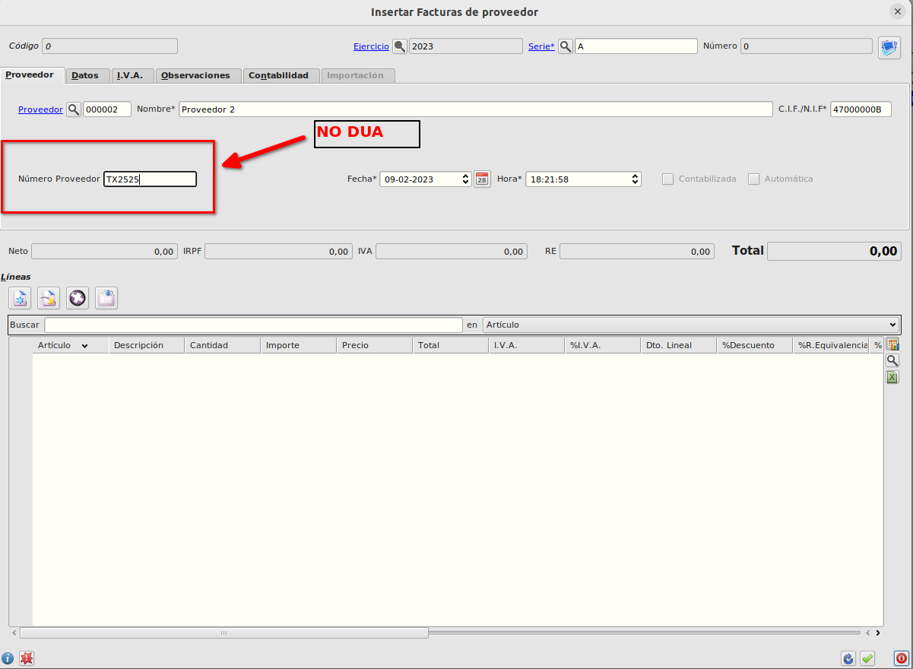
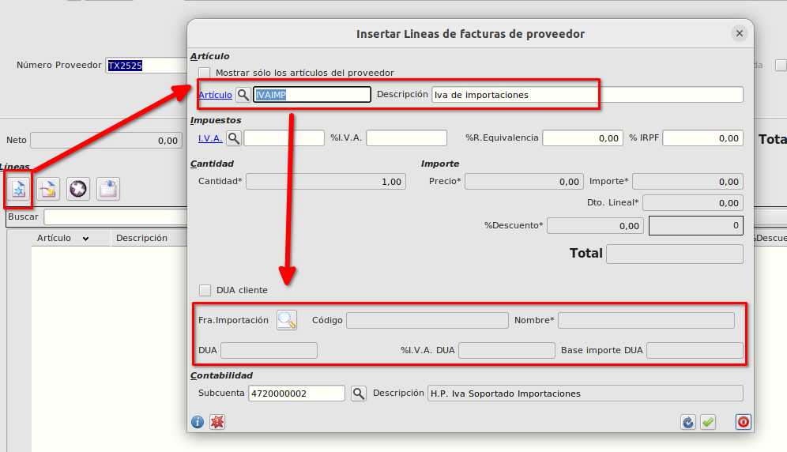
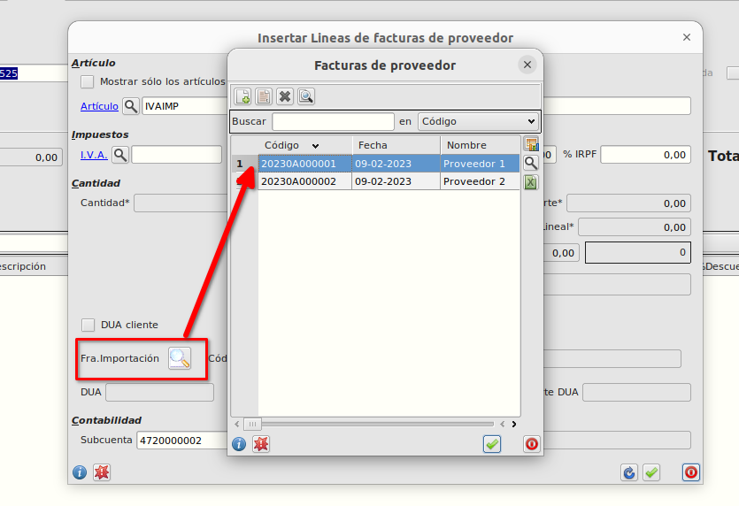
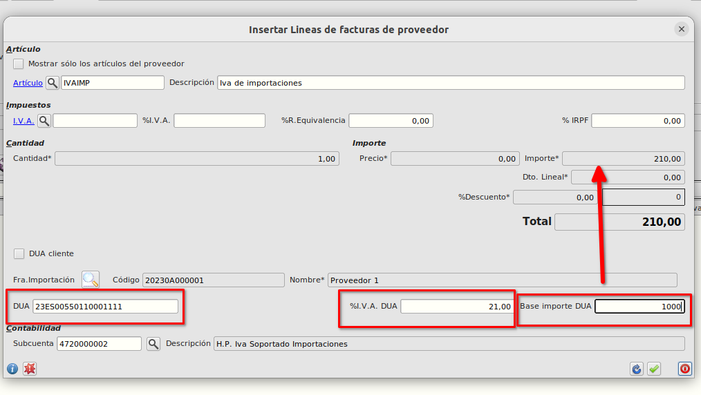
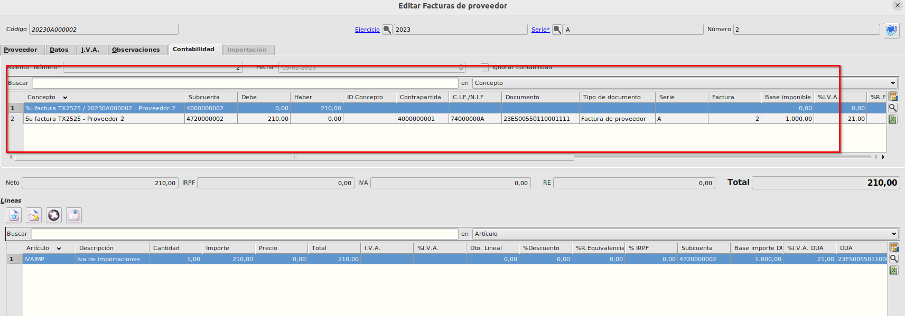
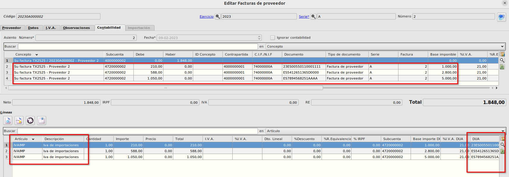

# Varios Duas / Funcionamiento

Para el correcto funcionamiento se debe de haber realizado la configuración tal y como se indica en el apartado [Configuración](./configuracion.md)

## Generación de Factura con Varios Duas
Para la generación de una factura de compras con varios duas seguiremos los siguientes pasos.
- Desde el **Área de Facturación -> Facturación -> Facturas de compra** pulsaremos en nuevo registro para generar una nueva factura.
- Informaremos el proveedor e informaremos el número de proveedor con el número de la factura que nos ha facilitado el proveedor que **NO** debe ser el número de DUA.

- Crearemos una nueva línea e informaremos la referencia que hemos configurarado como *Referencia de Importación*, el sistema automáticamente detecta que es una línea para informar una factura de DUA y activarán los campo del DUA

- Seleccionaremos con la lupa la factura de importación

- Informaremos el *Dua*, el *% IVA DUA* y la *Base importe DUA*, automáticamente se calculará la cuota que se informará en el total de la línea.

- Guardaremos la línea y la factura.

- Si observamos la pestaña de contabilidad de la factura podemos ver que se ha creado un asiento con dos partidas por el importe de la línea, una con la subcuenta del proveedor y otra con la subcuenta que está asociada a la referencia de importación que es una subcuenta de IVA. En la partida de IVA estará guardado en el campo documento el DUA.

- Si tuviéramos en la factura de importación más DUAS, insertaríamos tantas líneas como duas tuviéramos y se crearían tantas partidas de con la subcuenta de la referencia de importación como DUAS hubiera

### Más

  * [Volver al Índice](./index.md)
