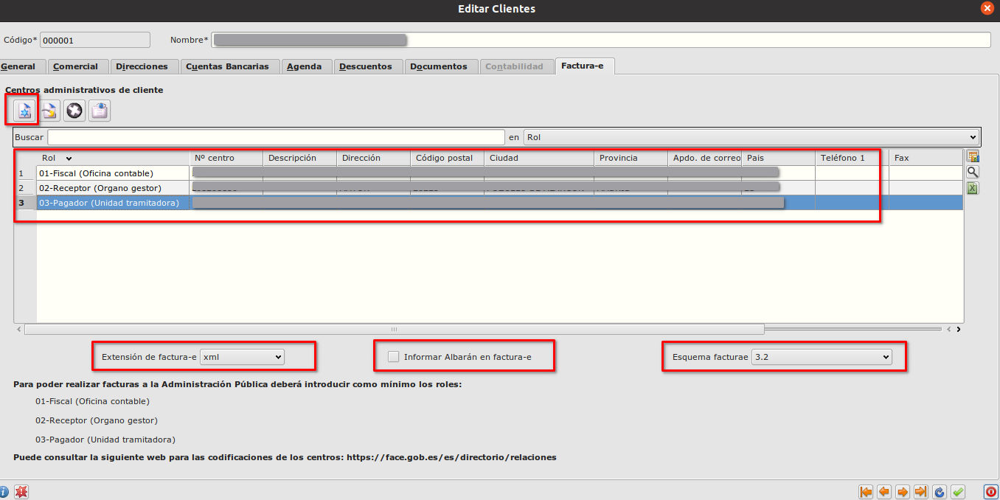

# Factura Electrónica / Configiración

Vamos a explicar los pasos a configurar Eneboo antes de usar la funcionalidad de Factura Electrónica

## Informar los campos en la tabla países
Tenemos que informar los campos Código ISO, Código ISO Alpha 2 Y Código ISO Alpha 3 en la tabla países para el país España.

## Informar Formas de Pago
Para que podemos usar la factura electrónica correctamente debemos de informar el campo 'Pago factura-e' en las formas de pago. Solo se van a crear facturas electrónicas para las facturas de venta que tiene en su forma de pago informado este campo.
Vamos a Área de Facturación -> Principal -> Formas de Pago

## Configuración Empresa
Tambien necesitamos configurar el formulario de empresa. 
Desde Área de Facturación -> Principal -> Empresa

Primero informamos la cuenta bancaría de la empresa en el campo 'Cuenta para factura electrónica.

En el siguiente paso informamos la ruta de la librería EnebooSignature.
Esta librería se proporciona gratuito del equipo Eneboo.
Y tambien hay que seleccionar el certificado digital de la empresa la que va a presentar las facturas electrónicas.

## Configuración de ficha de cliente.
El siguiente paso es configurar las clientes con los que vamos a usar la factura de electrónica.
Desde Área de Facturación -> Principal -> Clientes selecionamos el(los) cliente(s) que tenemos que configurar.
En la pestaña Factura-e, creamos registros en la tabla  y tambien informamos los campos que están marcados en rojo tal y como se ven en la captura.

### Más

  * [Volver al Índice](./index.md)

