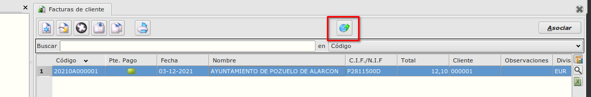

# Factura Electrónica / Funcionamiento

Una vez hechas todas las configuraciones se puede pasar crear la factura electrónica.

## Generación de Factura Electrónica
Desde Área de Facturación -> Facturación -> Facturas de venta
selecionamos la factura la que queremos generar como factura electrónica.

Con el botón 'Generar documento electrónico' empezamos el proceso.

Se va a abrir un dialogo para selecionar la ruta y informar el nombre del fichero. El fichero debe de tener la extensión .xml

Nos va a pedir el programa la contraseña del certificado digital de la empresa.

Si todo esta correcto al final el programa informará que se ha generado y firmado correctamente el fichero de factura electrónica.

### Más

  * [Volver al Índice](./index.md)
