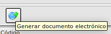

# Factura Electrónica / Funcionamiento

Para el correcto funcionamiento se debe de haber realizado la configuración tal y como se indica en el apartado [Configuración](./configuracion.md)

## Generación de Factura Electrónica
Generaremos la factura electrónica desde el **Área de Facturación -> Facturación -> Facturas de venta** seleccionando una factura y pulsando sobre el botón *Generar documento electrónico*

Selecionamos la factura la que queremos generar como factura electrónica.

Una vez que hemos pulsado el botón, se mostrará un diálogo para que seleccionemos la ruta y el nombre del fichero el cual debe de terminar con la extensión .xml

Al guardar se mostrará un diálogo para informar la contraseña del certificado digital

Si el proceso ha sido satisfactorio, nos mostrará un mensaje como que se ha guardado el fichero en la ruta seleccionada.

### Más

  * [Volver al Índice](./index.md)
