# Manual TicketBAI

## ¿Donde puedo configurar el garante TicketBAI?

* El Garante TicketBAI se puede configurar el la pestaña **servidor** de **Area de Facturación/Principal/Configuración**. El servidor se encargaŕa de firmar digitalmente las facturas nuevas y anularlas, además de mantener la cadena garante.

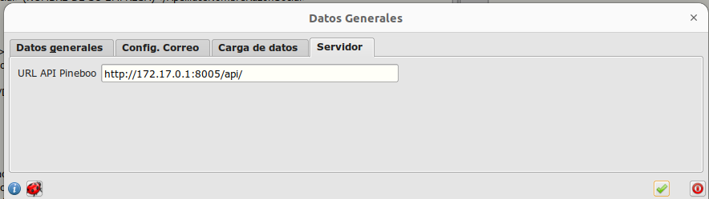

## ¿Como puedo firmar una factura?

* Por defecto las facturas se crean en modo borrador. Este modo nos permitirá modificar la factura, hasta que la consideremos definitiva. 

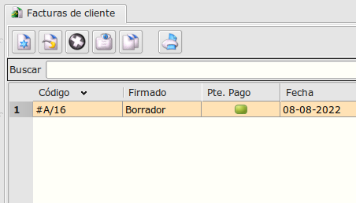

* Para firmar una factura. Seleccionamos la linea de esta y pulsamos sobre el botón **Firmar**. Nos mostrará un diálogo donde confirmaremos la inteción de firmar la factura.

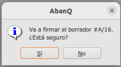

*  La factura antes de ser enviada a firmar, pasara a estado *Pte.Firma*. 

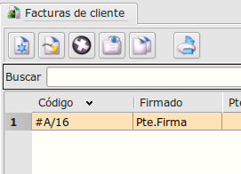

* Este proceso durará unos segundos y nos cambiará el estado de una factura. Si la factura se firma correctamente pasará a estado *Firmado*. 

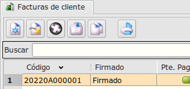

* De lo contrario , mostrará un error y pasara a estado *Error firma*.

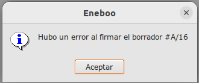

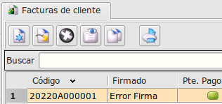

## ¿Como puedo anular una factura?

* Ya que no podemos modificar facturas una vez firmadas, tenemos que anular las facturas con un proceso similar al usado para la firma, pero esta vez,  creando una anulación.

* Pulsaremos sobre el botón **Anular**. Estço cambiará nuestra factira al estado *Pte.Anulación*.

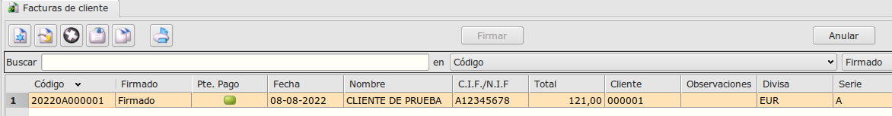

* Nos mostrará un diálogo donde confirmaremos la inteción de anular la factura.

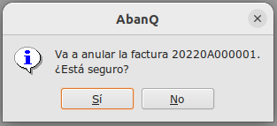

* La factura antes de ser anulada cambiará estado *Pte.Anulación*

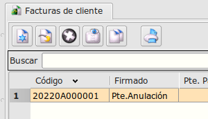

* Este proceso durará unos segundos y nos cambiará el estado de una factura. Si la factura se anula correctamente cambiará de estado a *Anulado*. 

* De lo contrario, mostrará un error y pasará a estado *Error Anulación*

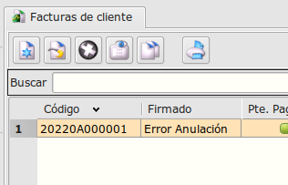

## ¿Donde puedo cambiar los datos de la factura relacionados con TicketBAI?

* Mientras la factura esté en modo borrador, podremos realizar cambios en la **pestaña Ticket BAI**.

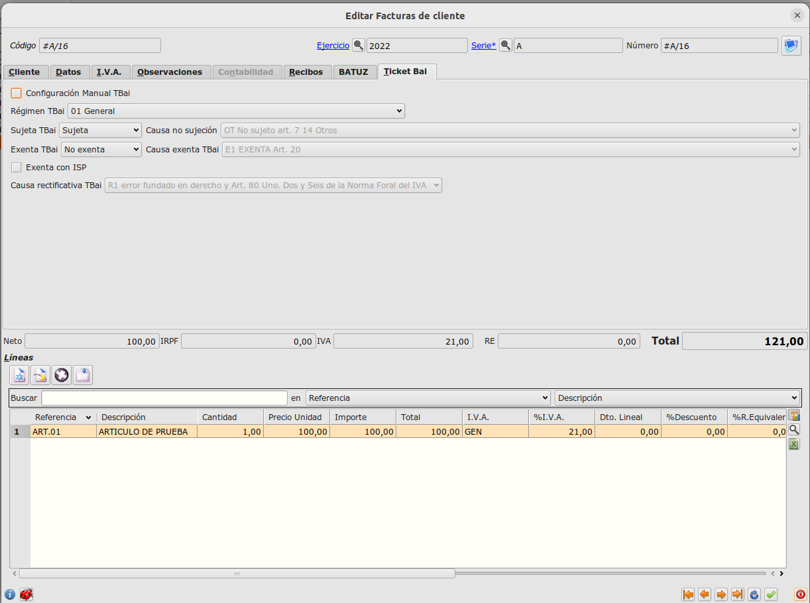

## ¿Como puedo ver si una factura está firmada?

* En la pantalla de **Garante SIGN** , podemos ver la información relacionada con las firmas y anulaciones de facturas. En la parte de abajo encotramos información de la cadena garante que valida que no ha sido alterada, ninguna factura una vez firmada.

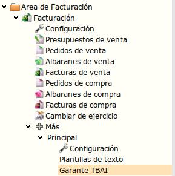
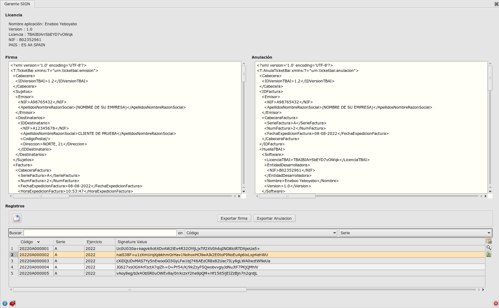

* También disponemos de opciones para exportar firma o anulación de una factura en formato xml.

