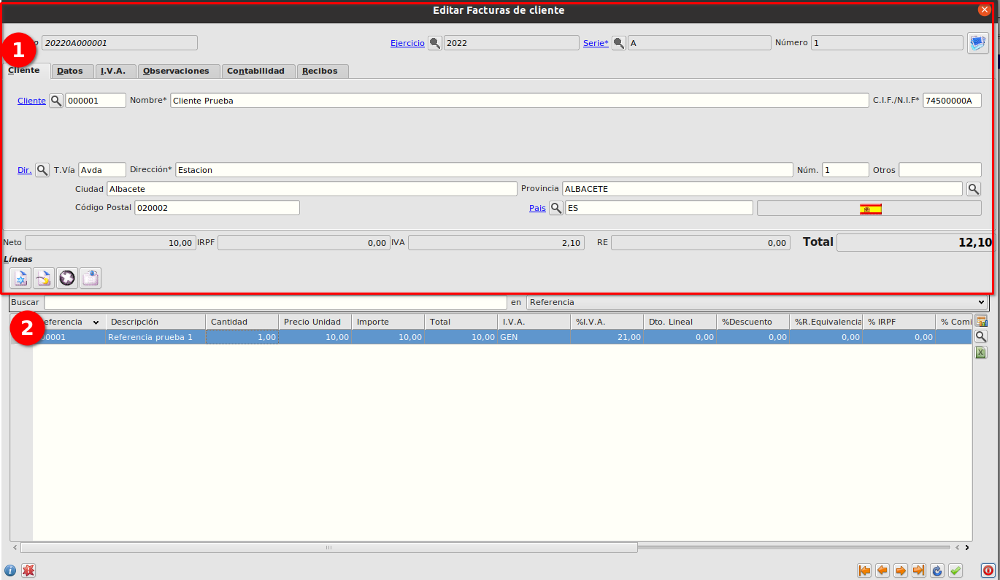

# Factura de Venta

## 1. Creación de factura

### 1.1. Objetivo

    Generar una factura a un cliente

### 1.2. Descripción

    El objetivo es la creación de una factura de cliente, ver como se crea el recibo y el asiento contable.

### 1.3. Proceso

    Seleccionamos el cliente, se cargarán los valores predeterminados del cliente.
    
