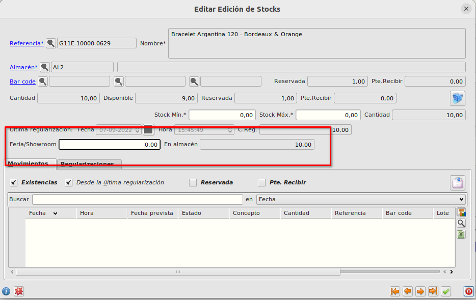
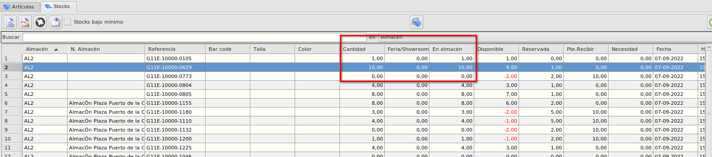
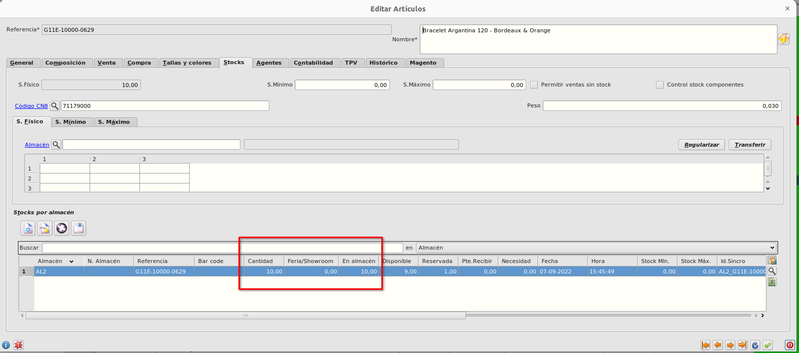

# Cantidades Feria/Showroom y En Almacen

### Objetivo

* Poder informar la cantidad de un stock que está en una feria

### Funcionamiento
* En el formulario de **Stocks** podemos ver 2 nuevos campos, *Feria/Showroom* el cual es un campo que se informa manualmente y se utiliza para informar que cantidad del artículo que está en Showroom o Ferias y el campo *En Almacen* el cual se calcula automáticamente como la resta del campo *Cantidad* de stock y del campo *Feria/Showroom*.

 Al formulario de stocks podemos acceder desde **Área de Facturación -> Almacén -> Stocks** 

 

o desde la pestaña de **Stocks** del formulario **Artículos** 

