# Plan de precios

## Crear plan de precios

* Desde el **Área de facturación -> Almacén -> Más -> Magento -> Plan de precios** accedemos a los planes de precios.

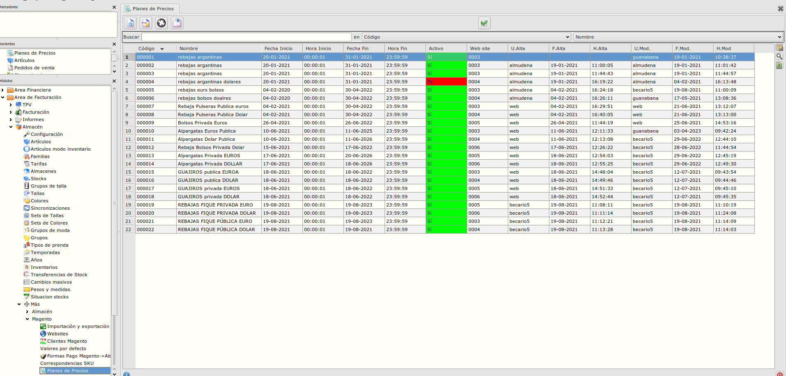

* Para crear un plan de precios pulsaremos insertar nuevo registro e informaremos los campos obligatorios:

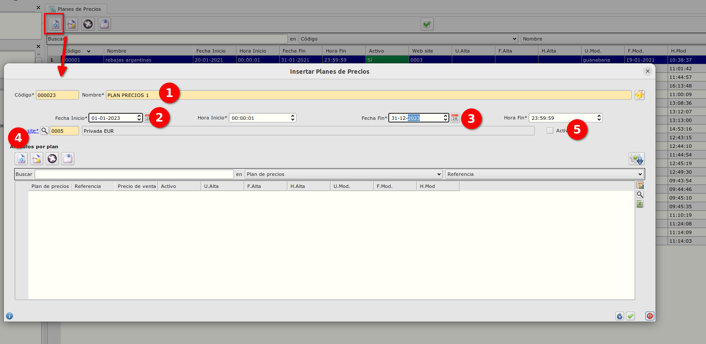

1. *Descripción* del plan de precios, indicaremos una descripción para el plan de precios.
2. *Fecha Inicio* del plan de precios, a partir de que día se aplicaran los precios a las referencias que se indiquen en las líneas.
3. *Fecha Fin* del plan de precios, hasta que día se aplicaran los precios a las referencias que se indiquen en las líneas.
4. WebSite al que va destinado el plan de precios.
5. Check de *Activo*, al marcarlo, todas las líneas creadas se pondrán como activas y se sincronizarán a la web el precio indicado desde la fecha inicio hasta la fech fin.

* Para incluir líneas dentro de un plan de precio podemos hacerlo de dos formas, manual o importando/copiando desde un fichero.

### Incluir líneas de forma manual

* Para incluir líneas de forma manual pulsaremos sobre nuevo registro e informaremos la referencia (1) y el precio(2).

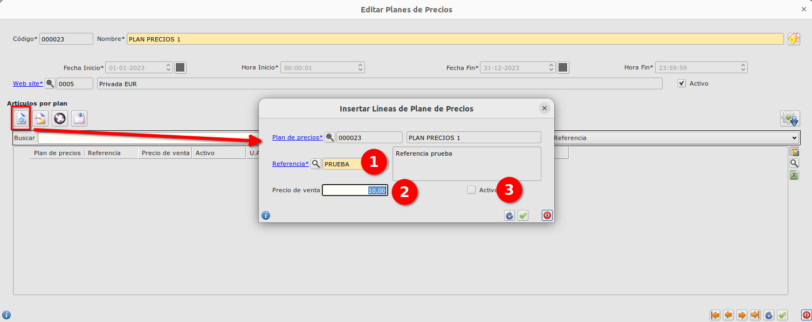

* El check de activo de la línea (3) nos servirá para poder activar/desactivar una determinada referencia dentro del plan de precios.

### Incluir líneas importando/copiando desde un fichero.

* Para incluir líneas desde un fichero excel/csv pulsaremos sobre el botón del engranaje y tendremos dos opciones:

    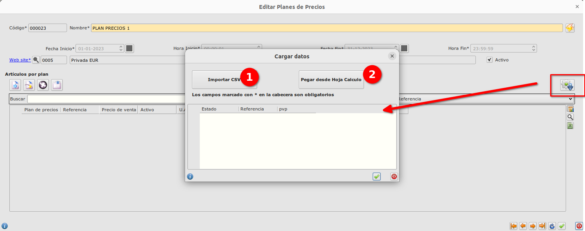

    **A. Importar CSV.** 
    - Pulsaremos el botón *Importar CSV* y se mostrará un diálogo en el cual informaremos:
        1. El caracter separador del csv (por defecto **|**)
        2. Check de ignorar primera línea, lo marcaremos si tenemos que ignorar la primera línea porque tiene título y no la marcaremos si no lo tiene.
        3. Número de líneas adicionales a ignorar. Informaremos el número de líneas adicionales a parte del título queremos que se ignoren porque hay subtítulos...

    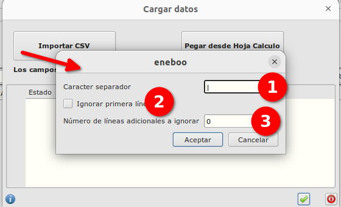

    - Al aceptar seleccionaremos un fichero csv el cual contendrá unicamente 2 columnas, referencia y precio.
    - Se informará en la tabla las líneas que contiene el fichero, si no hay errores (que alguna referencia no exista etc...) podremos aceptar

    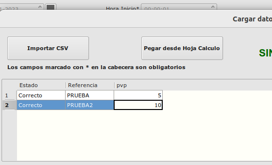

    - Una vez que hemos aceptado se habrán creado las líneas del plan de precios que contiene el fichero.

    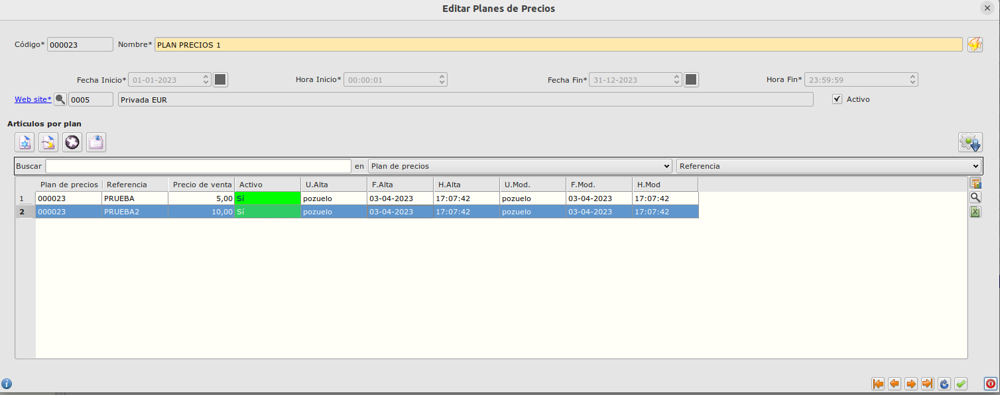

    Aceptaremos y se sincronizarán los precios del plan de precios para las referencias en las fechas indicadas.    

    **B. Pegar desde Hoja Cálculo**

    - Pulsaremos el botón *Pegar desde Hoja Cálculo* y se mostrará un diálogo en el cual pegaremos las líneas de la hoja de cálculo que hayamos copiado previamente.

    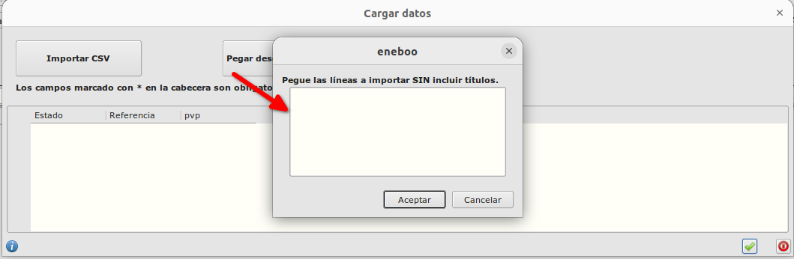

    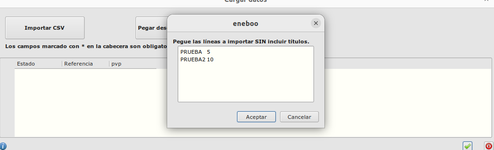

    - Al aceptar ee informará en la tabla las líneas que contiene el fichero, si no hay errores (que alguna referencia no exista etc...) podremos aceptar

    
    
    - Una vez que hemos aceptado se habrán creado las líneas del plan de precios que contiene el fichero.

## Activar/desactivar plan de precios
    - Podemos activar/desactivar un plan de precios o activar/desactivar una determinada referencia del plan de precios

### Activar/desactivar plan de precios entero

    - En el maestro de planes de precios tenemos un botón el cual nos permite activar o desactivar el plan de precios entero.

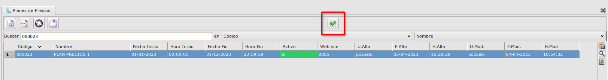
    
    El funcionamiento es el siguiente:

#### Deshabiliar plan Activo

    1. Tenemos el plan de precios seleccionado y en estado activo.
    
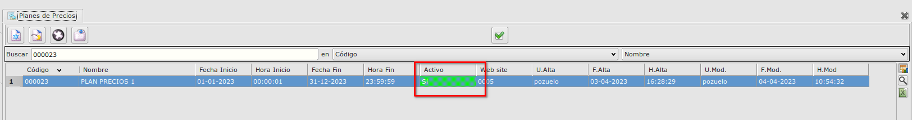

    2. Pulsamos sobre el botón de activar/desactivar plan de precios, el sistema nos avisa de que se va a desactivar el plan de precios y se van a sincronizar con la web.

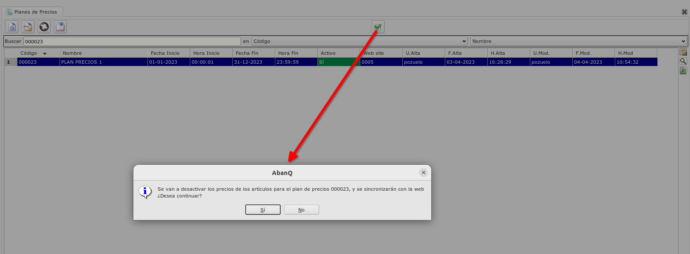

    3. Si pulsamos que no, no se realizará ningún cambio.

    4. Si pulsamos que si, todas las líneas se pondrán como NO Activas y se sincronizará a la web quedando deshabilitados los precios en la WEB.

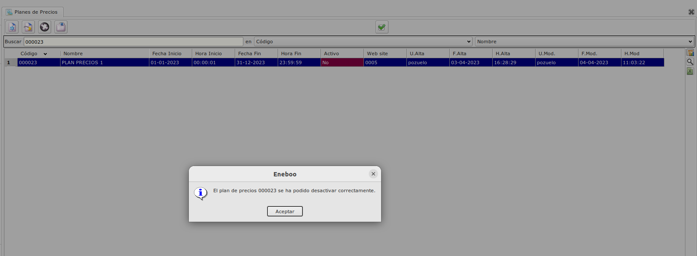

#### Habilitar plan NO Activo

    1. Tenemos el plan de precios seleccionado y en estado NO activo.
    
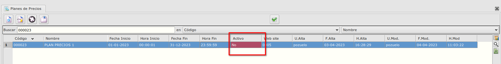

    2. Pulsamos sobre el botón de activar/desactivar plan de precios, el sistema nos avisa de que se va a activar el plan de precios y se van a sincronizar con la web.

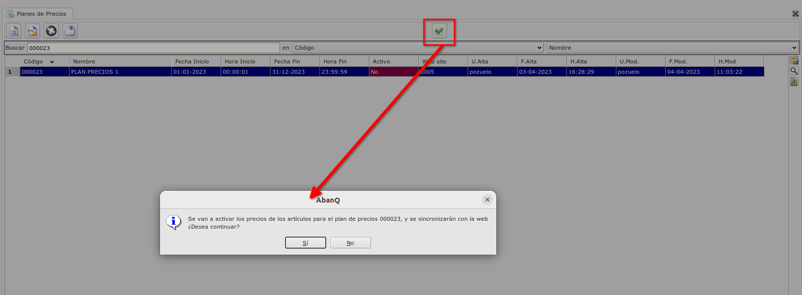

    3. Si pulsamos que no, no se realizará ningún cambio.

    4. Si pulsamos que si, todas las líneas se pondrán como Activas y se sincronizará a la web quedando habilitados los precios en la WEB.

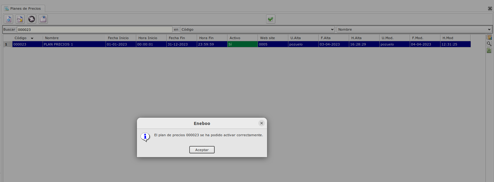

### Activar/desactivar plan una referencia de un plan de precio

Podemos activar o desactivar una única referencia de un plan de precios.

- Editamos el plan de precios en el cual queremos habilitar/deshabilitar la referencia

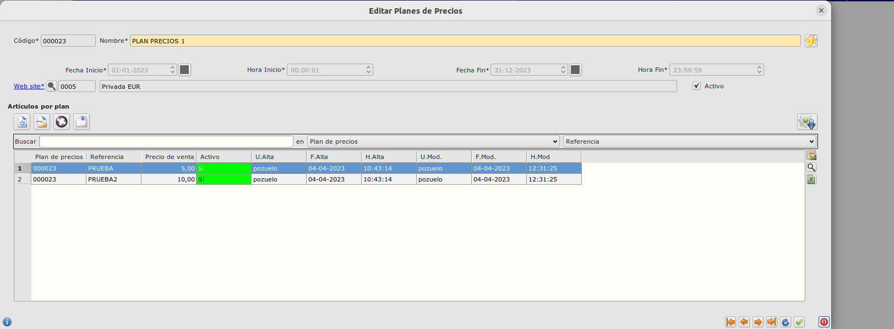

- Editamos la línea que queremos habilitar/deshabilitar

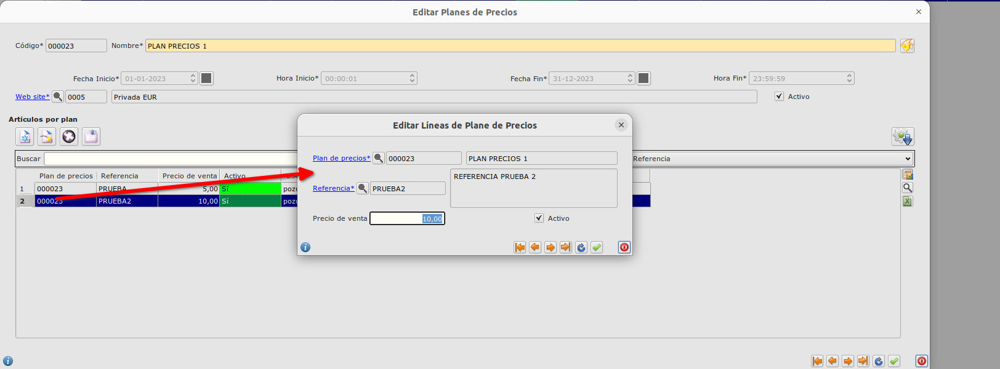

- Marcamos (habilitar) o desmarcarmos (deshabilitar) el check de activo según lo que queramos realizar

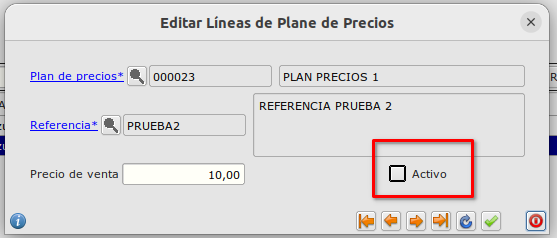

- Al aceptar podemos ver que la línea se ha habilitado o deshabilitado

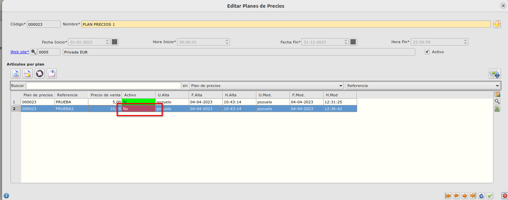

- Aceptamos el formulario y se sincronizará las líneas que hayan cambiado a la web.

