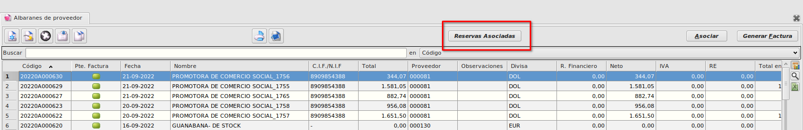
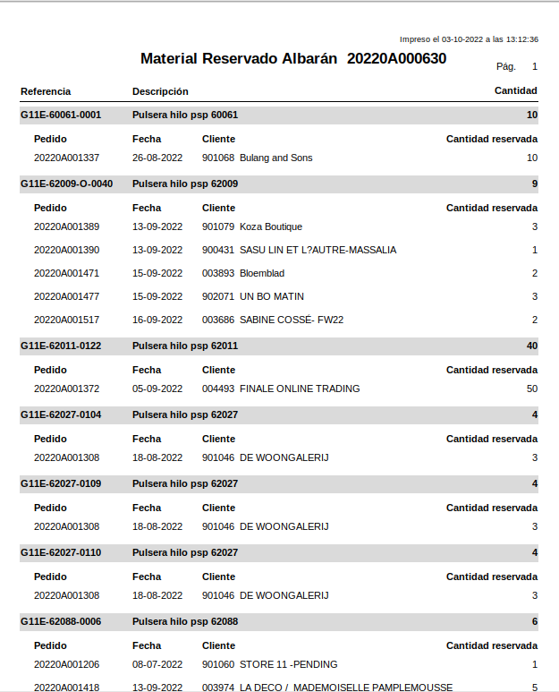

# Informe reservas

### Objetivo

* Podremos imprimir un informe a partir de un albarán de compra para ver que pedidos de venta están reservando el material que ha llegado en dicho albarán de compra.

### Funcionamiento
* En el maestro de **Albaranes de compra**, el cual podemos encontrar en **Área de Facturación -> Facturación -> Albaranes de compra**, seleccionaremos un albarán y pulsaremos el botón *Reservas Asociadas*.

* Al pulsar el botón se nos imprimirá un informe en el cual se mostrará para cada referencia del albarán, que pedidos, fecha, cliente y cantidad están reservando ordenado por fecha de pedido de más antiguo a más moderno.

