# Generar orden produccion

## Configuración

Activamos gestión de tramos.

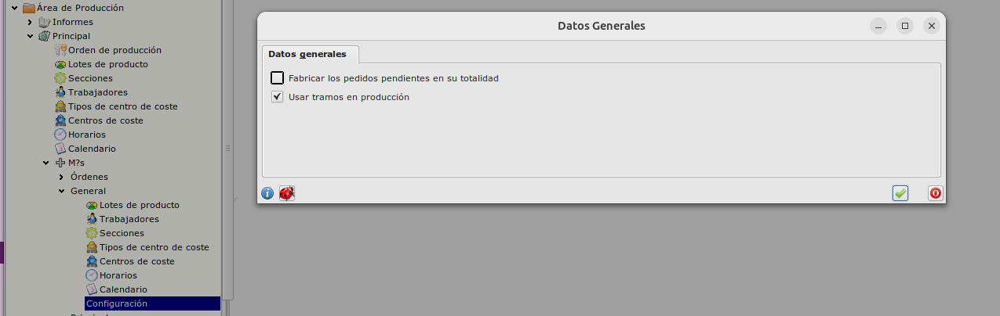

## Generar pedido

Las ordenes de producción se generar desde un pedido de compra. Una vez el pedido es generado se crean tantas ordenes como lineas contiene este pedido

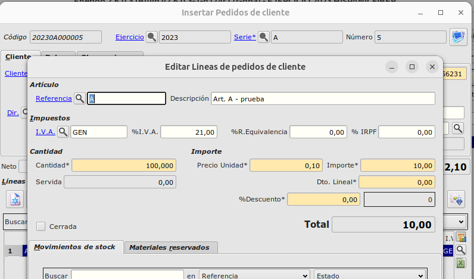

## Lanzar orden producción

Una vez generada la linea de pedido , tenemos que activar la orden de producción

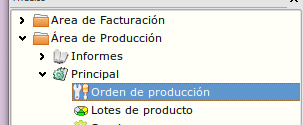

Pulsamos sobre insertar orden de producción

Una vez dentro seleccionamos el pedido, pulsamos sobre la lupa y buscamos las posibles ordenes de producción. Estas lineas mostrarán los articulos disponibles y los que realmente necesitamos fabricar (A Fabricar)

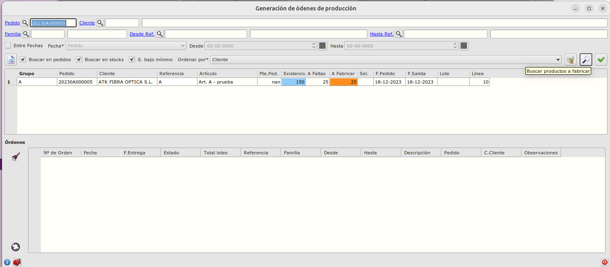

Hacemos doble click sobre la casilla Sel. de la linea y se marcará con una X

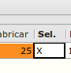

Una vez seleccionadas las lineas , generamos las ordenes pulsando sobre el icono de rocket.

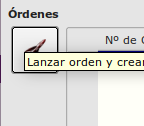

Recibiremos un mensaje avisando de que los procesos han sido lanzados

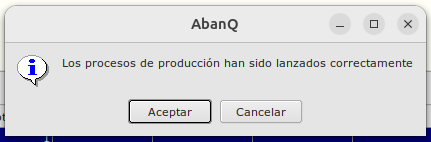

## Gestionar orden produción

Las ordenes se van gestionando desde la pestaña de terminal

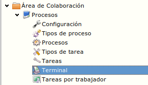

En esta pestaña el trabajador puede ir activando / desactivando las tareas de la orden de producción y añadiento tramos a esta.

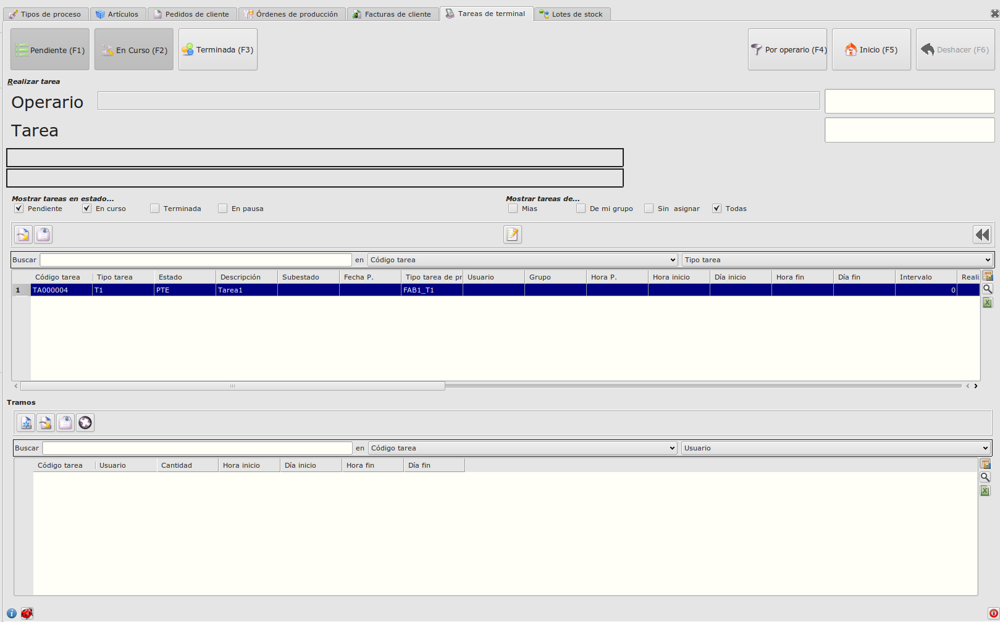

Los trabajadores pueden gestionar las tareas identificandose

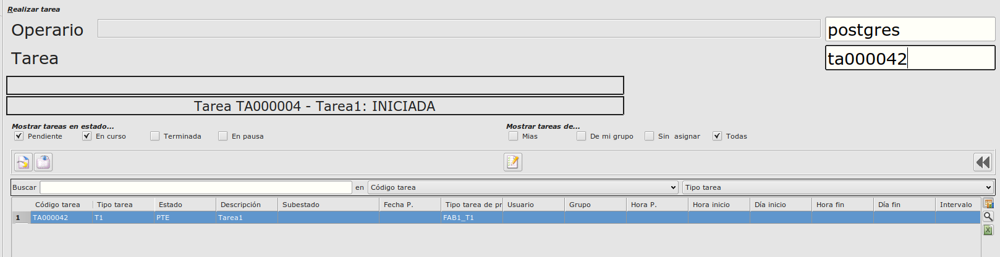

## Control de tramos

Si insertamos / editamos tramos o finalizamos una tarea , podemos actualizar la cantidad disponible de producto en el campo cantidad de la tarea.

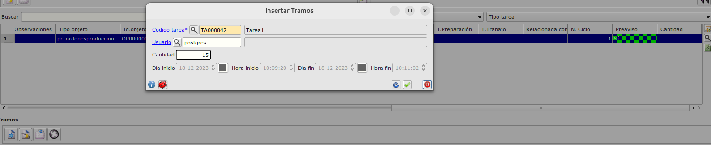

## Movimientos de stock

Cuando la tarea es la responsable de descontar componentes , los descuenta de almacén

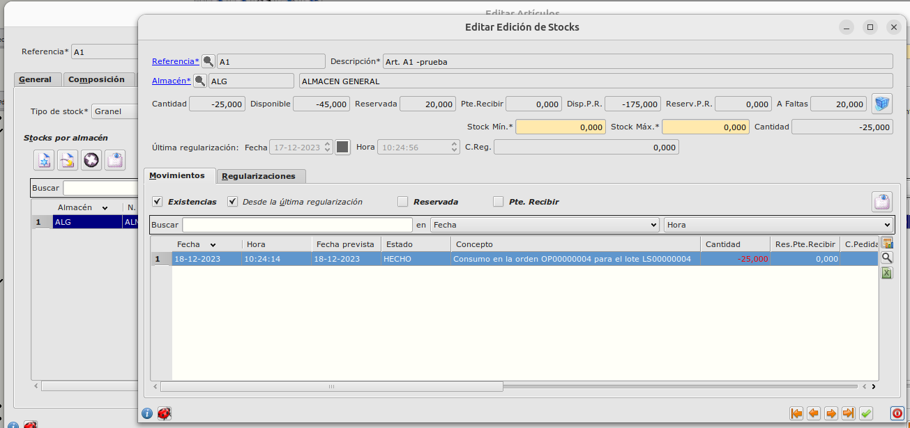

Cuando se finaliza la última tarea de la orden de trabajo , se actualiza el stock del articulo.

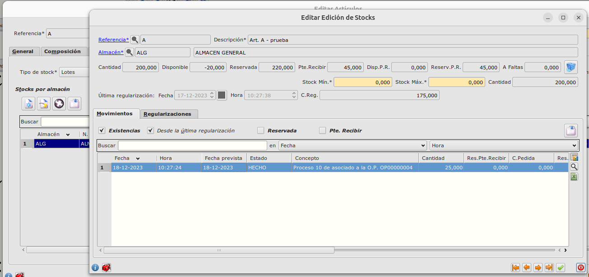