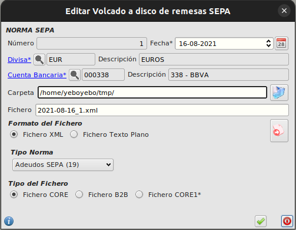
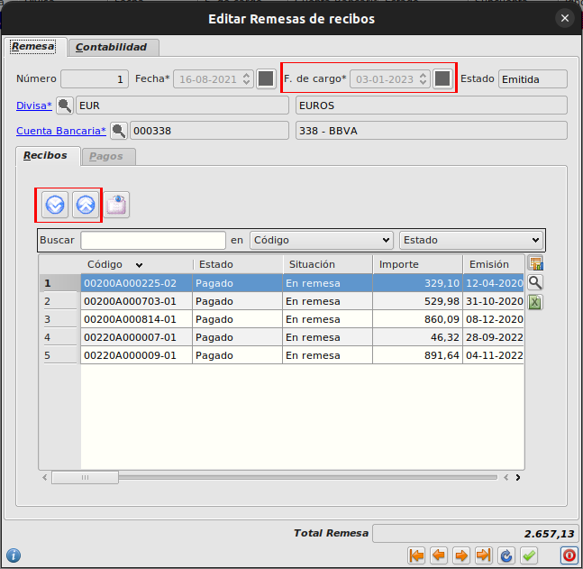

# Remesas de cliente

## Generar una remesa norma SEPA 19

* Vamos a *Facturación - Tesorería - Remesas a clientes*, seleccionamos la remesa y pulsamos  remesas, *Volcar remesa en disco en norma SEPA*.

* Se abre el formulario de *Volcado a disco de remesas*
    * Si ya habíamos guardado una remesa anteriormente en nuestro puesto, el campo *Carpeta* recuerda la carpeta de grabación*.
    
    * El campo *Nombre fichero* contiene el nombre construido según el siguiente criterio:
        * Si la remesa consta de más de un recibo, se calculará automáticamente como *AAAA-mm-dd_numero_remesa*, usando el campo *Fecha de cargo* de la remesa.

            Ejemplo: *2022-11-31_150.xml*

        * Si la remesa consta un único recibo, se calculará automáticamente como *AAAA-mm-dd_numero-de-recibo.xml*.

            Ejemplo: *2022-11-31_20220A001225-01.xml*
* Modificamos, si es necesario, la carpeta o el nombre del fichero, y pulsamos *Aceptar*.
    * El fichero de remesa se genera en la ruta indicada con el nombre indicado.

        

## Crear una remesa
* Vamos a *Facturación - Tesorería - Remesas a clientes* y pulsamos *Insertar*.

* Informamos los datos de la remesa (cuenta, etc.)

* Pulsamos el botón *Agregar recibos*
    * Se abre el formulario de selección de recibos.
    
* Seleccionamos los recibos a incluir y pulsamos *Aceptar*.
    * Los recibos se añaden a la remesa
    
    * El campo *F.de cargo* de la remesa se actualiza con el máximo valor del campo *Vencimiento* de los recibos incluidos.
* Si queremos quitar un recibo de la remesa, usamos el botón *Quitar recibo*.
    * El campo *F.de cargo* de la remesa se actualiza con el máximo valor del campo *Vencimiento* de los recibos incluidos.
        
        