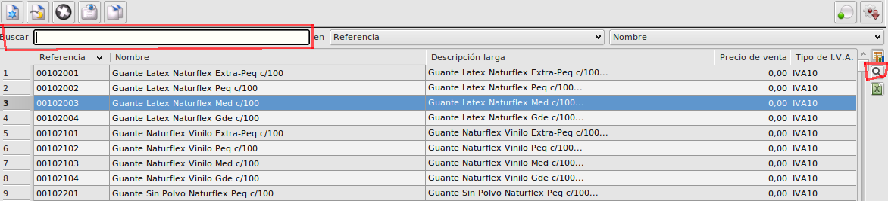
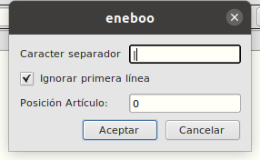

# Importacion de inventarios desde csv

Podemos crear un inventario importando sus líneas desde un fichero csv

## Generación del fichero

El fichero de importación debe tener formato **csv** con una sóla columna en la que se indicará las referencias a importar.
Podemos generar este fichero exportándolo desde abanq siguiendo los siguientes pasos.

- Abrimos el formulario principal de artículos
- Establecemos los filros necesarios o bien en el campo buscar o con los filtros de la tabla pulsando el botón de filtros de la parte derecha

- Una vez filtrados los artículos que queramos importar al inventario pulsamos el botón de exportar a excel de la parte derecha de la tabla

- Se nos abrirá una hoja de excel con los artículos. Seleccionamos todas las columnas menos la primera y pulsamos con el botón derecho Eliminar columnas
Nos debería quedar la tabla únicamente con una columna con las referencias.

- Pulsamos la opción Guardar como y seleccionamos el formato CSV. Una vez guardado el fichero en csv podemos hacer la importación en inventarios

## Importación en inventarios

Creamos un inventario nuevo en **Facturación -> Almacén -> Inventarios**

- Primero debemos especificar el **Almacén**
- Después pulsamos sobre el botón **Importar desde fichero** situado en la parte superior derecha de la tabla de **Líneas**
- Seleccionamos el fichero csv que hemos guardado previamente
- Se abrirá un formulario en el que nos solicitará algunos datos:

    - **Carácter separador** El que hayamos especificado al exportar el fichero a csv
    - **Ignorar primera** Debemos marcarlo si en la primera línea del csv va la cabecera de la columna
    - **Posición artículo** Debemos especificar el número de columna en la que están informadas las referencias. En este caso es la columna 0.

- Una vez especificados estos valores pulsamos el botón aceptar. El proceso puede tardar un poco dependiendo del número de artículos a importar. Una vez finalizado tendremos importadas todas las líneas.

[Volver al Índice](../../index.md)