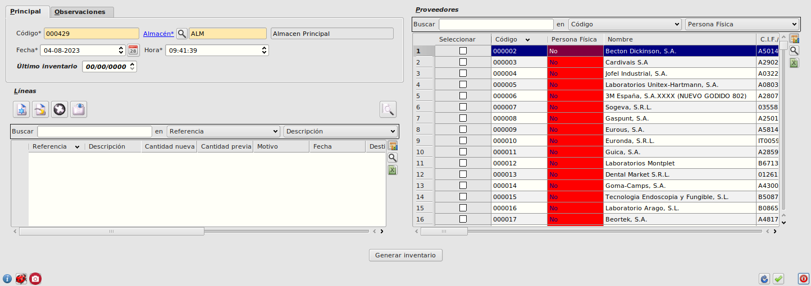
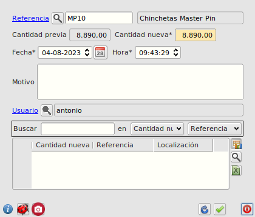
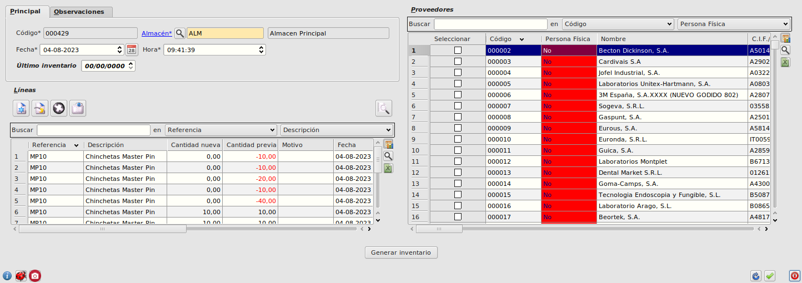
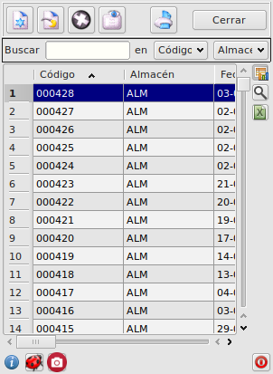
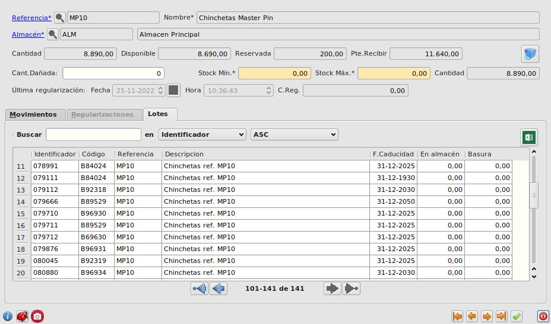
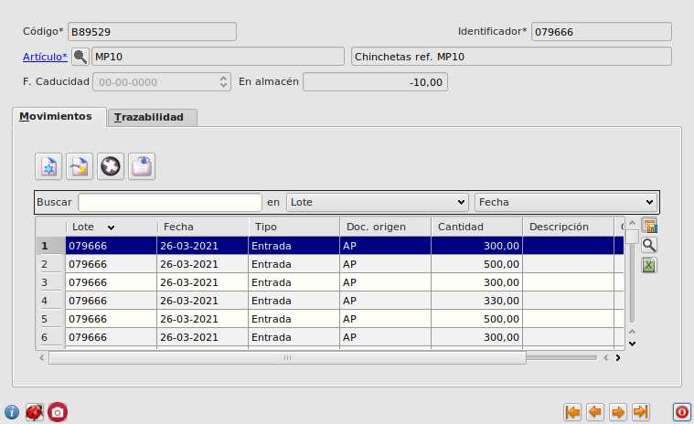

# Inventarios de productos por lotes

A continuación describimos el proceso para realizar inventarios de artículos por lotes

## Generación del inventario

+ Vamos a _Facturación - Almacén - Inventarios_ y creamos un nuevo registro.
+ Informamos el almacén

+ Pulsamos el botón de _Nueva Línea_ para indicar el primer producto.
+ Informamos la referencia de un producto por lotes.

    + Al guardar, se generarán tantas líneas de transferencia como lotes haya del producto indicado en el almacén del inventario con cantidad distinta de 0 (positiva o negativa). Para ellos solo contamos entradas, salidas y regularizaciones del lote __en el almacén inventariado__.

+ Guardamos el inventario

Podemos realizar este proceso para más de un producto en un mismo inventario.

## Recuento
+ Vamos a AQNext - _Inventarios_, y seleccionamos el inventario recién creado.
    + Se muestran las líneas del inventario creadas.
+ Para cada línea, indicamos la cantidad correcta de la que disponemos para el lote de la línea en nuestro almacén.

## Cierre del inventario
Una vez realizado el recuento, podemos volver a _Facturación - Almacén - Inventarios_ y cerrar el inventario realizado.
+ Seleccionamos el inventario y pulsamos el botón _Cerrar_.

## Comprobación del inventario
Para comprobar que los stocks se han modificado tal y como hemos indicado en el inventario, realizamos los siguientes pasos:
+ Vamos a _Facturación - Almacén - Artículos_ y buscamos el artículo inventariado.
+ Vamos a la pestaña _Stocks_ del artículo y seleccionamos el stock del almacén del inventario.

+ En la pestaña _Lotes_, comprobamos que:
    + Las cantidades de cada lote distinto de cero coinciden con las inventariadas.
    + El stock total del producto en el inventario es la suma de las cantidades de los lotes regularizados.

__NOTA__: Puede que las cantidades no coincidan si tras hacer el inventario ya se han producido entradas o salidas del producto en el almacén inventariado. Esto lo podemos ver en la ficha de cada lote.

[Volver al Índice](../../index.md)