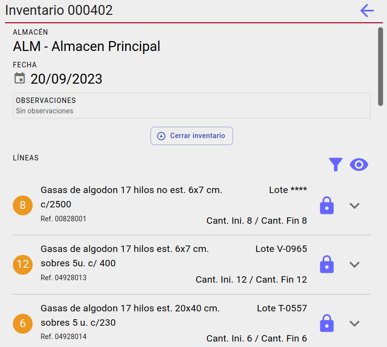

# PANTALLA INVENTARIOS

A la izquierda si estamos en pantalla grande y la pantalla inicial si estamos en movil tenemos una lista con los inventarios donde los colores del avatar representan:

* **Verde**: Inventario abierto.
* **Rojo**: Inventario Cerrado.

## Gestionar inventario

En esta pantalla hay un registro por cada artículo y lote, se puede ver informacion del código de lote del articulo si es un articulo por lotes:

* **Cant. Ini**: Cantidad disponible de stock en el momento que se creo el inventario.
* **Cant. Fin**: Nueva cantidad que se guardara en el stock. 

Los colores del avatar representan:

* **Amarillo**: Cantidad final sin tocar.
* **Verde**: Linea cerrada.
* **Azul**: Linea abierta, con cantidad final mayor que la inicial.