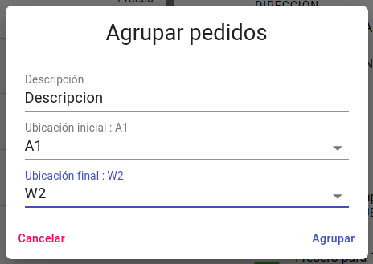

## Generar preparación

Pulsando el boton  podemos habilitar para seleccionar uno o varios pedidos, una vez tengamos seleccionados los pedidos que van a entrar a una preparación pulsamos el boton  para generar la preparación.

Para completar el proceso seleccionamos Descripcion y las ubicaciones a las que perteneceran los articulos que entraran en la preparación.

[Volver](../generarPreparacion.md)