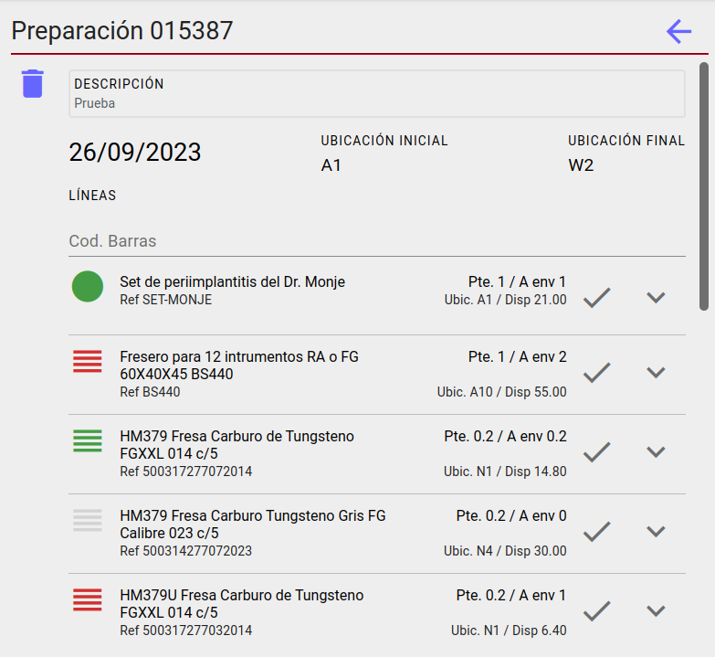

# PANTALLA PREPARACION DE PEDIDOS DE VENTA

A la izquierda si estamos en pantalla grande y la pantalla inicial si estamos en movil tenemos una lista con las preparaciones de venta donde los colores del avatar representan:

* **Gris**: Si todos pedidos que forman la preparación estan Servidos.
* **Verde**: Si alguno de los pedidos de la preparación aun no esta Servido.

# PANTALLA PREPARACION

Pantalla con todas las líneas de los pedidos que cumplen las condiciones de la preparación, accion borrar preparación disponible que libera las línas de los pedidos asignadas.

## Lectos de códigos de barras

* [Lector barcodes](./Acciones/lectorBarcode.md)

## Acciones

* [Cerrar línea](./Acciones/cerrarLinea.md)
* [Ver movimíentos de lote](./Acciones/verLotes.md)
* [Completar línea](./Acciones/completarLinea.md)

[Volver](./index.md)