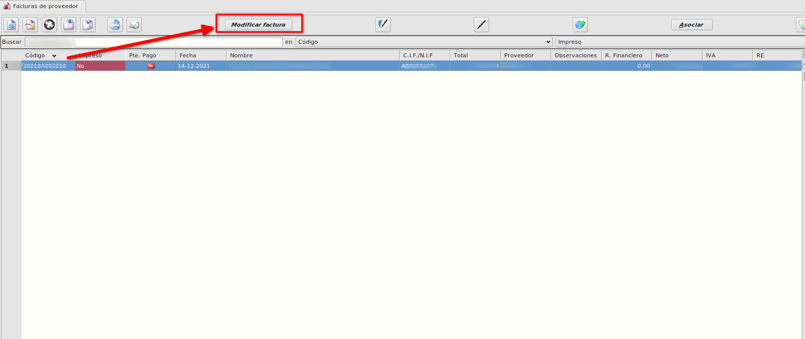
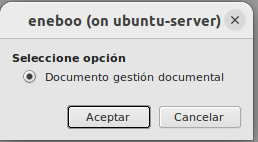
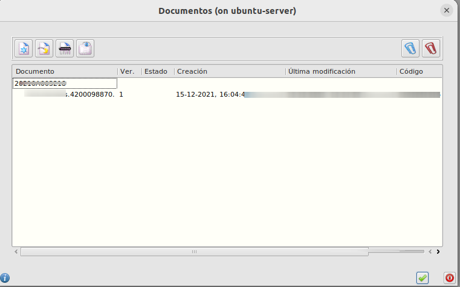

# Gestión documental

## Adjuntar documento a factura bloqueada

Cuando queremos adjuntar un documento a una factura de proveedor que está no editable bien porque está pagada, iva cerrado etc... podemos realizar modificaciones de la siguiente forma.

- Seleccionamos la factura a editar
- Pulsamos en el botón de Modificar Factura

- Seleccionamos la opción de **Documento Gestión Docuemental*

- Aceptamos y se muestra la lista de documentos que tiene adjuntos pudiendo asociar nuevos documentos y borrar los que ya hay.

- Una vez que hemos realizado los cambios aceptamos el formulario.

[Volver al Índice](../../../index.md)