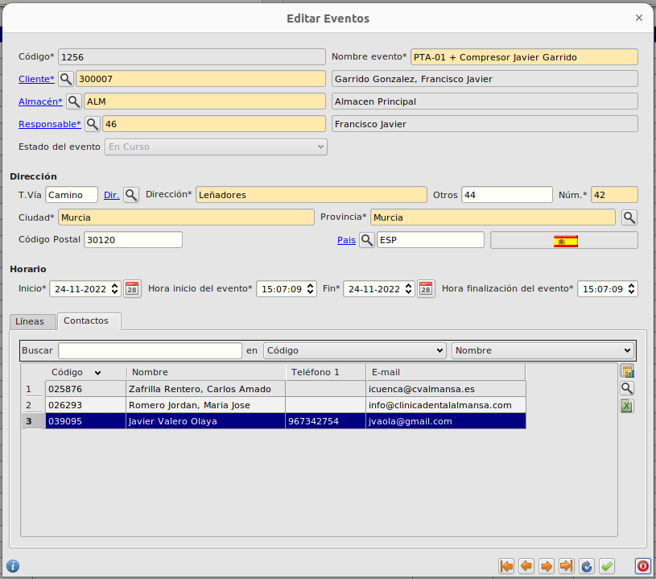
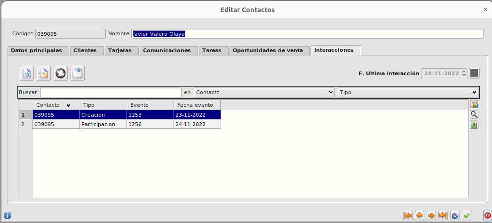

# Importación de asistentes a evento

## ¿Cómo selecciono los datos a importar?

* Seleccionamos el registro y pulsamos sobre el botón **Importar** del formulario principal de **Area de Facturación/Facturación/Eventos**. Esto abrirá un formulario de importación.

* La estructura de datos del contacto debe ser la siguiente: nombre del curso, nombre del agente, ciudad, email, teléfono, código postal. Por ejemplo:
  * Evento de prueba | Ramón Sanchez | Getafe | ramget@gmail.com | 655555555 | 28901

Para realizar la importación seguimos los pasos indicados en [Importación CSV](../../../../modulos/area_facturacion/facturacion/importacioncsv.md)

## ¿Cómo veo los datos importados?

* Los contactos importados cuyo email no exista en la base de datos se considerarán un nuevo contacto y se creará un registro en la base de datos.

* Al finalizar la importación se rellenará una tabla **Contactos** del formulario del evento seleccionado. Si editamos ese registro veremos que aparece una tabla con todos los datos que se han importado.

* También podremos ver las asistencias a eventos o *interacciones* en el formulario de edición de un contacto en **Area de C.R.M./Principal/Contactos** clicando en la pestaña **Interacciones**. Veremos el código del contacto, el tipo de interacción, *Creación* si el contacto fue creado como consecuencia de la asistencia al evento, *Particpación* si el contacto ya existía en la base de datos, el código del evento al que el contacto asistió y la fecha de inicio del mismo.

* Además, podemos ver la fecha de la última interacción del contacto de forma rápida en el campo F. Última interacción.

[Volver al Índice](./index.md)